# Contributing to the AI Agent

This guide covers the architecture, conventions, and development workflows for the AI Agent feature on the `ai-agent` branch. Read this before making changes.

---

## Architecture Overview

The AI Agent is an editor-time assistant (not a runtime component) that lets users build apps via natural language. It follows a strict separation: the **server** talks to LLMs and parses responses, the **client** manages UI and applies changes to the live editor.

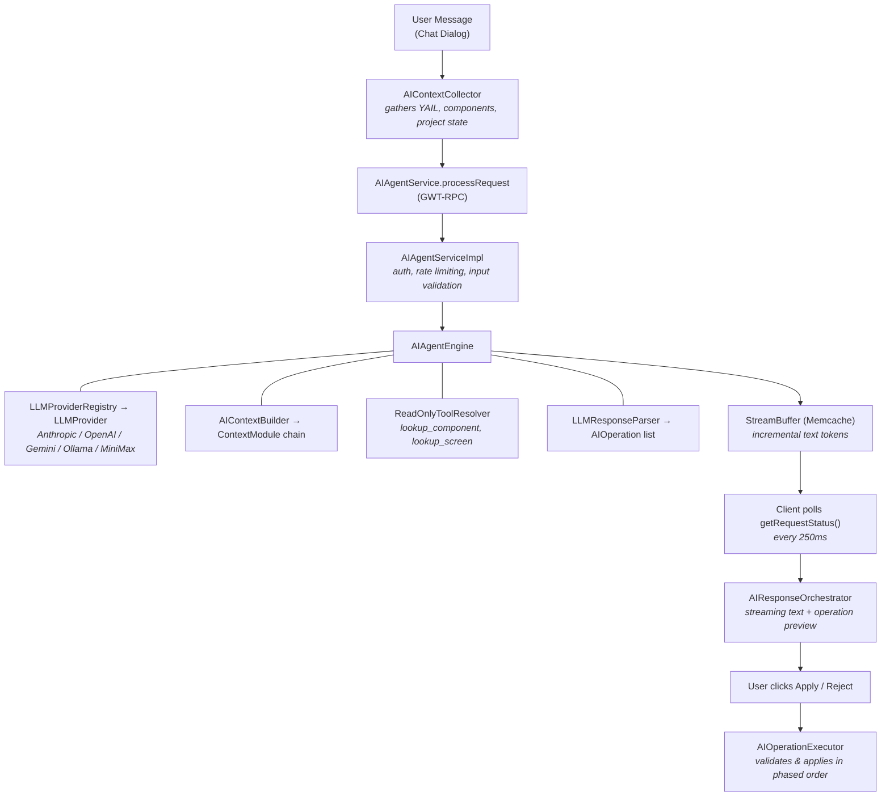

### Key Design Principles

1. **Server handles LLM, client handles mutations.** The server never modifies the project directly. It returns structured `AIOperation` objects that the client validates and applies.
2. **Preview before apply.** Every change is shown to the user for explicit approval.
3. **Operation-based, not code-based.** All modifications are expressed as typed operations (ADD_COMPONENT, WRITE_BLOCK, etc.), not raw code patches.
4. **Screen-scoped editing.** All editing operations target the currently-open screen and view. Cross-screen or cross-view work requires navigation operations issued in separate batches.
5. **Streaming via Memcache polling.** LLM text tokens are buffered server-side in Memcache and consumed by the client through lightweight polls.

---

## Directory Structure

### Server -- `appengine/src/com/google/appinventor/server/aiagent/`

| File | Purpose |
|------|---------|
| `AIAgentEngine.java` | Core orchestration: context building, LLM calls, tool-use loop, response parsing, narration retry (`retryIfNarration`), finalization |
| `AIAgentServiceImpl.java` | Servlet layer: authentication, rate limiting, input validation, delegates to engine |
| `AIContextBuilder.java` | Assembles the full LLM context from modular context modules |
| `ConversationManager.java` | Conversation lifecycle: Memcache state (24h TTL) + Datastore message persistence |
| `StreamBuffer.java` | Writes LLM text/thinking tokens to Memcache for client polling |
| `LLMResponseParser.java` | Parses LLM tool calls into typed `AIOperation` objects |
| `AIToolResolver.java` | Resolves read-only tool calls (component/screen lookups) |
| `ModeEnforcer.java` | Validates operations against the active AI mode (Advisor/ScreenEditor/ProjectEditor) |
| `AIToolNames.java` | Constants for tool names sent to the LLM |
| `AIDebug.java` | Debug logging utilities |
| `TutorialContentCache.java` | Fetches tutorial HTML, strips to text, caches in memory (8h TTL, max 100 entries) |

### Context Modules -- `server/aiagent/context/`

Each module extends `ContextModule` and contributes one section of the LLM system prompt.

| Module | What it provides |
|--------|-----------------|
| `ProjectModule` | App name, screens list, assets |
| `ScreenModule` | Current screen's component tree and block YAIL |
| `CatalogModule` | Brief component catalog (types, categories, descriptions) |
| `GrammarModule` | YAIL syntax documentation |
| `ExamplesModule` | Few-shot examples for in-context learning |
| `ReferenceModule` | App Inventor reference guide |
| `ModeModule` | Mode-specific instructions and constraints |
| `TutorialModule` | Tutorial content and pedagogical instructions (when TutorialURL is set) |

To add a new context section, create a class extending `ContextModule`, implement `build(ContextParams)`, and register it in `AIContextBuilder`.

### LLM Providers -- `server/aiagent/llm/`

| File | Purpose |
|------|---------|
| `LLMProvider.java` | Interface: `chat()`, `continueWithToolResults()`, `isStateless()` |
| `LLMProviderRegistry.java` | Factory: selects provider from `ai.agent.provider` system property |
| `OpenAIChatCompletionsProvider.java` | Base class for OpenAI Chat Completions compatible providers |
| `AnthropicCompatibleProvider.java` | Full implementation for Anthropic Messages API compatible providers |
| `AnthropicProvider.java` | Thin subclass: Anthropic API endpoint |
| `OpenAIProvider.java` | Standalone: OpenAI Responses API (stateful via `response_id`) |
| `GeminiProvider.java` | Standalone: Google Gemini API (stateful) |
| `OllamaProvider.java` | Standalone: local Ollama models, configurable base URL |
| `MiniMaxProvider.java` | Thin subclass: MiniMax endpoint (OpenAI chat/completions format) |
| `OpenRouterProvider.java` | Thin subclass: OpenRouter endpoint + routing headers |
| `BedrockProvider.java` | Standalone: AWS Bedrock Converse API + SigV4 auth |
| `VertexProvider.java` | Standalone: Google Vertex AI generateContent + OAuth |
| `AwsSigV4Signer.java` | AWS Signature V4 request signing helper |
| `GcpAuthHelper.java` | GCP service account JWT/OAuth token management |
| `LLMResponse.java` | Response DTO (text, tool calls, provider ref, hasMore flag) |
| `LLMTool.java` | Tool definition sent to LLM |
| `ChatMessage.java` | Role + content message for conversation history |
| `RawToolCall.java` | Unparsed tool call from LLM response |
| `ReadOnlyToolResolver.java` | Interface for resolving read-only tools server-side |

### Shared RPC -- `shared/rpc/aiagent/`

GWT-RPC interfaces and DTOs shared between client and server.

| File | Purpose |
|------|---------|
| `AIAgentService.java` | Service interface: `processRequest`, `continueRequest`, `reportExecutionErrors`, `clearConversation`, `getConversationHistory`, `getRequestStatus` |
| `AIAgentRequest.java` | Request DTO: user message, project ID, screen name, YAIL, view, components JSON, locale |
| `AIAgentResponse.java` | Response DTO: AI message text, operations list, errors, `hasMore` flag |
| `AIOperation.java` | Single operation: type enum + JSON payload string |
| `AIOperationResult.java` | Execution result: succeeded/failed/skipped with error details |
| `AIConversationMessage.java` | Message for chat history display |
| `AIStreamStatus.java` | Streaming poll response: status text, text delta, thinking delta, done flag |

### Client -- `client/editor/youngandroid/aiagent/`

| File | Purpose |
|------|---------|
| `AIResponseOrchestrator.java` | RPC orchestration, polling, retry logic, auto-accept mode |
| `AIChatRenderer.java` | Renders chat messages with Markdown and streaming support |
| `AIContextCollector.java` | Gathers editor state (YAIL, components, warnings) for requests |
| `AIModeSelectionDialog.java` | First-time mode selection UI |
| `AIDialogResizeHandler.java` | Floating dialog resize/position management |
| `AIEditorState.java` | Dialog visibility and mode state tracking |
| `AIOperationFormatter.java` | Color-coded operation preview formatting |
| `AIJsonUtils.java` | JSON utility functions |

### Operation Execution -- `client/.../aiagent/executor/`

| File | Purpose |
|------|---------|
| `AIOperationExecutor.java` | Applies operations in phased order (project -> designer -> blocks) |
| `AIProjectOperations.java` | CREATE_SCREEN, DELETE_SCREEN, SWITCH_SCREEN, SET_PROJECT_PROP |
| `AIDesignerOperations.java` | ADD_COMPONENT, SET_PROPERTY, RENAME_COMPONENT, DELETE_COMPONENT |
| `AIBlockOperations.java` | WRITE_BLOCK, DELETE_BLOCK |

### Operation Validation -- `client/.../aiagent/validator/`

| File | Purpose |
|------|---------|
| `AIOperationValidator.java` | Main validator, delegates to type-specific validators |
| `ProjectOperationValidator.java` | Validates project-level operations |
| `DesignerOperationValidator.java` | Validates component operations |
| `BlockOperationValidator.java` | Validates block operations against Blockly engine |

### Blockly AI -- `blocklyeditor/src/ai/`

| File | Purpose |
|------|---------|
| `yail_to_blocks.js` | Converts YAIL S-expressions into Blockly blocks with viewport-aware positioning and component grouping |
| `sexpr_parser.js` | S-expression parser for YAIL |

### Resources -- `server/aiagent/resources/`

| File | Purpose |
|------|---------|
| `appinventor_reference.md` | System prompt reference guide for the LLM |
| `yail_grammar.md` | YAIL syntax documentation for block generation |
| `few_shot_examples.json` | Few-shot examples for in-context learning |
| `tutorial_instructions.md` | Pedagogical instructions for tutorial-aware mode |

### I18n -- `blocklyeditor/src/msg/ai_blockly/`

22 locale files (`messages.json`, `messages_es.json`, `messages_de.json`, etc.) with translated strings for the chat UI.

---

## Context Gathering

Context is assembled from two sources: the **client** collects live editor state into the `AIAgentRequest`, and the **server** builds the system prompt and per-request context messages from `ContextModule` instances.

### Client-Side Context (AIContextCollector)

`AIContextCollector.buildRequest()` reads the live editor on every request and populates:

| Field | Source | Description |
|-------|--------|-------------|
| `projectId` | `DesignToolbar.getCurrentProject()` | Active project ID |
| `screenName` | `DesignToolbar.currentScreen` | Currently open screen name |
| `blocksYail` | `BlocksEditor.getBlocksYail()` | YAIL for all blocks on the current screen (event handlers, globals, procedures) |
| `currentView` | `DesignToolbar.getCurrentView()` | `"Designer"` or `"Blocks"` |
| `screenComponentsJson` | `YaFormEditor.getPropertiesJson()` | Live component tree with property values |
| `projectSnapshot` | Built inline | JSON with app name, version, theme, sizing, colors, tutorial URL, screen names, assets, extensions, and screen summaries (ProjectEditor mode only) |
| `blockWarnings` | `BlocksEditor.getBlocksWarningsAndErrors()` | JSON with warnings/errors from the Blockly workspace |
| `locale` | `LocaleInfo.getCurrentLocale()` | User's interface locale (e.g. `"es"`) |
| `languageDisplayName` | `LocaleInfo.getLocaleNativeDisplayName()` | Native language name (e.g. `"Espanol"`) |

Context is **never cached** -- it is rebuilt fresh for every request so the LLM always sees the latest project state, even after manual edits between messages.

### Server-Side Context (AIContextBuilder)

The system prompt and per-request context messages are split into layers:

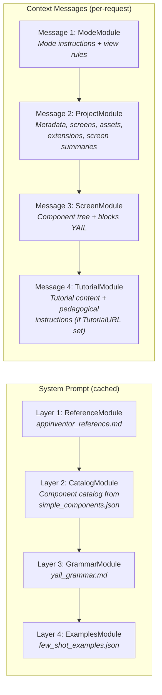

- The **system prompt** layers are cached after first build (they are static across requests).
- The **context messages** are built fresh per-request and sent as separate user messages before the user's actual message. Crucially, `ProjectModule` and `ScreenModule` parse the **client-provided JSON** (projectSnapshot, screenComponentsJson, blocksYail) rather than reading from `StorageIo`. This means the LLM always sees exactly what the user sees -- including unsaved changes.
- **Message 4 (TutorialModule)** is only included when `AIContextBuilder.INCLUDE_TUTORIAL_CONTEXT` is `true` and the project has a non-empty `TutorialURL`. The tutorial page content is fetched via HTTP by `TutorialContentCache` and cached in memory (8h TTL). When active, the LLM receives pedagogical instructions (from `tutorial_instructions.md`) alongside the full tutorial text, shifting its behavior to guide users step-by-step rather than doing everything at once.

### Why a Client/Server Hybrid?

The client owns the live, unsaved editor state. The Blockly workspace, the designer's component tree, and the project settings panel may all contain changes that haven't been saved to the server yet. By having the client snapshot this state into the `AIAgentRequest` on every call, and having the server-side context modules consume that snapshot directly, the AI operates on the same truth the user is looking at.

The server, meanwhile, handles:
- **Static reference material** (cached system prompt) -- component catalog, YAIL grammar, examples. These don't change per-request.
- **Structuring the prompt** -- assembling client data into well-formatted context messages with mode-specific instructions.
- **Read-only tool resolution** -- `lookup_screen` reads from `StorageIo` (last-saved data) for screens the user is *not* currently viewing. The tool's description tells the LLM to prefer the live context for the current screen.

---

## LLM Tools

The LLM interacts with the project through a set of tools passed via each provider's native tool/function-calling API. Tools are **filtered by mode and current editor view** -- the LLM only sees tools it is allowed to use.

### Tool Inventory

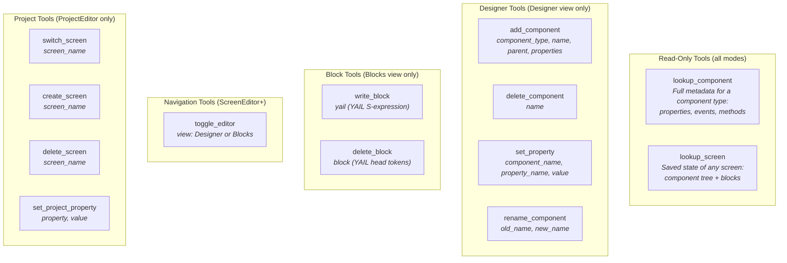

### Read-Only vs. Write Tools

Read-only tools (`lookup_component`, `lookup_screen`) are resolved **server-side** within the provider's internal tool-use loop. The LLM can call them repeatedly (up to 5 iterations) to research the project before deciding what changes to make. These calls are invisible to the user.

Write tools (`add_component`, `write_block`, etc.) are **not executed server-side**. They are parsed into `AIOperation` objects and returned to the client for preview and execution.

### How lookup_component Works

1. LLM calls `lookup_component({"component_type": "Slider"})`.
2. `AIToolResolver` searches the built-in `simple_components.json` database by name/type.
3. If not found, it searches extension components from `assets/external_comps/*/components.json`.
4. Returns the full JSON specification (all properties, events, methods, and their types).
5. If not found anywhere, throws `ReadOnlyToolException` -- the LLM sees an error and can retry with a corrected name.

### How lookup_screen Works

1. LLM calls `lookup_screen({"screen_name": "LoginScreen"})`.
2. `AIToolResolver` delegates to `AIContextBuilder.buildScreenState()`.
3. Returns the screen's component tree and blocks from server-side storage.
4. Note: for the **current** screen, the live component tree in the context messages is more authoritative than this tool (which reads last-saved data). The tool's description tells the LLM to prefer context for the current screen.

### Tool Filtering by Mode and View

`AIContextBuilder.buildTools(mode, currentView)` controls which tools the LLM sees:

| Mode | View | Available Tools |
|------|------|----------------|
| Advisor | any | `lookup_component`, `lookup_screen` |
| ScreenEditor | Designer | lookups + `add_component`, `delete_component`, `set_property`, `rename_component`, `toggle_editor` |
| ScreenEditor | Blocks | lookups + `write_block`, `delete_block`, `toggle_editor` |
| ProjectEditor | Designer | all ScreenEditor Designer tools + `switch_screen`, `create_screen`, `delete_screen`, `set_project_property` |
| ProjectEditor | Blocks | all ScreenEditor Blocks tools + `switch_screen`, `create_screen`, `delete_screen`, `set_project_property` |

---

## Operation Types and Execution Phases

All project modifications are expressed as `AIOperation` objects with a `Type` enum and a JSON payload.

### Operation Types

```java
public enum Type {
    ADD_COMPONENT,       // Add a component to the current screen
    DELETE_COMPONENT,    // Remove a component from the current screen
    SET_PROPERTY,        // Change a property value on a component
    RENAME_COMPONENT,    // Rename a component

    WRITE_BLOCK,         // Create or replace a block (event, procedure, global)
    DELETE_BLOCK,        // Remove a block

    SWITCH_SCREEN,       // Navigate to a different screen (ProjectEditor only)
    CREATE_SCREEN,       // Add a new screen (ProjectEditor only)
    DELETE_SCREEN,       // Remove a screen (ProjectEditor only)
    SET_PROJECT_PROP,    // Change project-level settings (ProjectEditor only)

    TOGGLE_EDITOR        // Switch between Designer and Blocks views
}
```

### Execution Phases

Operations are applied in strict phase order to respect dependencies:

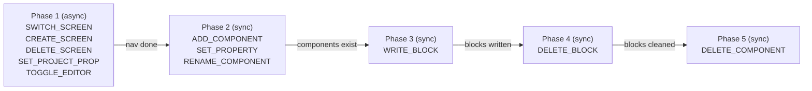

| Phase | Why it comes here |
|-------|-------------------|
| 1 | Navigation/project changes must complete before screen edits |
| 2 | Components must exist before blocks can reference them |
| 3 | Blocks can reference components added in phase 2 |
| 4 | Delete blocks before components to avoid dangling references |
| 5 | Safe to delete components after block cleanup |

Phase 1 is **async** (screen switches involve RPC callbacks). Phases 2-5 are **synchronous**. On any failure, the executor **halts** -- remaining operations are marked as skipped. There is no rollback.

After all sync phases complete, `blocksEditor.sendComponentData(true)` forces a Companion YAIL update so the device reflects the changes immediately.

### Block Positioning

When `WRITE_BLOCK` creates new blocks, `AI.YailToBlocks.convert()` in `blocklyeditor/src/ai/yail_to_blocks.js` handles positioning with three layered strategies:

1. **Viewport-aware free-space placement (always active):** Scans existing top-level blocks visible in the viewport, places new blocks below the lowest one. If the user scrolled to empty space, blocks appear there instead.
2. **Component grouping (gated by `AI.YailToBlocks.GROUP_BY_COMPONENT`):** Event handlers are placed near existing handlers for the same component, derived from the block's `instance_name` mutation attribute. Falls back to free-space when no group exists.
3. **Horizontal overlap avoidance:** After computing a position, blocks are shifted rightward if they would overlap an existing block's bounding box.

Replaced blocks (upserts) always return to their original position regardless of these strategies.

### Solo Operations

`TOGGLE_EDITOR`, `SWITCH_SCREEN`, and `CREATE_SCREEN` must be the **only operation** in a batch. If the LLM returns them alongside other operations, `ModeEnforcer` strips the non-solo operations. This is why multi-step requests produce multiple batches.

### Mode Enforcement

`ModeEnforcer.enforce()` runs three checks on every operation batch:

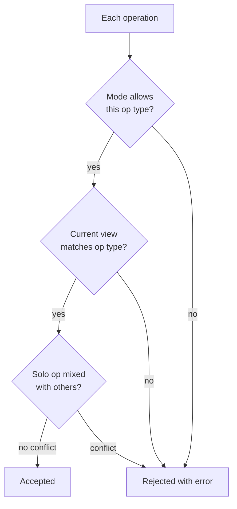

| Mode | Allowed Operations |
|------|-------------------|
| Advisor | None (read-only lookups only) |
| Screen Editor | All except SWITCH_SCREEN, CREATE_SCREEN, DELETE_SCREEN, SET_PROJECT_PROP |
| Project Editor | All operations |

---

## Validation Pipeline

Operations go through two validation stages before they affect the project: **client-side pre-validation** (before preview) and **per-operation validation** (during execution).

### Stage 1: Client-Side Pre-Validation (Block Operations)

Before showing the operation preview, `AIResponseOrchestrator` validates all WRITE_BLOCK and DELETE_BLOCK operations using the live Blockly runtime:

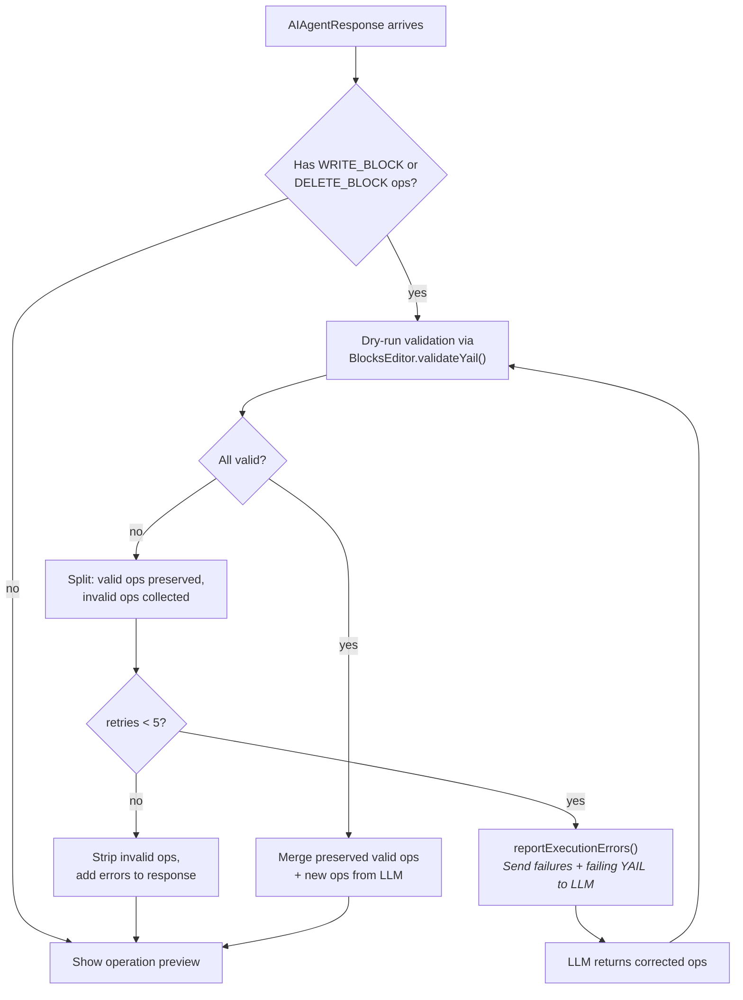

- **WRITE_BLOCK**: the YAIL is tested against the Blockly engine in a dry run (no blocks created). If the YAIL is malformed, the error message **and** the failing YAIL are sent back to the LLM so it can see and fix its mistake.
- **DELETE_BLOCK**: the block identifier is validated via `BlocksEditor.validateDeleteId()`.
- Valid operations from a mixed-result batch are **preserved across retries** (`preservedValidOps`) and merged back once the LLM fixes the failures.
- Up to **5 validation retries** before falling back to stripping invalid operations.

### Stage 2: Per-Operation Validation (During Execution)

Each operation is validated immediately before execution by `AIOperationValidator`, which delegates to type-specific validators. Validation happens **one at a time** (not upfront) because earlier operations change editor state.

#### Designer Operation Validation (`DesignerOperationValidator`)

| Operation | Checks |
|-----------|--------|
| ADD_COMPONENT | `component_type` exists in SimpleComponentDatabase, `name` is a valid identifier, no duplicate name on current screen |
| DELETE_COMPONENT | Component exists on screen, is not the Form root |
| SET_PROPERTY | `component_name` exists, `property_name` and `value` are present |
| RENAME_COMPONENT | `old_name` exists, `new_name` is a valid identifier, `new_name` doesn't already exist |

#### Block Operation Validation (`BlockOperationValidator`)

| Operation | Checks |
|-----------|--------|
| WRITE_BLOCK | `yail` field is present and non-empty, blocks editor is available |
| DELETE_BLOCK | `block` identifier is present, blocks editor is available |

#### Project Operation Validation (`ProjectOperationValidator`)

| Operation | Checks |
|-----------|--------|
| SWITCH_SCREEN | Target screen exists in the project |
| CREATE_SCREEN | Name is a valid identifier, not a reserved name, doesn't already exist |
| DELETE_SCREEN | Screen exists, is not `Screen1` |
| TOGGLE_EDITOR | `view` is exactly `"Designer"` or `"Blocks"` |
| SET_PROJECT_PROP | Property is in the whitelist (AppName, Icon, VersionCode, VersionName, Sizing, Theme, PrimaryColor, PrimaryColorDark, AccentColor, ActionBar, ShowListsAsJson, TutorialURL, DefaultFileScope) |

---

## Request Lifecycle

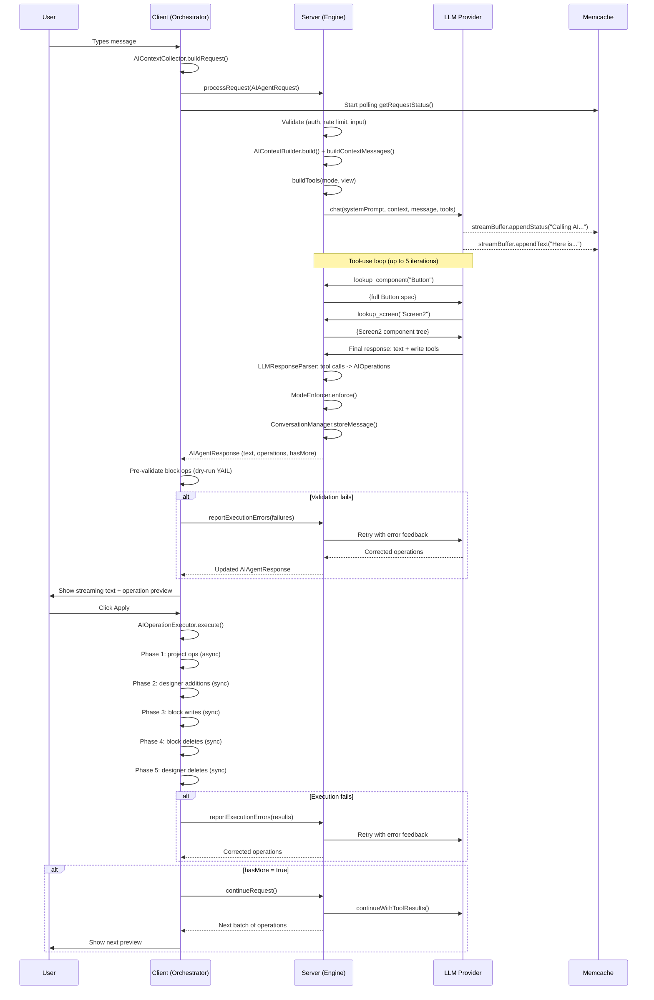

### Step-by-Step

1. **User sends a message.** The client calls `processRequest(AIAgentRequest)` via GWT-RPC.

2. **Server validates.** `AIAgentServiceImpl` checks: non-empty message (max 2000 chars), user owns project, rate limit not exceeded, AI mode is not OFF.

3. **Engine builds context and calls LLM.** `AIContextBuilder` assembles the system prompt (cached layers) and per-request context messages (fresh). Calls the LLM through `LLMProvider.chat()` with tools, history, and a `StreamBuffer`.

4. **Tool-use loop (server-side).** If the LLM calls read-only tools, the provider resolves them via `ReadOnlyToolResolver` and re-calls the LLM, up to 5 iterations.

5. **Response parsing.** `LLMResponseParser` converts remaining tool calls into `AIOperation` objects. `ModeEnforcer` validates them against mode, view, and solo-op rules.

6. **Streaming to client.** During steps 3-5, text tokens are written to `StreamBuffer` (Memcache). The client polls every 250ms.

7. **Client pre-validates blocks.** WRITE_BLOCK/DELETE_BLOCK operations are dry-run tested against Blockly. Failures trigger automatic LLM retries (up to 5).

8. **User reviews preview.** Color-coded operation list: green = add, red = delete, blue = modify.

9. **User decides.** Apply / Reject / Apply & Accept All.

10. **Execution.** `AIOperationExecutor` applies operations in 5 phases. On failure, `reportExecutionErrors()` triggers LLM retry (up to 3).

11. **Continuation.** If `hasMore` is true, `continueRequest()` fetches the next batch.

---

## Conversation Management

```mermaid
flowchart TD
    subgraph "First Message"
        FM1["processRequest() called"]
        FM2["ConversationManager.getConversation(projectId)"]
        FM3{"Exists in<br/>Memcache?"}
        FM4["Create new state<br/>UUID + provider name"]
        FM5["Save to Memcache<br/>(24h TTL)"]
        FM6["Use existing state"]

        FM1 --> FM2 --> FM3
        FM3 -->|no| FM4 --> FM5
        FM3 -->|yes| FM6
    end

    subgraph "Message Storage"
        MS1["storeMessage(conversationId, role, text)"]
        MS2["Datastore: ConversationMessageData<br/><i>timestamp + sequence counter</i>"]
        MS3["cleanupConversationMessages()<br/><i>evict expired entries</i>"]

        MS1 --> MS2 --> MS3
    end

    subgraph "Page Reload"
        PR1["getConversationHistory(projectId)"]
        PR2["Load state from Memcache"]
        PR3["loadAIConversationMessages(conversationId)"]
        PR4["Return text-only messages<br/>(no operations)"]

        PR1 --> PR2 --> PR3 --> PR4
    end

    subgraph "Clear Conversation"
        CC1["clearConversation(projectId)"]
        CC2["Delete Memcache entry"]
        CC3["Clear stream buffer"]
        CC4["Delete Datastore messages"]

        CC1 --> CC2 --> CC3 --> CC4
    end
```

### Persistence Model

| Store | What | TTL | Purpose |
|-------|------|-----|---------|
| **Memcache** | `AIConversationState` (provider name, conversation ID, provider ref) | 24 hours | Fast access for active conversations |
| **Memcache** | Stream buffer chunks (per-request) | Request lifetime | Text streaming from server to client |
| **Datastore** | `ConversationMessageData` entities | Until cleared | Message history persistence across server restarts |

### Message Ordering

Messages are stored with a composite key of `(timestamp, sequence)`. The `ThreadLocal<Integer>` sequence counter ensures unique ordering when multiple messages are stored within the same millisecond (e.g. user message + AI response in one request).

### Structured Content

When the LLM returns tool calls, `ConversationManager.buildStructuredContentPair()` serializes them as paired JSON arrays:
- **Assistant content**: text blocks + tool_use blocks (what the LLM said and called)
- **Tool result content**: matching tool_result blocks (accepted operations get `"Pending client execution."`, rejected ones get the error message)

This structured format is stored in Datastore and replayed to stateless providers (Anthropic) on subsequent calls so the LLM sees the full tool-call history.

---

## Streaming Implementation

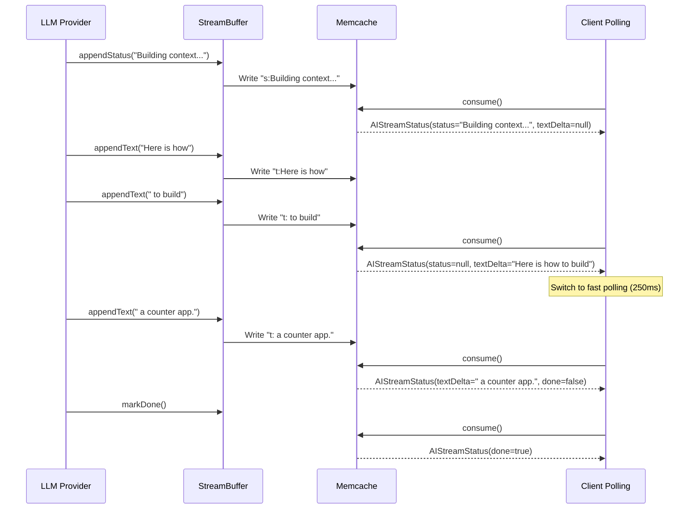

### Key Details

- Chunks are prefixed with `"s:"` (status), `"t:"` (text), or `"k:"` (thinking/reasoning) in Memcache.
- `consume()` separates and concatenates chunks per type, returning the **last** status, **accumulated** text, and **accumulated** thinking since the previous poll.
- When `ai.agent.reasoning.effort` is set, providers stream reasoning/thinking tokens via `streamBuffer.appendThinking()`. The client renders these in a collapsible `<details>` panel above the response text (open while streaming, auto-collapsed on completion).
- **250ms** (fast) -- during active streaming (switched after first text delta arrives).
- **1000ms** (slow) -- initial wait, post-operation completion.
- **RPC timeout: 720,000ms** (12 min) -- must exceed the server's LLM read timeout.

---

## Error Handling and Retry

The system has three retry mechanisms that operate independently:

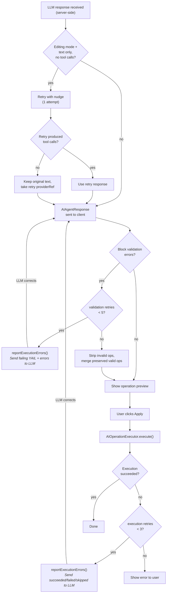

### Narration Retry (server-side, 1 attempt)

Some LLMs respond with text describing what they *would* do instead of actually calling tools. In editing modes (ScreenEditor/ProjectEditor), both `processRequest()` and `continueRequest()` detect this pattern -- text-only response with zero tool calls -- and retry once with a nudge asking the model to reassess whether tools are needed. The shared logic lives in `AIAgentEngine.retryIfNarration()`. This is especially important for continuations after solo operations like `toggle_editor`, where the LLM may narrate ("Now I'll add the blocks...") instead of actually calling `write_block`.

- **Trigger**: editing mode + non-empty text + zero raw tool calls + zero parsed operations.
- **Nudge message**: asks the LLM to use tools if the user's request requires changes, or respond with text only if it was a question.
- **If the retry produces tool calls**: the retry's text and operations replace the original response. The narration and nudge are persisted to Datastore as non-displayed messages to keep history roles alternating.
- **If the retry is also text-only**: the original response text is kept (it's a natural reply to the user, not contaminated by the nudge). The retry's `providerRef` is used so stateful providers stay in sync. The narration/nudge exchange is not persisted.
- **Stateful providers** (OpenAI, Gemini): the retry chains via `providerRef`; context messages are not re-sent (already in the provider's server-side state).
- **Stateless providers** (Anthropic): the narration is appended to a temporary in-memory history copy so the LLM sees its failed attempt; context messages are re-sent.

### Validation Retries (up to 5)

- Triggered when WRITE_BLOCK or DELETE_BLOCK fails client-side Blockly dry-run.
- Valid operations from a mixed batch are **preserved** in `preservedValidOps`.
- Only the failures are reported to the LLM with the failing YAIL code.
- LLM returns corrected operations, which are re-validated.
- After 5 attempts, remaining invalid ops are stripped and errors shown in preview.

### Execution Retries (up to 3)

- Triggered when `AIOperationExecutor` fails during phased execution.
- Per-operation results are sent: succeeded, failed (with error), skipped.
- LLM sees exactly what worked and what didn't, and can adjust.

### Server-Side Retry Handling

When the client calls `reportExecutionErrors()`, here is what happens on the server (`AIAgentEngine.reportExecutionErrors()`):

1. **Categorize results.** The `AIOperationResult` DTOs are split into three lists: succeeded summaries, failed details (with error messages), and skipped summaries.

2. **Build feedback message.** `LLMResponseParser.buildExecutionErrorFeedback()` assembles a structured text message with three labeled sections:
   - "ALREADY APPLIED successfully (do NOT re-emit these)" -- succeeded ops
   - "FAILED during execution" -- failed ops with error details
   - "SKIPPED (never executed, halted after the failure above)" -- skipped ops
   - Closing instruction: "fix the failed operation(s) and re-emit ONLY the failed and skipped operations"

3. **Send as a new user message.** The feedback is stored in conversation history (as a non-display message) and sent to the LLM via `provider.chat()` as the user message, with fresh context messages built from the client's updated editor state. The LLM sees the full current project state plus the error feedback.

4. **`retryAttempt` and `totalTools`** are passed from the client and used for the status display (`"3 out of 8 tools failed, retry attempt 2"`). `totalTools` preserves the original batch size since subsequent retries only re-emit failed/skipped operations.

5. **Parse and enforce as usual.** The LLM's corrected response goes through the same `parseAndEnforce()` pipeline -- unknown tools, mode violations, etc. are caught the same way as on a first request.

### Server-Side Parse Errors (LLMResponseParser)

Before mode enforcement, `LLMResponseParser.parseToolCalls()` validates each raw tool call:

| Check | What happens on failure |
|-------|------------------------|
| Unknown tool name | Error added: `"Unknown tool: <name>"`. The tool call is dropped. |
| Malformed JSON arguments | Error added: `"Malformed JSON arguments for <name>"`. Dropped. |
| Missing required field | Error added: `"Missing required field '<field>' for <name>"`. Dropped. |
| Type coercion failure | Error added: `"Type coercion failed for <name>"`. Dropped. |
| Read-only tool (lookup_*) | Silently skipped (already resolved server-side by the provider). |

Parse errors are collected into the `AIAgentResponse.errors` list and shown to the user. The dropped tool calls are also tracked as `PARSE_REJECTED` in `ToolCallStatus`, which is written into the continuation state so that `continueWithToolResults()` sends `"REJECTED: <error>"` instead of `"Done."` for those calls -- the LLM sees its mistake in the tool result.

### Rejection Flow

When the user clicks Reject, the orchestrator sends a feedback message (`"The user rejected the proposed operations. Please suggest alternatives."`) as a regular `processRequest()` call. The LLM sees the rejection in conversation history and can propose a different approach.

---

## LLM Provider System

### Configuration (appengine-web.xml)

```xml
<property name="ai.agent.available" value="true" />
<property name="ai.agent.provider" value="anthropic" />
<property name="ai.agent.model" value="" />
<property name="ai.agent.api.key" value="YOUR_KEY" />
<property name="ai.agent.base.url" value="" />
<property name="ai.agent.rate.limit" value="10" />
<property name="ai.agent.debug" value="false" />

<!-- Bedrock-specific (only when ai.agent.provider=bedrock) -->
<property name="ai.agent.provider.bedrock.region" value="us-east-1" />
<property name="ai.agent.provider.bedrock.access.key" value="" />
<property name="ai.agent.provider.bedrock.secret.key" value="" />
<property name="ai.agent.provider.bedrock.session.token" value="" />

<!-- Vertex-specific (only when ai.agent.provider=vertex) -->
<property name="ai.agent.provider.vertex.project" value="" />
<property name="ai.agent.provider.vertex.region" value="us-central1" />
<property name="ai.agent.provider.vertex.service.account" value="" />
```

| Property | Default | Description |
|----------|---------|-------------|
| `ai.agent.available` | `true` | Feature toggle |
| `ai.agent.provider` | `anthropic` | Provider name: `anthropic`, `anthropic-compatible`, `openai`, `gemini`, `ollama`, `minimax`, `openrouter`, `openai-compatible`, `bedrock`, `vertex` |
| `ai.agent.model` | (per-provider) | Model override. Defaults: `claude-sonnet-4-20250514`, `gpt-4o`, `gemini-2.0-flash`, `llama3.1`, `MiniMax-M2`, `anthropic.claude-sonnet-4-20250514-v1:0` (bedrock), `anthropic/claude-sonnet-4` (openrouter) |
| `ai.agent.reasoning.effort` | (empty) | Reasoning/thinking effort level. Empty = use model default. Values vary by provider: OpenAI (`low`, `medium`, `high`, `xhigh`), Anthropic (`low`, `medium`, `high`), Gemini (`LOW`, `MEDIUM`, `HIGH`). When set, also enables thinking content streaming to the UI. |
| `ai.agent.api.key` | (empty) | API key for the selected provider |
| `ai.agent.base.url` | (empty) | Base URL override (required for `ollama`, `openai-compatible`, `anthropic-compatible`; optional for `anthropic`, `minimax`) |
| `ai.agent.rate.limit` | `10` | Max requests per user per minute |
| `ai.agent.debug` | `false` | Enable verbose debug logging |
| `ai.agent.provider.bedrock.region` | `us-east-1` | AWS region for Bedrock |
| `ai.agent.provider.bedrock.access.key` | (empty) | AWS access key ID |
| `ai.agent.provider.bedrock.secret.key` | (empty) | AWS secret access key |
| `ai.agent.provider.bedrock.session.token` | (empty) | Optional STS session token |
| `ai.agent.provider.vertex.project` | (empty) | GCP project ID |
| `ai.agent.provider.vertex.region` | `us-central1` | GCP region |
| `ai.agent.provider.vertex.service.account` | (empty) | Path to service account JSON key file |

### Stateful vs. Stateless Providers

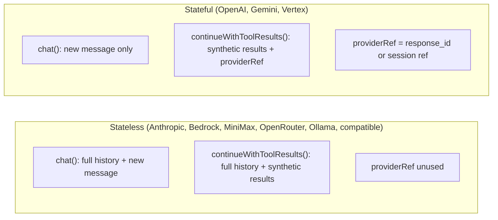

- **Stateless** (Anthropic, Bedrock, MiniMax, OpenRouter, Ollama, compatible providers): Full conversation history is sent on every call. Each call is self-contained.
- **Stateful** (OpenAI, Gemini, Vertex): The provider maintains server-side state. A `providerRef` (response ID, session reference, cached contents) is passed back for continuation.

### Adding a New Provider

If the new provider uses the **OpenAI Chat Completions** format (`/v1/chat/completions` with `tool_calls` array, SSE streaming with `[DONE]`), extend `OpenAIChatCompletionsProvider` -- override `getEndpoint()`, `getHeaders()`, and `getProviderName()`. See `MiniMaxProvider` or `OpenRouterProvider` for examples.

If the new provider uses the **Anthropic Messages** format (`tool_use`/`tool_result` content blocks), extend `AnthropicCompatibleProvider` -- same override pattern. See `AnthropicProvider` for the example.

For providers with a unique API format, implement `LLMProvider` from scratch:

1. Create `YourProvider.java` in `server/aiagent/llm/` implementing `LLMProvider`.
2. Implement `chat()` -- handle the tool-use loop for read-only tools internally (max 5 iterations).
3. Implement `continueWithToolResults()` -- send synthetic `"Done."` results for pending tool calls.
4. Implement `isStateless()` -- return `true` if the provider doesn't support server-side conversation state.
5. Register in `LLMProviderRegistry`:
   - Add a default model in `DEFAULT_MODELS`.
   - Add a `case` in the `get()` switch.
6. Accept a `StreamBuffer` parameter and call `streamBuffer.appendText()` / `streamBuffer.appendThinking()` / `streamBuffer.appendStatus()` during streaming.
7. Accept a `reasoningEffort` constructor parameter (from `ai.agent.reasoning.effort`). Map it to the provider's native reasoning/thinking parameter if supported (e.g. OpenAI `reasoning.effort` + `reasoning.summary`, Anthropic `thinking.effort`, Gemini `thinkingConfig.thinkingLevel` + `includeThoughts`).

---

## Multi-Step Workflows

Complex requests that span screens or views produce multiple batches due to the "navigate, then act" rule:

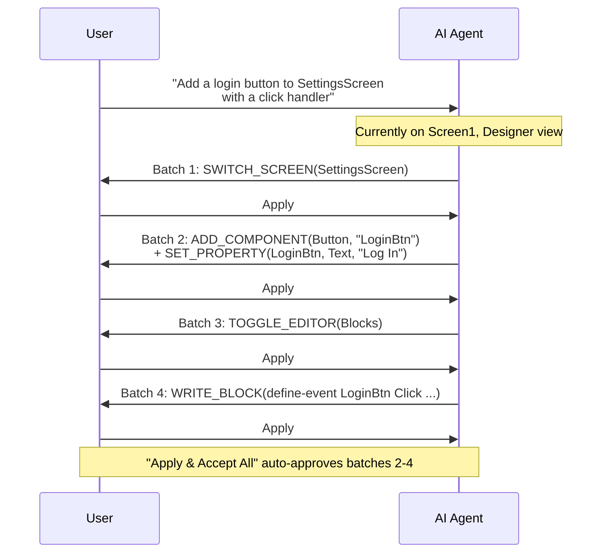

### Why Navigation Must Be Solo

Navigation operations (SWITCH_SCREEN, CREATE_SCREEN, TOGGLE_EDITOR) change which screen or view is active. Subsequent operations in the same batch would target the **old** screen/view. By forcing them to be solo, the system ensures the editor state is updated before the next batch references it.

### The hasMore Flag

When the server returns `hasMore = true`:
1. The client applies the current batch.
2. On success, it calls `continueRequest()` with a fresh context snapshot.
3. The server calls `LLMProvider.continueWithToolResults()` to resume the LLM conversation.
4. The LLM generates the next batch of operations.
5. This repeats until `hasMore = false`.

---

## Build System

The AI agent code is compiled through existing Ant build targets in `appengine/build.xml`:

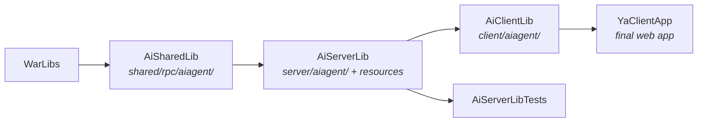

### Running the build
```bash
cd appinventor
ant -f appengine/build.xml AiServerLib    # Server only
ant -f appengine/build.xml AiClientLib    # Client (includes shared)
ant -f appengine/build.xml tests          # All tests
```

### Adding new resource files

If you add `.md` or `.json` files to `server/aiagent/resources/`, they are automatically included by the existing copy task. For other file types, update the `includes` attribute in the `AiServerLib` target's resource copy block.

---

## Testing

### Existing tests
- `appengine/tests/.../server/aiagent/StreamBufferTest.java` -- Unit tests for the Memcache streaming buffer.

### Running tests
```bash
ant -f appengine/build.xml AiServerLibTests
```

### Writing new tests
- Place server-side tests in `appengine/tests/com/google/appinventor/server/aiagent/`.
- Place shared DTO tests in `appengine/tests/com/google/appinventor/shared/rpc/aiagent/`.
- LLM provider tests should mock HTTP calls (never call real APIs in CI).
- Context module tests can verify output format by constructing `ContextParams` with test data.

---

## Common Development Tasks

### Modifying the system prompt

Edit the relevant `ContextModule` in `server/aiagent/context/`. Each module's `build()` method returns a string that becomes part of the system prompt. For static reference content, edit the files in `server/aiagent/resources/`.

### Adding a new operation type

1. Add the enum value to `AIOperation.Type`.
2. Add a tool constant in `AIToolNames`.
3. Add the tool definition in `AIContextBuilder.buildTools()`.
4. Update `LLMResponseParser` to parse the new tool call into the operation.
5. Update `ModeEnforcer` with mode/view permissions (add to the correct op set).
6. Add a validation method in the appropriate `*OperationValidator`.
7. Wire the new type into `AIOperationValidator.validate()`.
8. Add execution logic in the appropriate `AI*Operations` class under `executor/`.
9. Add the new type to the correct phase in `AIOperationExecutor.execute()`.
10. Update `AIOperationFormatter` for preview display.
11. Update `ConversationManager.summarizeOperations()` for text summaries.

### Adding a new context module

1. Create a class extending `ContextModule` in `server/aiagent/context/`.
2. Implement `build(ContextParams)` returning the context section text.
3. Register it in `AIContextBuilder` -- either as a new system prompt layer (cached) or as a per-request context message.

### Adding i18n strings

1. Add the key/value to `blocklyeditor/src/msg/ai_blockly/messages.json` (English).
2. Add translations to each `messages_*.json` file (22 locales).

---

## Conventions

- **All LLM communication is server-side only.** API keys and prompts never reach the client.
- **Operations are the only mutation mechanism.** Never bypass the operation/executor pipeline to modify project state directly from AI responses.
- **Navigation operations must be issued alone** -- SWITCH_SCREEN, CREATE_SCREEN, and TOGGLE_EDITOR cannot be combined with other operations in the same batch.
- **Read-only tools are resolved server-side** within the provider's internal loop. Only non-read-only tool calls become `AIOperation` objects returned to the client.
- **Max 5 tool-use iterations** per LLM call to prevent infinite loops.
- **Max 5 validation retries** for block YAIL errors before stripping invalid operations.
- **Max 3 execution error retries** before giving up and showing the error to the user.
- **Message length limit: 2000 characters.** Enforced server-side with control character stripping.
- **Rate limit: configurable** (default 10 req/min per user). Enforced via in-memory timestamps in `AIAgentServiceImpl`.
- **Context is never cached client-side.** Every request rebuilds the full editor state snapshot.
- **Tutorial context is gated by `AIContextBuilder.INCLUDE_TUTORIAL_CONTEXT`.** When `true` (default), projects with a `TutorialURL` get tutorial page content and pedagogical instructions injected into the LLM context. Set to `false` to disable without other code changes.

---

## Security Considerations

- **API keys** must be stored in `appengine-web.xml` system properties (or preferably in a secret manager). Never hardcode keys in source code.
- **Input validation**: messages are trimmed, control characters stripped (except newline, tab), and length-checked before processing.
- **Authorization**: every RPC verifies the user owns the target project via `StorageIo.assertUserHasProject()`.
- **Property whitelist**: `SET_PROJECT_PROP` only accepts properties from a hardcoded whitelist in `ProjectOperationValidator`.
- **No runtime access**: the AI operates on source files only -- it cannot run apps, access devices, or make network requests.
- **Conversation data** has a 24-hour TTL in Memcache and can be cleared by the user at any time.

---

## Further Reading

- [`appinventor/misc/ai-agent/educator-guide.md`](appinventor/misc/ai-agent/educator-guide.md) -- Comprehensive guide for educators using the AI Agent, with teaching scenarios and a glossary.
