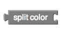

There are three main types of color blocks:

* [a color box](#basic)
* [make color](#make)
* [split color](#split)

### How do colors work in App Inventor?

Internally, App Inventor stores each color as a single number. When you use `make color`{:.color.block} and take in a list as an argument, internally this list is then converted using App Inventor's color scheme and stored as a number. If you knew the numbers for the colors, you could even specify what color you wanted something to be by just setting its Color property to a specific number. If you want to see a chart of colors to numbers, check out [this page](http://appinventor.mit.edu/explore/app-inventor-color-chart).

### basic color   {#basic}

This is a basic color block. It has a small square shape and has a color in the middle that represents the color stored internally in this block.

If you click on the color in the middle, a pop-up appears on the screen with a table of 70 colors that you can choose from. Clicking on a new color will change the current color of your basic color block.

Each basic color block that you drag from the Colors drawer to the Blocks Editor screen will display a table with the same colors when clicked.

### make color   {#make}

`make color`{:.color.block} takes in a list of 3 or 4 numbers. These numbers in this list represent values in an RGB code. RGB codes are used to make colors on the Internet. An RGB color chart is available [here](https://sites.google.com/view/metricrat-ai2/scraps/android-and-html-colour-codes). This first number in this list represents the R value of the code. The second represents the G. The third represents the B. The fourth value is optional and represents the alpha value or how saturated the color is. The default alpha value is 100. Experiment with different values and see how the colors change using this block.

### split color   {#split}

`split color`{:.color.block} does the opposite of `make color`{:.color.block}. It takes in a color: a color block, variable holding a color, or property from one of the components representing a color and returns a list of the RGB values in that color's RGB code.
