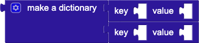
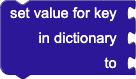
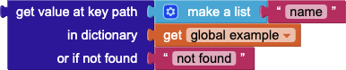
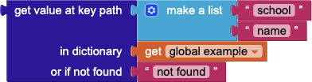
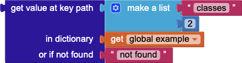
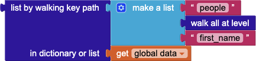
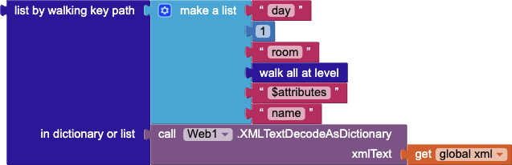

Table of Contents:

* [Introduction](#dictionaries)
* [create empty dictionary](#create-empty-dictionary)
* [make a dictionary](#make-a-dictionary)
* [pair](#pair)
* [get value for key](#get-value-for-key)
* [set value for key](#set-value-for-key)
* [delete entry for key](#delete-entry-for-key)
* [get value at key path](#get-value-at-key-path)
* [set value for key path](#set-value-for-key-path)
* [get keys](#get-keys)
* [get values](#get-values)
* [is key in dictionary?](#is-key-in-dictionary)
* [size of dictionary](#size-of-dictionary)
* [list of pairs to dictionary](#list-of-pairs-to-dictionary)
* [dictionary to list of pairs](#dictionary-to-list-of-pairs)
* [copy dictionary](#copy-dictionary)
* [merge into dictionary](#merge-into-dictionary)
* [list by walking key path](#list-by-walking-key-path)
* [walk all at level](#walk-all-at-level)
* [is a dictionary?](#is-a-dictionary)

## Introduction

Dictionaries, called in other languages terms such as maps, associative arrays or lists, are data structures that associate one value, often called the key, with another value. A common way of displaying dictionaries is using the JavaScript Object Notation (JSON), for example:

```json
{
  "id":  1,
  "name":  "Tim the Beaver",
  "school": {
    "name": "Massachusetts Institute of Technology"
  },
  "enrolled": true,
  "classes": ["6.001", "18.01", "8.01"]
}
```

The above example shows that in JSON the keys (quoted text before the `:`) can map to different types of values. The allowed types are number, text, other dictionaries, booleans, and lists. In the blocks language, you can bulid this dictionary as follows:


**Figure 1**: A blocks representation of the JSON code snippet shown above.

### create empty dictionary


The `create empty dictionary`{:.dictionary.block} block creates a dictionary without any key-value pairs. Entries can be added to the empty dictionary using the `set value for key`{:.dictionary.block} block. The `create empty dictionary`{:.dictionary.block} block can also be turned into a `make a dictionary`{:.dictionary.block} block by using the blue mutator button to add `pair`{:.dictionary.block} entries.

### make a dictionary



The `make a dictionary`{:.dictionary.block} is used to create a dictionary with a set of `pair`{:.dictionary.block}s known in advance. Additional entries can be added using `set value for key`{:.dictionary.block}.

### pair


The `pair`{:.dictionary.block} block is a special purpose block used for constructing dictionaries.

### get value for key


The `get value for key`{:.dictionary.block} block checks to see if the dictionary contains a corresponding value for the given key. If it does, the value is returned. Otherwise, the value of the `not found` parameter is returned. This behavior is similar to the behavior of the [`lookup in pairs`{:.list.block}](lists.html#lookupinpairs) block.

### set value for key



The `set value for key`{:.dictionary.block} block sets the corresponding value for the given `key` in the `dictionary` to `value`. If no mapping exists for `key`, a new one will be created. Otherwise, the existing value is replaced by the new value.

### delete entry for key


The `delete entry for key`{:.dictionary.block} block removes the key-value mapping in the dictionary for the given key. If no entry for the key exists in the dictionary, the dictionary is not modified.

### get value at key path

The `get value at key path`{:.dictionary.block} block is a more advanced version of the `get value for key`{:.dictionary.block} block. Rather than getting the value of a specific key, it instead takes a list of valid keys and numbers representing a path through a data structure. The `get value for key`{:.dictionary.block} block is equivalent to using this block with a key path of length 1 containing the key. For example, the following two blocks would return `"Tim the Beaver"`{:.text.block}:

 

It walks the data structure, starting from the initial dictionary, using the `path` provided in order to retrieve values nested deeply in complex data structures. It is best used for processing JSON data from web services. Starting from the initial input, it takes the first element in the `key path` and checks to see if a key (if the input is a dictionary) or index (if the input is a list) exists at that point. If so, it selects that item as the input and proceeds to check the next element in the `key path`, continuing until either the whole path has been followed, at which point it returns what is at that location, or the `"not found"` parameter.

**Examples**

```json
{
  "id":  1,
  "name":  "Tim the Beaver",
  "school": {
    "name": "Massachusetts Institute of Technology"
  },
  "enrolled": true,
  "classes": ["6.001", "18.01", "8.01"]
}
```

For example, given the JSON dictionary above, the following use of `get value at key path`{:.dictionary.block} will yield the result `"Massachusetts Institute of Technology"`{:.text.block}.



The `get value at key path<`{:.dictionary.block} allows for the path to include numbers representing the index of elements to traverse when dictionaries and lists are mixed. For example, if we wanted to know the second class that Tim was taking, we could do the following:



which returns the value `"18.01"`.

### set value for key path


The `set value for key path`{:.dictionary.block} block updates the value at a specific `key path` in a data structure. It is the mirror of `get value for key path`{:.dictionary.block}, which retrieves a value at a specific `key path`. The path **must be valid**, except for the last key, which if a mapping does not exist will create a mapping to the new value. Otherwise, the existing value is replaced with the new value.

### get keys


The `get keys`{:.dictionary.block} returns a list of keys in the dictionary.

### get values


The `get values`{:.dictionary.block} returns a list containing the values in the dictionary. Modifying the contents of a value in the list will also modify it in the dictionary.

### is key in dictionary?


The `is key in dictionary?`{:.dictionary.block} tests whether the key exists in the dictionary and returns `true`{:.logic.block} if it does, otherwise it returns `false`{:.logic.block}.

### size of dictionary


The `size of dictionary`{:.dictionary.block} block returns the number of key-value pairs present in the dictionary.

### list of pairs to dictionary


The `list of pairs to dictionary`{:.dictionary.block} block converts an associative list of the form `((key1 value1) (key2 value2) ...)` into a dictionary mapping the keys to their values.
Because dictionaries provide better lookup performance than associative lists, if you want to perform many operations on a data structure it is advisable to use this block to convert the associative list into a dictionary first.

### dictionary to list of pairs


The `dictionary to list of pairs`{:.dictionary.block} converts a dictionary into an associative list.
This block reverses the conversion performed by the [`list of pairs to dictionary`{:.list.block}](#list-of-pairs-to-dictionary) block.


### copy dictionary


The `copy dictionary`{:.dictionary.block} makes a deep copy of the given dictionary. This means that all of the values are copied recursively and that changing a value in the copy will not change it in the original.

### merge into dictionary


The `merge into dictionary from dictionary`{:.dictionary.block} block ccopies the key-value pairs from one dictionary into another, overwriting any keys in the target dictionary.

### list by walking key path


The `list by walking key path`{:.dictionary.block} block works similarly to the `get value at key path`{:.dictionary.block}, but creates a list of values rather than returning a single value. It works by starting at the given dictionary and walking down the tree of objects following the given path. Unlike the `get value at key path`{:.dictionary.block} though, its path can be composed of three major types: dictionary keys, list indices, and the [`walk all at level`{:.dictionary.block}](#walk-all-at-level) block. If a key or index is provided, the specific path is taken at that point in the tree. If the `walk all at level`{:.dictionary.block} is specified, every value at that point is followed in succession (breadth-first), at which point the walk continues from the next element in the path. Any element that matches the whole path is added to the output list.

**Examples**

Consider the following JSON and blocks:

```json
{
  "people": [{
    "first_name": "Tim",
    "last_name": "Beaver"
  },{
    "first_name": "John",
    "last_name": "Smith"
  },{
    "first_name": "Jane",
    "last_name": "Doe"
  }]
}
```


If `global data`{:.variable.block} contains a dictionary represented by the JSON, then the `list by walking key path`{:.dictionary.block} block will produce the list `["Tim", "Beaver"]`{:.list.block}. First, the value of the `"people"`{:.text.block} tag, that is the list of people, is chosen. Next, the first element in the list is chosen. Lastly, the walk all at level block selects the values in the object at that point, that is, the values `"Tim"`{:.text.block} and `"Beaver"`{:.text.block}.

You can also use `walk all at level`{:.dictionary.block} at a level containing a list. For example, the following block selects the first names of all of the people in the structure, i.e., `["Tim", "John", "Jane"]`{:.list.block}.



This block can also be used with XML parsed using the [`Web.XMLTextDecodeAsDictionary`{:.method.block}](/reference/components/connectivity.html#Web.XMLTextDecodeAsDictionary) block. Consider the following XML document:

```xml
<schedule>
  <day>
    <room name="Hewlitt" />
    <room name="Bleil" />
  </day>
  <day>
    <room name="Kiva" />
    <room name="Star" />
  </day>
</schedule>
```

You can use the following blocks to get a list of the names of the rooms on the first day, i.e. `["Hewlitt", "Bleil"]`{:.list.block}.



### walk all at level


The `walk all at level`{:.dictionary.block} block is a specialized block that can be used in the key path of a `list by walking key path`{:.dictionary.block}. When encountered during a walk, it causes every item at that level to be explored. For dictionaries, this means that every value is visited. For lists, each item in the list is visited. This can be used to aggregate information from a list of items in a dictionary, such as the first name of every person in a database represented by JSON objects. See the [`list by walking key path`{:.dictionary.block}](#list-by-walking-key-path) block for examples.

### is a dictionary?


The `is a dictionary?`{:.dictionary.block} block tests to see whether the `thing` given to it is a dictionary or not. It will return `true`{:.logic.block} if the `thing` is a dictionary and `false`{:.logic.block} otherwise.
