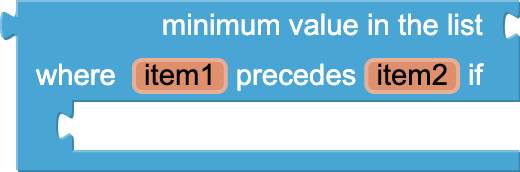

* [create empty list](#emptylist)
* [make a list](#makealist)
* [add items to list](#additems)
* [is in list](#inlist)
* [length of list](#lengthoflist)
* [is list empty](#islistempty)
* [pick a random item](#pickrandomitem)
* [index in list](#indexinlist)
* [select list item](#selectlistitem)
* [insert list item](#insert)
* [replace list item](#replace)
* [remove list item](#removeitem)
* [append to list](#append)
* [copy list](#copy)
* [is a list?](#isalist)
* [reverse list](#reverse)
* [list to csv row](#listtocsvrow)
* [list to csv table](#listtocsvtable)
* [list from csv row](#listfromcsvrow)
* [list from csv table](#listfromcsvtable)
* [lookup in pairs](#lookupinpairs)
* [join with separator](#joinwithseparator)
* [make new mapped list](#mapnondest)
* [make new filtered list](#filter)
* [reduce list to a single value](#reduce)
* [sort list in ascending order](#sort)
* [sort list with a specified comparator](#sortwithcomparator)
* [sort list with proxy values](#sortwithkey)
* [minimum value in list](#minnumber)
* [maximum value in list](#maximum)
* [all but first](#butfirst)
* [all but last](#butlast)
* [list slices](#slices)

*Need additional help understanding lists? Check out [making lists](../concepts/lists.html) on the Concepts page.*

### create empty list   {#emptylist}

Creates an empty list with no elements.

### make a list   {#makealist}

Creates a list from the given blocks. If you don't supply any arguments, this creates an empty list, which you can add elements to later.
This block is a [mutator](../concepts/mutators.html). Clicking the blue plus sign will allow you to add additional items to your list.

### add items to list   {#additems}

Adds the given items to the end of the list.
The difference between this and append to list is that append to list takes the items to be appended as a single list
while add items to list takes the items as individual arguments. This block is a [mutator](../concepts/mutators.html).

### is in list   {#inlist}

If thing is one of the elements of the list, returns true; otherwise, returns false. Note that if a list contains sublists,
the members of the sublists are not themselves members of the list. For example, the members of the list (1 2 (3 4)) are 1, 2, and the list (3 4); 3 and 4 are not themselves members of the list.

### length of list   {#lengthoflist}

Returns the number of items in the list.

### is list empty   {#islistempty}

If list has no items, returns true; otherwise, returns false.

### pick a random item   {#pickrandomitem}

Picks an item at random from the list.

### index in list   {#indexinlist}

Returns the position of the thing in the list. If not in the list, returns 0.

### select list item   {#selectlistitem}

Selects the item at the given index in the given list. The first list item is at index 1.

### insert list item   {#insert}

Inserts an item into the list at the given position.

### replace list item   {#replace}

Inserts *replacement* into the given list at position index. The previous item at that position is removed.

### remove list item   {#removeitem}

Removes the item at the given position.

### append to list   {#append}

Adds the items in the second list to the end of the first list.

### copy list   {#copy}

Makes a copy of a list, including copying all sublists.

### is a list?   {#isalist}

If *thing* is a list, returns true; otherwise, returns false.

### reverse list   {#reverse}

Returns a copy of the list with items in the reverse order. For example reverse([1,2,3]) returns [3,2,1]

### list to csv row   {#listtocsvrow}

Interprets the list as a row of a table and returns a CSV (comma-separated value) text representing the row.
Each item in the row list is considered to be a field, and is quoted with double-quotes in the resulting CSV text. Items are separated by commas.
For example, converting the list (a b c d) to a CSV row produces ("a", "b", "c", "d").
The returned row text does not have a line separator at the end.

### list to csv table   {#listtocsvtable}

Interprets the list as a table in row-major format and returns a CSV (comma-separated value) text representing the table.
Each item in the list should itself be a list representing a row of the CSV table.
Each item in the row list is considered to be a field, and is quoted with double-quotes in the resulting CSV text.
In the returned text, items in rows are separated by commas and rows are separated by CRLF (\r\n).

### list from csv row   {#listfromcsvrow}

Parses a text as a CSV (comma-separated value) formatted row to produce a list of fields.
For example, converting ("a", "b", "c", "d") to a list produces (a b c d).

### list from csv table   {#listfromcsvtable}

Parses a text as a CSV (comma-separated value) formatted table to produce a list of rows, each of which is a list of fields.
Rows can be separated by newlines (\n) or CRLF (\r\n).

### lookup in pairs   {#lookupinpairs}

Used for looking up information in a dictionary-like structure represented as a list.
This operation takes three inputs, a *key*, a list *pairs*, and a *notFound* result, which by default, is set to "not found".
Here *pairs* must be a list of pairs, that is, a list where each element is itself a list of two elements.
`Lookup in pairs`{:.list.block} finds the first pair in the list whose first element is the *key*, and returns the second
element. For example, if the list is ((a apple) (d dragon) (b boxcar) (cat 100)) then looking up 'b' will return 'boxcar'.
If there is no such pair in the list, then the `lookup in pairs`{:.list.block} will return the *notFound* parameter. If *pairs* is not a list of
pairs, then the operation will signal an error.

### join with separator   {#joinwithseparator}

Joins all elements in the specified list by the specified separator, producing text as a result.

### make new mapped list  {#map}

Creates a new list from mapping each item in the input list to a new value using the provided expression.
The body is an expression that manipulates each item in the list.
Use the given variable name, item, to refer to the current list item.

[Here](../concepts/pholo.html#map) is a tutorial on how to use the map block.

### make new filtered list  {#filter}

Create a new list from keeping each item in the input list satisfying the test.
The body is a boolean expression that checks if an item passes the test.
If the body returns true, then the item is added to the new filtered list.
Use the given variable name, item, to refer to the current list item.

[Here](../concepts/pholo.html#filter) is a tutorial on how to use the filter block.

### reduce list to a single value  {#reduce}

Returns an accumulated value by reducing the input list.
If the input list is empty, then initialAnswer is returned. Otherwise, answerSoFar is initialized to initialAnswer.
The body block will be evaluated using the accumulated answerSoFar and each item in the input list.

[Here](../concepts/pholo.html#reduce) is a tutorial on how to use the reduce block.

### sort list in ascending order  {#sort}

Create a new list from sorting the input list in ascending order.
This is a generic sorting procedure that works on lists of any type.
It groups items of the same type together, and then sorts accordingly within the same type group.
The current order of the types is booleans, numbers, strings, lists and then components.
For booleans, false is defined as less than true.
Components are first compared with their class names.
If they are instances of the same class, their hashcodes are used for comparison.

[Here](../concepts/pholo.html#sort) is a tutorial on how to use the sort block.

### sort list with a specified comparator  {#sortwithcomparator}

Create a new list from sorting the input list in an order specified by the body of the block.
The body of this block is a boolean expression involving item1 and item2 and returns true or false.
If the body returns true, then item1 is merged prior to item2 in sorting.
If the body returns false, then item2 is merged prior to item1 in sorting.
Use the given variable names, item1 and item2, to refer to the two current list items that are being compared.

[Here](../concepts/pholo.html#sortwithcomparator) is a tutorial on how to use the sort with comparator block.

### sort list with key  {#sortwithkey}

Create a new list from sorting the input list with the keys in ascending order.
The keys are proxy values generated from each item in the list by the body of this block.

[Here](../concepts/pholo.html#sortwithkey) is a tutorial on how to use the sort with key block.

### minimum value in list  {#minnumber}

Return the minimum number in the input list.

### maximum value in list  {#maxnumber}

Return the maximum number in the input list.

### all but first  {#butfirst}

Return a list without the first item in the input list.

### all but last  {#butlast}

Return a list without the last item in the input list.

### list slices  {#slices}

Return a list from slicing the input list at the two given index.
The returned list contains items of the input list that starts from index1 up to but not including index2.
