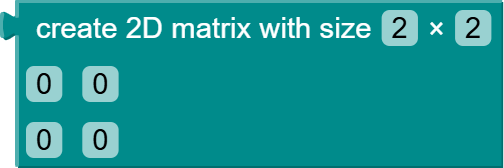
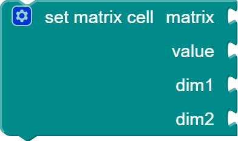

* [create matrix](#creatematrix)
* [get matrix row](#getrow)
* [get matrix column](#getcolumn)
* [get matrix cell](#getcell)
* [set matrix cell](#setcell)
* [matrix inverse](#inverse)
* [matrix transpose](#transpose)
* [matrix +](#matrixadd)
* [matrix -](#matrixsubtract)
* [matrix *](#matrixmultiply)
* [matrix ^](#matrixpower)

### create a matrix {#creatematrix}

Creates a matrix initialized with 2x2 dimensions and cell values of 0. Size and cell values can be mutated.

### get matrix row {#getrow}

Returns the row of the given row index in the given matrix.

### get matrix column {#getcolumn}

Returns the column of the given column index in the given matrix.

### get matrix cell {#getcell}

Returns the cell value at the given row and column indices in the given matrix.

### set matrix cell {#setcell}

Changes the cell value at the given row and column indices in the given matrix. The previous cell value at that position is removed. 

### matrix inverse {#inverse}

Returns the inverse of the given matrix.

### matrix transpose {#transpose}

Returns the transpose of the given matrix.

### matrix + {#matrixadd}

Returns the result of adding two matrices together. The two matrices must have equal dimensions.

### matrix - {#matrixsubtract}

Returns the result of subtracting one matrix from another matrix. The two matrices must have equal dimensions.

### matrix * {#matrixmultiply}

Returns the result of multipling either two matrices together or a matrix with a scalar. In the case of two matrices, they must have matching inner dimensions (e.g. the column of the first matrix must equal the row of the second matrix).

### matrix ^ {#matrixpower}

Returns the result of raising a matrix to the power of a scalar. The matrix must be a square matrix and the scalar must be nonnegative.