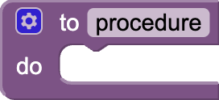
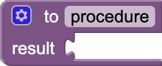

A procedure is a sequence of blocks or code that is stored under a name, the name of your procedure block. Instead of having to keep putting together the same long sequence of blocks, you can create a procedure and just call the procedure block whenever you want your sequence of blocks to run. In computer science, a procedure also might be called a function or a method.

* [procedure do](#do)
* [procedure result](#return)

### procedure do   {#do}

Collects a sequence of blocks together into a group. You can then use the sequence of blocks repeatedly by calling the procedure. If the procedure has arguments, you specify the arguments by using the block's mutator button. If you click the blue plus sign, you can drag additional arguments into the procedure.

When you create a new procedure block, App Inventor chooses a unique name automatically. Click on the name and type to change it. Procedure names in an app must be unique. App Inventor will not let you define two procedures on the same screen with the same name. You can rename a procedure at any time while you are building the app, by changing the label in the block. App Inventor will automatically rename the associated call blocks to match.

Java kewords cannot be used as procedure names. [Here](https://en.wikipedia.org/wiki/List_of_Java_keywords) is a list of keywords.

When you create a procedure, App Inventor automatically generates a call block and places it in the Procedures drawer. You use the call block to invoke the procedure.

### procedure result   {#return}

Same as a [procedure do](#do) block, but calling this procedure returns a result.

After creating this procedure, a call block that needs to be plugged in will be created. This is because the result from executing this procedure will be returned in that call block and the value will be passed on to whatever block is connected to the plug.
