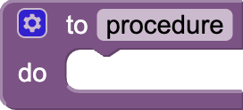
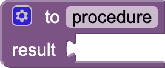
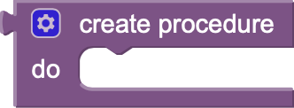
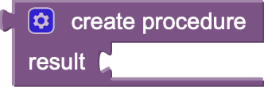
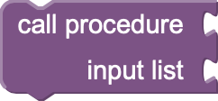

A procedure is a sequence of blocks or code that is stored under a name, the name of your procedure block. Instead of having to keep putting together the same long sequence of blocks, you can create a procedure and just call the procedure block whenever you want your sequence of blocks to run. In computer science, a procedure also might be called a function or a method.

App Inventor also supports **higher-order procedures**, meaning procedures can take other procedures as inputs and/or return them as values. Procedures can be created without naming them (anonymous procedures), assigned to variables, and called dynamically.

* [procedure do](#do)
* [procedure result](#return)
* [create procedure do](#create-do)
* [create procedure result](#create-result)
* [call procedure](#call-procedure)
* [call procedure with input list](#call-procedure-list)
* [number of inputs procedure](#number-of-inputs)
* [get procedure (name)](#get-procedure-name)
* [get procedure (dropdown)](#get-procedure-dropdown)

### procedure do   {#do}

Collects a sequence of blocks together into a group. You can then use the sequence of blocks repeatedly by calling the procedure. If the procedure has arguments, you specify the arguments by using the block's mutator button. If you click the blue plus sign, you can drag additional arguments into the procedure.

When you create a new procedure block, App Inventor chooses a unique name automatically. Click on the name and type to change it. Procedure names in an app must be unique. App Inventor will not let you define two procedures on the same screen with the same name. You can rename a procedure at any time while you are building the app, by changing the label in the block. App Inventor will automatically rename the associated call blocks to match.

Java keywords cannot be used as procedure names. [Here](https://en.wikipedia.org/wiki/List_of_Java_keywords) is a list of keywords.

When you create a procedure, App Inventor automatically generates a call block and places it in the Procedures drawer. You use the call block to invoke the procedure.

### procedure result   {#return}

Same as a [procedure do](#do) block, but calling this procedure returns a result.

After creating this procedure, a call block that needs to be plugged in will be created. This is because the result from executing this procedure will be returned in that call block and the value will be passed on to whatever block is connected to the plug.

---

### create procedure do   {#create-do}

This block creates an anonymous (unnamed) procedure that performs a sequence of actions (statements) but does not return a value. Because it does not have a name, it is typically assigned to a variable or passed directly into another block that expects a procedure as an input.

### create procedure result   {#create-result}

This block creates an anonymous procedure that evaluates an expression and returns a result. It is useful for defining calculations or logic on the fly (e.g., computing a 25% discount on a price) that can be passed as an argument or saved to a variable.

### call procedure   {#call-procedure}

  

Executes a procedure object dynamically. Instead of selecting a fixed procedure name from a dropdown, you plug the procedure object (such as a variable containing a procedure) into the block and provide any necessary arguments. This block comes in two versions: a statement block (for procedures that do not return a value) and a value block (for procedures that return a result).

### call procedure with input list   {#call-procedure-list}

  

Executes a procedure object by passing all of its arguments together as a single App Inventor List. This is extremely useful when the arguments are constructed dynamically at runtime, rather than being hardcoded into individual sockets. Like the standard call block, this is available in both statement and value versions.

### number of inputs procedure   {#number-of-inputs}

Takes a procedure object as an input and returns the number of arguments (parameters) that the procedure requires in order to run.

### get procedure (name)   {#get-procedure-name}

Retrieves a procedure object based on its string name. This allows you to dynamically look up and call named procedures using text blocks or variables.

### get procedure (dropdown)   {#get-procedure-dropdown}

Provides a static dropdown menu of all named procedures currently defined in the project. It returns the selected procedure object so it can be passed to other blocks or assigned to a variable.