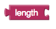
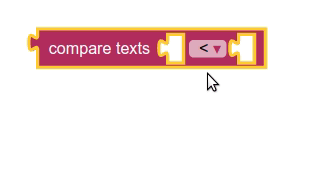
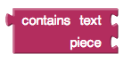
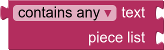
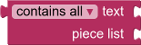
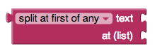
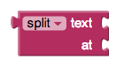
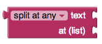
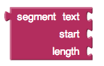
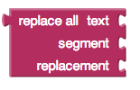

* [string](#string)
* [join](#join)
* [length](#length)
* [is empty](#isempty)
* [compare texts](#compare)
* [trim](#trim)
* [upcase](#upcase)
* [downcase](#downcase)
* [starts at](#startsat)
* [contains](#contains)
* [contains any](#containsany)
* [contains all](#containsall)
* [split at first](#splitatfirst)
* [split at first of any](#splitatfirstofany)
* [split](#split)
* [split at any](#splitatany)
* [split at spaces](#splitatspaces)
* [segment](#segment)
* [replace all](#replaceall)
* [obfuscated text](#obfuscatetext)
* [is a string?](#isstring)
* [reverse](#reverse)
* [replace all mappings](#replaceallmappings)

### " " (string block)   {#string}

Contains a text string.

This string can contain any characters (letters, numbers, or other special characters). On App Inventor it will be considered a Text object.

### join   {#join}

Appends all of the inputs to make a single string. If no inputs, returns an empty string.

### length   {#length}

Returns the number of characters including spaces in the string. This is the length of the given text string.

### is empty   {#isempty}

Returns whether or not the string contains any characters (including spaces). When the string length is 0, returns true otherwise it returns false.

### compare texts < > = ≠ {#compare}

Returns whether or not the first string is lexicographically <, >, =, or ≠ the second string depending on which dropdown is selected.

A string a considered lexicographically greater than another if it is alphabetically greater than the other string. Essentially, it would come after it in the dictionary. All uppercase letters are considered smaller or to occur before lowercase letters. cat would be > Cat.

### trim   {#trim}

Removes any spaces leading or trailing the input string and returns the result.

### upcase   {#upcase}

Returns a copy of its text string argument converted to all upper case.

### downcase   {#downcase}

Returns a copy of its text string argument converted to all lower case.

### starts at   {#startsat}

Returns the character position where the first character of *piece* first appears in text, or 0 if not present. For example, the location of *ana* in *havana banana* is 4.

### contains   {#contains}

Returns true if *piece* appears in text; otherwise, returns false.

### contains any   {#containsany}

Returns true if any of the pieces in the piece list appear in text; otherwise, returns false.

This block can be obtained by changing the dropdown on the contains block.

### contains all   {#containsall}

Returns true if all of the pieces in the piece list appear in text; otherwise, returns false.

This block can be obtained by changing the dropdown on the contains block.

### split at first   {#splitatfirst}

Divides the given text into two pieces using the location of the first occurrence of at as the dividing point, and returns a two-item list consisting of the piece before the dividing point and the piece after the dividing point. Splitting *apple,banana,cherry,dogfood* with a comma as the splitting point returns a list of two items: the first is the text *apple* and the second is the text *banana,cherry,dogfood*. Notice that the comma after apple doesn't appear in the result, because that is the dividing point.

### split at first of any   {#splitatfirstofany}

Divides the given text into a two-item list, using the first location of any item in the list at as the dividing point.

Splitting *i love apples bananas apples grapes* by the list *[ba,ap]* would result in a list of two items the first being *i love* and the second *ples bananas apples grapes*.

### split   {#split}

Divides text into pieces using at as the dividing points and produces a list of the results. Splitting *one,two,three,four* at *,* (comma) returns the list *(one two three four)*. Splitting *one-potato,two-potato,three-potato,four* at *-potato,* returns the list *(one two three four)*.

### split at any   {#splitatany}

Divides the given text into a list, using any of the items in at as the dividing point, and returns a list of the results.

Splitting *appleberry,banana,cherry,dogfood* with at as the two-element list whose first item is a comma and whose second item is *rry* returns a list of four items: *(applebe banana che dogfood)*.

### split at spaces   {#splitatspaces}

Divides the given text at any occurrence of a space, producing a list of the pieces.

### segment   {#segment}

Extracts part of the text starting at start position and continuing for length characters.

### replace all   {#replaceall}

Returns a new text string obtained by replacing all occurrences of the substring with the replacement.

Replace all with *She loves eating. She loves writing. She loves coding* as the text, *She* as the segment, and *Hannah* as the replacement would result in *Hannah loves eating. Hannah loves writing. Hannah loves coding*.

Note:
Regular expressions (regex) are patterns used for matching character combinations in strings. When using the "replace all" block, it's essential to be aware of special characters in regular expressions.Special characters like $, *, ., etc., have special meanings in regular expressions.
If you want to use these characters as literal characters in your pattern, you need to escape them with a backslash (\\). 

Example:
replace all with *Price: $50.00* as the text,  *\$* as the segment, *€* as the replacement
this would result in *Price: €50.00*

### obfuscated text   {#obfuscatetext}

Produces text, like a text block.  The difference is that th etext is not easily discoverable by examining the app's contents.  Use this when creating apps to distribute that include confidential information, for example, API keys.

*Warning: This provides only very low security against expert adversaries.*

### is a string?   {#isstring}

Returns true if *thing* is a text object, otherwise false.

### reverse   {#reverse}

Reverse the given text. For example, "reverse" would become "esrever".

### replace all mappings {#replaceallmappings}

Given a dictionary of mappings as input, replaces the key entries in the text with the corresponding values in the dictionary.
Returns the text with the mappings applied.

#### dictionary order {#replaceallmappingsdictionary}

If the dictionary order is specified, in the case of one key entry being a substring of another key entry, the first one to be replaced
is based on the entry order in the dictionary (the earliest one gets replaced first).

#### longest string first order {#replaceallmappingslongeststring}

If the longest string order is specified, in the case of one key entry being a substring of another key entry, the first one to be replaced
is the one which is longer.
