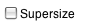
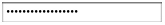
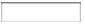

[&laquo; Back to index](index.html)
# User Interface

Table of Contents:

* [Button](#Button)
* [CheckBox](#CheckBox)
* [CircularProgress](#CircularProgress)
* [DatePicker](#DatePicker)
* [Image](#Image)
* [Label](#Label)
* [LinearProgress](#LinearProgress)
* [ListPicker](#ListPicker)
* [ListView](#ListView)
* [Notifier](#Notifier)
* [PasswordTextBox](#PasswordTextBox)
* [Screen](#Screen)
* [Slider](#Slider)
* [Spinner](#Spinner)
* [Switch](#Switch)
* [TextBox](#TextBox)
* [TimePicker](#TimePicker)
* [WebViewer](#WebViewer)

## Button  {#Button}

Button with the ability to detect clicks. Many aspects of its appearance can be changed, as well
 as whether it is clickable (`Enabled`). Its properties can be changed in the Designer or in the
 Blocks Editor.


### Properties  {#Button-Properties}

{:.properties}

{:id="Button.BackgroundColor" .color} *BackgroundColor*
: Specifies the `Button`'s background color as an alpha-red-green-blue
 integer.  If an [`Image`](#Button.Image) has been set, the color
 change will not be visible until the [`Image`](#Button.Image) is removed.

{:id="Button.Enabled" .boolean} *Enabled*
: Specifies whether the `Button` should be active and clickable.

{:id="Button.FontBold" .boolean} *FontBold*
: Specifies whether the text of the `Button` should be bold.
 Some fonts do not support bold.

{:id="Button.FontItalic" .boolean} *FontItalic*
: Specifies whether the text of the `Button` should be italic.
 Some fonts do not support italic.

{:id="Button.FontSize" .number} *FontSize*
: Specifies the text font size of the `Button`, measured in sp(scale-independent pixels).

{:id="Button.FontTypeface" .text .do} *FontTypeface*
: Specifies the text font face of the `Button` as default, serif, sans
 serif, monospace, or custom font typeface. To add a custom typeface,
 upload a .ttf file to the project's media.

{:id="Button.Height" .number .bo} *Height*
: Specifies the `Button`'s vertical height, measured in pixels.

{:id="Button.HeightPercent" .number .wo .bo} *HeightPercent*
: Specifies the `Button`'s vertical height as a percentage
 of the [`Screen`'s `Height`](userinterface.html#Screen.Height).

{:id="Button.Image" .text} *Image*
: Specifies the path of the `Button`'s image. If there is both an `Image` and a
 [`BackgroundColor`](#Button.BackgroundColor) specified, only the `Image` will be visible.

{:id="Button.Left" .number} *Left*
: Specifies the position of the Left edge of the component relative to an
 AbsoluteArrangement.

{:id="Button.Shape" .number .do} *Shape*
: Specifies the shape of the `Button`. The valid values for this property are `0` (default),
 `1` (rounded), `2` (rectangle), and `3` (oval). The `Shape` will not be visible if an
 [`Image`](#Button.Image) is used.

{:id="Button.ShowFeedback" .boolean} *ShowFeedback*
: Specifies if a visual feedback should be shown when a `Button` with an assigned
 [`Image`](#Button.Image) is pressed.

{:id="Button.Text" .text} *Text*
: Specifies the text displayed by the `Button`.

{:id="Button.TextAlignment" .number .do} *TextAlignment*
: Specifies the alignment of the `Button`'s text. Valid values are:
 `0` (normal; e.g., left-justified if text is written left to right),
 `1` (center), or
 `2` (opposite; e.g., right-justified if text is written left to right).

{:id="Button.TextColor" .color} *TextColor*
: Specifies the text color of the `Button` as an alpha-red-green-blue
 integer.

{:id="Button.Top" .number} *Top*
: Specifies the position of the Top edge of the component relative to an
 AbsoluteArrangement.

{:id="Button.Visible" .boolean} *Visible*
: Specifies whether the `Button` should be visible on the screen.  Value is `true`{:.logic.block}
 if the `Button` is showing and `false`{:.logic.block} if hidden.

{:id="Button.Width" .number .bo} *Width*
: Specifies the horizontal width of the `Button`, measured in pixels.

{:id="Button.WidthPercent" .number .wo .bo} *WidthPercent*
: Specifies the horizontal width of the `Button` as a percentage
 of the [`Screen`'s `Width`](userinterface.html#Screen.Width).

### Events  {#Button-Events}

{:.events}

{:id="Button.Click"} Click()
: Indicates that the user tapped and released the `Button`.

{:id="Button.GotFocus"} GotFocus()
: Indicates the cursor moved over the `Button` so it is now possible
 to click it.

{:id="Button.LongClick"} LongClick()
: Indicates that the user held the `Button` down.

{:id="Button.LostFocus"} LostFocus()
: Indicates the cursor moved away from the `Button` so it is now no
 longer possible to click it.

{:id="Button.TouchDown"} TouchDown()
: Indicates that the `Button` was pressed down.

{:id="Button.TouchUp"} TouchUp()
: Indicates that the `Button` has been released.

### Methods  {#Button-Methods}

{:.methods}
None


## CheckBox  {#CheckBox}



 `CheckBox` components can detect user taps and can change their boolean state in response.

 A `CheckBox` component raises an event when the user taps it. There are many properties affecting
 its appearance that can be set in the Designer or Blocks Editor.


### Properties  {#CheckBox-Properties}

{:.properties}

{:id="CheckBox.BackgroundColor" .color} *BackgroundColor*
: Specifies the background color of the `CheckBox` as an alpha-red-green-blue
 integer.

{:id="CheckBox.Checked" .boolean} *Checked*
: Set to `true`{:.logic.block} if the box is checked, `false`{:.logic.block} otherwise.

{:id="CheckBox.Enabled" .boolean} *Enabled*
: Specifies whether the `CheckBox` should be active and clickable.

{:id="CheckBox.FontBold" .boolean .do} *FontBold*
: Specifies whether the text of the `CheckBox` should be bold.
 Some fonts do not support bold.

{:id="CheckBox.FontItalic" .boolean .do} *FontItalic*
: Specifies whether the text of the `CheckBox` should be italic.
 Some fonts do not support italic.

{:id="CheckBox.FontSize" .number} *FontSize*
: Specifies the text font size of the `CheckBox`, measured in sp(scale-independent pixels).

{:id="CheckBox.FontTypeface" .text .do} *FontTypeface*
: Specifies the text font face of the `CheckBox` as default, serif, sans
 serif, or monospace.

{:id="CheckBox.Height" .number .bo} *Height*
: Specifies the `CheckBox`'s vertical height, measured in pixels.

{:id="CheckBox.HeightPercent" .number .wo .bo} *HeightPercent*
: Specifies the `CheckBox`'s vertical height as a percentage
 of the [`Screen`'s `Height`](userinterface.html#Screen.Height).

{:id="CheckBox.Left" .number} *Left*
: Specifies the position of the Left edge of the component relative to an
 AbsoluteArrangement.

{:id="CheckBox.Text" .text} *Text*
: Specifies the text displayed by the `CheckBox`.

{:id="CheckBox.TextColor" .color} *TextColor*
: Specifies the text color of the `CheckBox` as an alpha-red-green-blue
 integer.

{:id="CheckBox.Top" .number} *Top*
: Specifies the position of the Top edge of the component relative to an
 AbsoluteArrangement.

{:id="CheckBox.Visible" .boolean} *Visible*
: Specifies whether the `CheckBox` should be visible on the screen.  Value is `true`{:.logic.block}
 if the `CheckBox` is showing and `false`{:.logic.block} if hidden.

{:id="CheckBox.Width" .number .bo} *Width*
: Specifies the horizontal width of the `CheckBox`, measured in pixels.

{:id="CheckBox.WidthPercent" .number .wo .bo} *WidthPercent*
: Specifies the horizontal width of the `CheckBox` as a percentage
 of the [`Screen`'s `Width`](userinterface.html#Screen.Width).

### Events  {#CheckBox-Events}

{:.events}

{:id="CheckBox.Changed"} Changed()
: User tapped and released the `CheckBox`.

{:id="CheckBox.GotFocus"} GotFocus()
: `CheckBox` became the focused component.

{:id="CheckBox.LostFocus"} LostFocus()
: `CheckBox` stopped being the focused component.

### Methods  {#CheckBox-Methods}

{:.methods}
None


## CircularProgress  {#CircularProgress}

Component for CircularProgress


### Properties  {#CircularProgress-Properties}

{:.properties}

{:id="CircularProgress.Color" .color} *Color*
: Change the indeterminate color of the circular progress bar.

{:id="CircularProgress.Height" .number .bo} *Height*
: Specifies the `CircularProgress`'s vertical height, measured in pixels.

{:id="CircularProgress.HeightPercent" .number .wo .bo} *HeightPercent*
: Specifies the `CircularProgress`'s vertical height as a percentage
 of the [`Screen`'s `Height`](userinterface.html#Screen.Height).

{:id="CircularProgress.Left" .number} *Left*
: Specifies the position of the Left edge of the component relative to an
 AbsoluteArrangement.

{:id="CircularProgress.Top" .number} *Top*
: Specifies the position of the Top edge of the component relative to an
 AbsoluteArrangement.

{:id="CircularProgress.Visible" .boolean} *Visible*
: Specifies whether the `CircularProgress` should be visible on the screen.  Value is `true`{:.logic.block}
 if the `CircularProgress` is showing and `false`{:.logic.block} if hidden.

{:id="CircularProgress.Width" .number .bo} *Width*
: Specifies the horizontal width of the `CircularProgress`, measured in pixels.

{:id="CircularProgress.WidthPercent" .number .wo .bo} *WidthPercent*
: Specifies the horizontal width of the `CircularProgress` as a percentage
 of the [`Screen`'s `Width`](userinterface.html#Screen.Width).

### Events  {#CircularProgress-Events}

{:.events}
None


### Methods  {#CircularProgress-Methods}

{:.methods}
None


## DatePicker  {#DatePicker}

A button that, when clicked on, launches a popup dialog to allow the user to select a date on
 the Gregorian Calendar.

 Note: Date and time are manipulated using methods in the [Clock](sensors.html#Clock) component.


### Properties  {#DatePicker-Properties}

{:.properties}

{:id="DatePicker.BackgroundColor" .color} *BackgroundColor*
: Specifies the `DatePicker`'s background color as an alpha-red-green-blue
 integer.  If an [`Image`](#DatePicker.Image) has been set, the color
 change will not be visible until the [`Image`](#DatePicker.Image) is removed.

{:id="DatePicker.Day" .number .ro .bo} *Day*
: Returns the Day of the month that was last picked using the DatePicker.

{:id="DatePicker.Enabled" .boolean} *Enabled*
: Specifies whether the `DatePicker` should be active and clickable.

{:id="DatePicker.FontBold" .boolean} *FontBold*
: Specifies whether the text of the `DatePicker` should be bold.
 Some fonts do not support bold.

{:id="DatePicker.FontItalic" .boolean} *FontItalic*
: Specifies whether the text of the `DatePicker` should be italic.
 Some fonts do not support italic.

{:id="DatePicker.FontSize" .number} *FontSize*
: Specifies the text font size of the `DatePicker`, measured in sp(scale-independent pixels).

{:id="DatePicker.FontTypeface" .text .do} *FontTypeface*
: Specifies the text font face of the `DatePicker` as default, serif, sans
 serif, monospace, or custom font typeface. To add a custom typeface,
 upload a .ttf file to the project's media.

{:id="DatePicker.Height" .number .bo} *Height*
: Specifies the `DatePicker`'s vertical height, measured in pixels.

{:id="DatePicker.HeightPercent" .number .wo .bo} *HeightPercent*
: Specifies the `DatePicker`'s vertical height as a percentage
 of the [`Screen`'s `Height`](userinterface.html#Screen.Height).

{:id="DatePicker.Image" .text} *Image*
: Specifies the path of the `DatePicker`'s image. If there is both an `Image` and a
 [`BackgroundColor`](#DatePicker.BackgroundColor) specified, only the `Image` will be visible.

{:id="DatePicker.Instant" .InstantInTime .ro .bo} *Instant*
: Returns instant of the date that was last picked using the DatePicker.

{:id="DatePicker.Left" .number} *Left*
: Specifies the position of the Left edge of the component relative to an
 AbsoluteArrangement.

{:id="DatePicker.Month" .number .ro .bo} *Month*
: Returns the number of the Month that was last picked using the DatePicker.

{:id="DatePicker.MonthInText" .text .ro .bo} *MonthInText*
: Returns the name of the Month that was last picked using the DatePicker.

{:id="DatePicker.Shape" .number .do} *Shape*
: Specifies the shape of the `DatePicker`. The valid values for this property are `0` (default),
 `1` (rounded), `2` (rectangle), and `3` (oval). The `Shape` will not be visible if an
 [`Image`](#DatePicker.Image) is used.

{:id="DatePicker.ShowFeedback" .boolean} *ShowFeedback*
: Specifies if a visual feedback should be shown when a `DatePicker` with an assigned
 [`Image`](#DatePicker.Image) is pressed.

{:id="DatePicker.Text" .text} *Text*
: Specifies the text displayed by the `DatePicker`.

{:id="DatePicker.TextAlignment" .number .do} *TextAlignment*
: Specifies the alignment of the `DatePicker`'s text. Valid values are:
 `0` (normal; e.g., left-justified if text is written left to right),
 `1` (center), or
 `2` (opposite; e.g., right-justified if text is written left to right).

{:id="DatePicker.TextColor" .color} *TextColor*
: Specifies the text color of the `DatePicker` as an alpha-red-green-blue
 integer.

{:id="DatePicker.Top" .number} *Top*
: Specifies the position of the Top edge of the component relative to an
 AbsoluteArrangement.

{:id="DatePicker.Visible" .boolean} *Visible*
: Specifies whether the `DatePicker` should be visible on the screen.  Value is `true`{:.logic.block}
 if the `DatePicker` is showing and `false`{:.logic.block} if hidden.

{:id="DatePicker.Width" .number .bo} *Width*
: Specifies the horizontal width of the `DatePicker`, measured in pixels.

{:id="DatePicker.WidthPercent" .number .wo .bo} *WidthPercent*
: Specifies the horizontal width of the `DatePicker` as a percentage
 of the [`Screen`'s `Width`](userinterface.html#Screen.Width).

{:id="DatePicker.Year" .number .ro .bo} *Year*
: Returns the Year that was last picked using the DatePicker.

### Events  {#DatePicker-Events}

{:.events}

{:id="DatePicker.AfterDateSet"} AfterDateSet()
: Event that runs after the user chooses a Date in the dialog.

{:id="DatePicker.GotFocus"} GotFocus()
: Indicates the cursor moved over the `DatePicker` so it is now possible
 to click it.

{:id="DatePicker.LostFocus"} LostFocus()
: Indicates the cursor moved away from the `DatePicker` so it is now no
 longer possible to click it.

{:id="DatePicker.TouchDown"} TouchDown()
: Indicates that the `DatePicker` was pressed down.

{:id="DatePicker.TouchUp"} TouchUp()
: Indicates that the `DatePicker` has been released.

### Methods  {#DatePicker-Methods}

{:.methods}

{:id="DatePicker.LaunchPicker" class="method"} <i/> LaunchPicker()
: Launches the DatePicker dialog. The [`AfterDateSet`](#DatePicker.AfterDateSet) event will be run after the user
 confirms their selection.

{:id="DatePicker.SetDateToDisplay" class="method"} <i/> SetDateToDisplay(*year*{:.number},*month*{:.number},*day*{:.number})
: Allows the user to set the date to be displayed when the date picker opens.
Valid values for the month field are 1-12 and 1-31 for the day field.

{:id="DatePicker.SetDateToDisplayFromInstant" class="method"} <i/> SetDateToDisplayFromInstant(*instant*{:.InstantInTime})
: Allows the user to set the date from the instant to be displayed when the date picker opens.

## Image  {#Image}

Component for displaying images and basic animations.

 The picture to display, and other aspects of the Image's appearance, can be specified in the
 Designer or in the Blocks Editor.


### Properties  {#Image-Properties}

{:.properties}

{:id="Image.AlternateText" .text .wo} *AlternateText*
: A written description of what the image looks like.

{:id="Image.Animation" .text .wo .bo} *Animation*
: This is a limited form of animation that can attach a small number of motion types to images.
 The allowable motions are `ScrollRightSlow`, `ScrollRight`, `ScrollRightFast`,
 `ScrollLeftSlow`, `ScrollLeft`, `ScrollLeftFast`, and `Stop`.

{:id="Image.Clickable" .boolean} *Clickable*
: Specifies whether the image should be clickable or not.

{:id="Image.Height" .number .bo} *Height*
: Specifies the `Image`'s vertical height, measured in pixels.

{:id="Image.HeightPercent" .number .wo .bo} *HeightPercent*
: Specifies the `Image`'s vertical height as a percentage
 of the [`Screen`'s `Height`](userinterface.html#Screen.Height).

{:id="Image.Left" .number} *Left*
: Specifies the position of the Left edge of the component relative to an
 AbsoluteArrangement.

{:id="Image.Picture" .text} *Picture*
: Specifies the path of the `Image`'s `Picture`.

{:id="Image.RotationAngle" .number} *RotationAngle*
: The angle at which the image picture appears rotated. This rotation does not appear on the designer screen, only on the device.

{:id="Image.ScalePictureToFit" .boolean .wo} *ScalePictureToFit*
: Specifies whether the image should be resized to match the size of the ImageView.

{:id="Image.Scaling" .number .bo} *Scaling*
: This property determines how the picture scales according to the Height or Width of the Image. Scale proportionally (0) preserves the picture aspect ratio. Scale to fit (1) matches the Image area, even if the aspect ratio changes.

{:id="Image.Top" .number} *Top*
: Specifies the position of the Top edge of the component relative to an
 AbsoluteArrangement.

{:id="Image.Visible" .boolean} *Visible*
: Specifies whether the `Image` should be visible on the screen.  Value is `true`{:.logic.block}
 if the `Image` is showing and `false`{:.logic.block} if hidden.

{:id="Image.Width" .number .bo} *Width*
: Specifies the horizontal width of the `Image`, measured in pixels.

{:id="Image.WidthPercent" .number .wo .bo} *WidthPercent*
: Specifies the horizontal width of the `Image` as a percentage
 of the [`Screen`'s `Width`](userinterface.html#Screen.Width).

### Events  {#Image-Events}

{:.events}

{:id="Image.Click"} Click()
: An event that occurs when an image is clicked.

### Methods  {#Image-Methods}

{:.methods}
None


## Label  {#Label}

Labels are components used to show text.

 

 A label displays text which is specified by the `Text` property. Other properties, all of which
 can be set in the Designer or Blocks Editor, control the appearance and placement of the text.


### Properties  {#Label-Properties}

{:.properties}

{:id="Label.BackgroundColor" .color} *BackgroundColor*
: Specifies the label's background color as an alpha-red-green-blue
 integer.

{:id="Label.FontBold" .boolean .do} *FontBold*
: Specifies whether the label's text should be bold.
 Some fonts do not support bold.

{:id="Label.FontItalic" .boolean .do} *FontItalic*
: Specifies whether the label's text should be italic.
 Some fonts do not support italic.

{:id="Label.FontSize" .number} *FontSize*
: Specifies the label's text's font size, measured in sp(scale-independent pixels).

{:id="Label.FontTypeface" .text .do} *FontTypeface*
: Specifies the label's text's font face as default, serif, sans
 serif, or monospace.

{:id="Label.HTMLContent" .text .ro .bo} *HTMLContent*
: Returns the content of the Label as HTML. This is only useful if the
 HTMLFormat property is true.

{:id="Label.HTMLFormat" .boolean .do} *HTMLFormat*
: Specifies the label's text's format

{:id="Label.HasMargins" .boolean} *HasMargins*
: Specifies whether the label should have margins.
 This margin value is not well coordinated with the
 designer, where the margins are defined for the arrangement, not just for individual
 labels.

{:id="Label.Height" .number .bo} *Height*
: Specifies the `Label`'s vertical height, measured in pixels.

{:id="Label.HeightPercent" .number .wo .bo} *HeightPercent*
: Specifies the `Label`'s vertical height as a percentage
 of the [`Screen`'s `Height`](userinterface.html#Screen.Height).

{:id="Label.Left" .number} *Left*
: Specifies the position of the Left edge of the component relative to an
 AbsoluteArrangement.

{:id="Label.Text" .text} *Text*
: Specifies the text displayed by the label.

{:id="Label.TextAlignment" .number .do} *TextAlignment*
: Specifies the alignment of the label's text: center, normal
 (e.g., left-justified if text is written left to right), or
 opposite (e.g., right-justified if text is written left to right).

{:id="Label.TextColor" .color} *TextColor*
: Specifies the label's text color as an alpha-red-green-blue
 integer.

{:id="Label.Top" .number} *Top*
: Specifies the position of the Top edge of the component relative to an
 AbsoluteArrangement.

{:id="Label.Visible" .boolean} *Visible*
: Specifies whether the `Label` should be visible on the screen.  Value is `true`{:.logic.block}
 if the `Label` is showing and `false`{:.logic.block} if hidden.

{:id="Label.Width" .number .bo} *Width*
: Specifies the horizontal width of the `Label`, measured in pixels.

{:id="Label.WidthPercent" .number .wo .bo} *WidthPercent*
: Specifies the horizontal width of the `Label` as a percentage
 of the [`Screen`'s `Width`](userinterface.html#Screen.Width).

### Events  {#Label-Events}

{:.events}
None


### Methods  {#Label-Methods}

{:.methods}
None


## LinearProgress  {#LinearProgress}

Component for LinearProgress


### Properties  {#LinearProgress-Properties}

{:.properties}

{:id="LinearProgress.Indeterminate" .boolean} *Indeterminate*
: Indicate whether this progress bar is in indeterminate mode.

{:id="LinearProgress.IndeterminateColor" .color} *IndeterminateColor*
: Change the indeterminate color of the progress bar.

{:id="LinearProgress.Left" .number} *Left*
: Specifies the position of the Left edge of the component relative to an
 AbsoluteArrangement.

{:id="LinearProgress.Maximum" .number} *Maximum*
: Set the upper range of the progress bar max.

{:id="LinearProgress.Minimum" .number} *Minimum*
: Set the lower range of the progress bar to min. This function works only for devices with API >= 26

{:id="LinearProgress.Progress" .number .bo} *Progress*
: Get the progress bar's current level of progress.

{:id="LinearProgress.ProgressColor" .color} *ProgressColor*
: Change the progress color of the progress bar.

{:id="LinearProgress.Top" .number} *Top*
: Specifies the position of the Top edge of the component relative to an
 AbsoluteArrangement.

{:id="LinearProgress.Visible" .boolean} *Visible*
: Specifies whether the `LinearProgress` should be visible on the screen.  Value is `true`{:.logic.block}
 if the `LinearProgress` is showing and `false`{:.logic.block} if hidden.

{:id="LinearProgress.Width" .number .bo} *Width*
: Specifies the horizontal width of the `LinearProgress`, measured in pixels.

{:id="LinearProgress.WidthPercent" .number .wo .bo} *WidthPercent*
: Specifies the horizontal width of the `LinearProgress` as a percentage
 of the [`Screen`'s `Width`](userinterface.html#Screen.Width).

### Events  {#LinearProgress-Events}

{:.events}

{:id="LinearProgress.ProgressChanged"} ProgressChanged(*progress*{:.number})
: Event that indicates that the progress of the progress bar has been changed. Returns the current progress value. If "Indeterminate" is set to true, then it returns "0".

### Methods  {#LinearProgress-Methods}

{:.methods}

{:id="LinearProgress.IncrementProgressBy" class="method"} <i/> IncrementProgressBy(*value*{:.number})
: Increase the progress bar's progress by the specified amount.

## ListPicker  {#ListPicker}

A button that, when clicked on, displays a list of texts for the user to choose among. The texts
 can be specified through the Designer or Blocks Editor by setting the
 [`ElementsFromString`](#ListPicker.ElementsFromString)  property to their string-separated concatenation
 (for example, `choice 1, choice 2, choice 3`) or by setting the [`Elements`](#ListPicker.Elements)
 property to a List in the Blocks editor.

 Setting property [`ShowFilterBar`](#ListPicker.ShowFilterBar) to `true`{:.logic.block}, will make the list
 searchable. Other properties affect the appearance of the button ([`TextAlignment`](#ListPicker.TextAlignment),
 [`BackgroundColor`](#ListPicker.BackgroundColor), etc.) and whether it can be clicked on
 ([`Enabled`](#ListPicker.Enabled)).


### Properties  {#ListPicker-Properties}

{:.properties}

{:id="ListPicker.BackgroundColor" .color} *BackgroundColor*
: Specifies the `ListPicker`'s background color as an alpha-red-green-blue
 integer.  If an [`Image`](#ListPicker.Image) has been set, the color
 change will not be visible until the [`Image`](#ListPicker.Image) is removed.

{:id="ListPicker.Elements" .list .bo} *Elements*
: Specifies the list of choices to display.

{:id="ListPicker.ElementsFromString" .text .wo} *ElementsFromString*
: Set the list of choices from a string of comma-separated values.

{:id="ListPicker.Enabled" .boolean} *Enabled*
: Specifies whether the `ListPicker` should be active and clickable.

{:id="ListPicker.FontBold" .boolean} *FontBold*
: Specifies whether the text of the `ListPicker` should be bold.
 Some fonts do not support bold.

{:id="ListPicker.FontItalic" .boolean} *FontItalic*
: Specifies whether the text of the `ListPicker` should be italic.
 Some fonts do not support italic.

{:id="ListPicker.FontSize" .number} *FontSize*
: Specifies the text font size of the `ListPicker`, measured in sp(scale-independent pixels).

{:id="ListPicker.FontTypeface" .text .do} *FontTypeface*
: Specifies the text font face of the `ListPicker` as default, serif, sans
 serif, monospace, or custom font typeface. To add a custom typeface,
 upload a .ttf file to the project's media.

{:id="ListPicker.Height" .number .bo} *Height*
: Specifies the `ListPicker`'s vertical height, measured in pixels.

{:id="ListPicker.HeightPercent" .number .wo .bo} *HeightPercent*
: Specifies the `ListPicker`'s vertical height as a percentage
 of the [`Screen`'s `Height`](userinterface.html#Screen.Height).

{:id="ListPicker.Image" .text} *Image*
: Specifies the path of the `ListPicker`'s image. If there is both an `Image` and a
 [`BackgroundColor`](#ListPicker.BackgroundColor) specified, only the `Image` will be visible.

{:id="ListPicker.ItemBackgroundColor" .color} *ItemBackgroundColor*
: The background color of the `ListPicker` items.

{:id="ListPicker.ItemTextColor" .color} *ItemTextColor*
: The text color of the ListPicker items.

{:id="ListPicker.Left" .number} *Left*
: Specifies the position of the Left edge of the component relative to an
 AbsoluteArrangement.

{:id="ListPicker.Selection" .text} *Selection*
: The selected item. When directly changed by the programmer, the [`SelectionIndex`](#ListPicker.SelectionIndex)
 property is also changed to the first item in the [`ListPicker`](#ListPicker) with the given value.
 If the value is not in [`Elements`](#ListPicker.Elements), [`SelectionIndex`](#ListPicker.SelectionIndex) will be set to 0.

{:id="ListPicker.SelectionIndex" .number .bo} *SelectionIndex*
: Selection index property setter method.

{:id="ListPicker.Shape" .number .do} *Shape*
: Specifies the shape of the `ListPicker`. The valid values for this property are `0` (default),
 `1` (rounded), `2` (rectangle), and `3` (oval). The `Shape` will not be visible if an
 [`Image`](#ListPicker.Image) is used.

{:id="ListPicker.ShowFeedback" .boolean} *ShowFeedback*
: Specifies if a visual feedback should be shown when a `ListPicker` with an assigned
 [`Image`](#ListPicker.Image) is pressed.

{:id="ListPicker.ShowFilterBar" .boolean} *ShowFilterBar*
: If `true`{:.logic.block}, the ListPicker will show a search filter bar.

{:id="ListPicker.Text" .text} *Text*
: Specifies the text displayed by the `ListPicker`.

{:id="ListPicker.TextAlignment" .number .do} *TextAlignment*
: Specifies the alignment of the `ListPicker`'s text. Valid values are:
 `0` (normal; e.g., left-justified if text is written left to right),
 `1` (center), or
 `2` (opposite; e.g., right-justified if text is written left to right).

{:id="ListPicker.TextColor" .color} *TextColor*
: Specifies the text color of the `ListPicker` as an alpha-red-green-blue
 integer.

{:id="ListPicker.Title" .text} *Title*
: Optional title displayed at the top of the list of choices.

{:id="ListPicker.Top" .number} *Top*
: Specifies the position of the Top edge of the component relative to an
 AbsoluteArrangement.

{:id="ListPicker.Visible" .boolean} *Visible*
: Specifies whether the `ListPicker` should be visible on the screen.  Value is `true`{:.logic.block}
 if the `ListPicker` is showing and `false`{:.logic.block} if hidden.

{:id="ListPicker.Width" .number .bo} *Width*
: Specifies the horizontal width of the `ListPicker`, measured in pixels.

{:id="ListPicker.WidthPercent" .number .wo .bo} *WidthPercent*
: Specifies the horizontal width of the `ListPicker` as a percentage
 of the [`Screen`'s `Width`](userinterface.html#Screen.Width).

### Events  {#ListPicker-Events}

{:.events}

{:id="ListPicker.AfterPicking"} AfterPicking()
: Event to be raised after the `ListPicker` activity returns its
 result and the properties have been filled in.

{:id="ListPicker.BeforePicking"} BeforePicking()
: Event to raise when the `ListPicker` is clicked or the picker is shown
 using the [`Open`](#ListPicker.Open) method.  This event occurs before the picker is displayed, and
 can be used to prepare the picker before it is shown.

{:id="ListPicker.GotFocus"} GotFocus()
: Indicates the cursor moved over the `ListPicker` so it is now possible
 to click it.

{:id="ListPicker.LostFocus"} LostFocus()
: Indicates the cursor moved away from the `ListPicker` so it is now no
 longer possible to click it.

{:id="ListPicker.TouchDown"} TouchDown()
: Indicates that the `ListPicker` was pressed down.

{:id="ListPicker.TouchUp"} TouchUp()
: Indicates that the `ListPicker` has been released.

### Methods  {#ListPicker-Methods}

{:.methods}

{:id="ListPicker.Open" class="method"} <i/> Open()
: Opens the `ListPicker`, as though the user clicked on it.

## ListView  {#ListView}

This is a visible component that displays a list of text and image elements in your [`Screen`](#Screen) to
 display. Simple lists of strings may be set using the [`ElementsFromString`](#ListView.ElementsFromString) property.
 More complex lists of elements containing multiple strings and/or images can be created using the
 [`ListData`](#ListView.ListData) and [`ListViewLayout`](#ListView.ListViewLayout) properties.

 [Information on Layouts](../other/advanced-listview.html)

   Warning: This component will not work correctly on Screens that are scrollable if its
 [`Height`](#ListView.Height) is set to Fill Parent.


### Properties  {#ListView-Properties}

{:.properties}

{:id="ListView.BackgroundColor" .color} *BackgroundColor*
: The color of the `ListView` background.

{:id="ListView.BounceEdgeEffect" .boolean} *BounceEdgeEffect*
: Sets the bounce effect function. `true`{:.logic.block} will enable the function,
 `false`{:.logic.block} will disable.

{:id="ListView.DividerColor" .color} *DividerColor*
: The color of the `ListView` divider.

{:id="ListView.DividerThickness" .number} *DividerThickness*
: Specifies the divider thickness of list view.
 If the thickness is 0, the divider is not visible.

{:id="ListView.ElementColor" .color} *ElementColor*
: The color of the `ListView` element.

{:id="ListView.ElementCornerRadius" .number} *ElementCornerRadius*
: Specifies the corner radius of the list view element.

{:id="ListView.ElementMarginsWidth" .number} *ElementMarginsWidth*
: Specifies the width of the margins of a list view element.
 If margins width > 0, then the divider is not displayed.

{:id="ListView.Elements" .list .bo} *Elements*
: Specifies the list of choices to display.

{:id="ListView.ElementsFromString" .text .wo} *ElementsFromString*
: Set the list of choices specified as a string with the elements separated by commas
 such as: Cheese,Fruit,Bacon,Radish.

{:id="ListView.FontSize" .number} *FontSize*
: Specifies the font size of the element's main text.

{:id="ListView.FontSizeDetail" .number} *FontSizeDetail*
: Specifies the font size of the element's detail text.

{:id="ListView.FontTypeface" .text .do} *FontTypeface*
: Specifies the label's text's font face as default, serif, sans
 serif, or monospace.

{:id="ListView.FontTypefaceDetail" .text .do} *FontTypefaceDetail*
: Specifies the label's text's font face as default, serif, sans
 serif, or monospace.

{:id="ListView.Height" .number .bo} *Height*
: Specifies the `ListView`'s vertical height, measured in pixels.

{:id="ListView.HeightPercent" .number .wo .bo} *HeightPercent*
: Specifies the `ListView`'s vertical height as a percentage
 of the [`Screen`'s `Height`](userinterface.html#Screen.Height).

{:id="ListView.HintText" .text} *HintText*
: Sets hint on the filter bar.

{:id="ListView.ImageHeight" .number} *ImageHeight*
: Specifies the image height of ListView layouts containing images

{:id="ListView.ImageWidth" .number} *ImageWidth*
: Specifies the image width of ListView layouts containing images

{:id="ListView.Left" .number} *Left*
: Specifies the position of the Left edge of the component relative to an
 AbsoluteArrangement.

{:id="ListView.ListData" .text .do} *ListData*
: Specifies data to be displayed in the ListView elements. This property sets the
 elements specified in [`ListViewLayout`](#ListView.ListViewLayout). For example, if the chosen
 layout is `Image,MainText` this property will allow any number of elements to be
 defined, each containing a filename for Image and a string for MainText.
 Designer only property.

{:id="ListView.ListViewLayout" .number} *ListViewLayout*
: Specifies type of layout for ListView row.

{:id="ListView.Orientation" .number} *Orientation*
: Specifies the layout's orientation. This may be: `Vertical`, which displays elements
 in rows one after the other; or `Horizontal`, which displays one element at a time and
 allows the user to swipe left or right to brows the elements.

{:id="ListView.Selection" .text} *Selection*
: Returns the text in the `ListView` at the position of [`SelectionIndex`](#ListView.SelectionIndex).

{:id="ListView.SelectionColor" .color} *SelectionColor*
: The color of the item when it is selected.

{:id="ListView.SelectionDetailText" .text .ro .bo} *SelectionDetailText*
: Returns the Secondary or Detail text in the ListView at the position set by SelectionIndex

{:id="ListView.SelectionIndex" .number .bo} *SelectionIndex*
: The index of the currently selected item, starting at `1`. If no item is selected, the value
 will be `0`. If an attempt is made to set this to a number less than `1` or greater than the
 number of items in the `ListView`, `SelectionIndex` will be set to `0`, and
 [`Selection`](#ListView.Selection) will be set to the empty text.

{:id="ListView.ShowFilterBar" .boolean} *ShowFilterBar*
: Sets visibility of the filter bar. `true`{:.logic.block} will show the bar,
 `false`{:.logic.block} will hide it.

{:id="ListView.TextColor" .color} *TextColor*
: The text color of the `ListView` items.

{:id="ListView.TextColorDetail" .color} *TextColorDetail*
: Specifies the color of the secondary text in a ListView layout

{:id="ListView.Top" .number} *Top*
: Specifies the position of the Top edge of the component relative to an
 AbsoluteArrangement.

{:id="ListView.Visible" .boolean} *Visible*
: Specifies whether the `ListView` should be visible on the screen.  Value is `true`{:.logic.block}
 if the `ListView` is showing and `false`{:.logic.block} if hidden.

{:id="ListView.Width" .number .bo} *Width*
: Specifies the horizontal width of the `ListView`, measured in pixels.

{:id="ListView.WidthPercent" .number .wo .bo} *WidthPercent*
: Specifies the horizontal width of the `ListView` as a percentage
 of the [`Screen`'s `Width`](userinterface.html#Screen.Width).

### Events  {#ListView-Events}

{:.events}

{:id="ListView.AfterPicking"} AfterPicking()
: Simple event to be raised after the an element has been chosen in the list.
 The selected element is available in the [`Selection`](#ListView.Selection) property.

### Methods  {#ListView-Methods}

{:.methods}

{:id="ListView.AddItem" class="method"} <i/> AddItem(*mainText*{:.text},*detailText*{:.text},*imageName*{:.text})
: Add new Item to list

{:id="ListView.AddItemAtIndex" class="method"} <i/> AddItemAtIndex(*index*{:.number},*mainText*{:.text},*detailText*{:.text},*imageName*{:.text})
: Add new Item to list at a given index

{:id="ListView.AddItems" class="method"} <i/> AddItems(*itemsList*{:.list})
: Add new Items to list

{:id="ListView.AddItemsAtIndex" class="method"} <i/> AddItemsAtIndex(*index*{:.number},*itemsList*{:.list})
: Add new Items to list at specific index

{:id="ListView.CreateElement" class="method returns dictionary"} <i/> CreateElement(*mainText*{:.text},*detailText*{:.text},*imageName*{:.text})
: Creates a

{:id="ListView.GetDetailText" class="method returns text"} <i/> GetDetailText(*listElement*{:.dictionary})
: Get the Detail Text of a ListView element.

{:id="ListView.GetImageName" class="method returns text"} <i/> GetImageName(*listElement*{:.dictionary})
: Get the filename of the image of a ListView element that has been uploaded to Media.

{:id="ListView.GetMainText" class="method returns text"} <i/> GetMainText(*listElement*{:.dictionary})
: Get the Main Text of a ListView element.

{:id="ListView.RemoveItemAtIndex" class="method"} <i/> RemoveItemAtIndex(*index*{:.number})
: Removes Item from list at a given index

## Notifier  {#Notifier}

The Notifier component displays alert messages and creates Android log entries through
 an assortment of methods.


### Properties  {#Notifier-Properties}

{:.properties}

{:id="Notifier.BackgroundColor" .color .wo} *BackgroundColor*
: Specifies the background color for alerts (not dialogs).

{:id="Notifier.NotifierLength" .number .do} *NotifierLength*
: Specifies the length of time that the alert is shown -- either "short" or "long".

{:id="Notifier.TextColor" .color} *TextColor*
: Specifies the text color for alerts (not dialogs).

### Events  {#Notifier-Events}

{:.events}

{:id="Notifier.AfterChoosing"} AfterChoosing(*choice*{:.text})
: Event after the user has made a selection for
 [`ShowChooseDialog`](#Notifier.ShowChooseDialog).

{:id="Notifier.AfterTextInput"} AfterTextInput(*response*{:.text})
: Event raised after the user has responded to [`ShowTextDialog`](#Notifier.ShowTextDialog).

{:id="Notifier.ChoosingCanceled"} ChoosingCanceled()
: Event raised when the user cancels choosing an option.
 [`ShowChooseDialog`](#Notifier.ShowChooseDialog).

{:id="Notifier.TextInputCanceled"} TextInputCanceled()
: Event raised when the user cancels
 [`ShowPasswordDialog`](#Notifier.ShowPasswordDialog), or
 [`ShowTextDialog`](#Notifier.ShowTextDialog).

### Methods  {#Notifier-Methods}

{:.methods}

{:id="Notifier.DismissProgressDialog" class="method"} <i/> DismissProgressDialog()
: Dismisses the alert created by the ShowProgressDialog block

{:id="Notifier.LogError" class="method"} <i/> LogError(*message*{:.text})
: Writes an error message to the Android system log. See the Google Android documentation for
 how to access the log.

{:id="Notifier.LogInfo" class="method"} <i/> LogInfo(*message*{:.text})
: Writes an information message to the Android log.

{:id="Notifier.LogWarning" class="method"} <i/> LogWarning(*message*{:.text})
: Writes a warning message to the Android log. See the Google Android documentation for how to
 access the log.

{:id="Notifier.ShowAlert" class="method"} <i/> ShowAlert(*notice*{:.text})
: Display a temporary notification.

{:id="Notifier.ShowChooseDialog" class="method"} <i/> ShowChooseDialog(*message*{:.text},*title*{:.text},*button1Text*{:.text},*button2Text*{:.text},*cancelable*{:.boolean})
: Shows a dialog box with two buttons, from which the user can choose. If `cancelable` is
 `true`{:.logic.block} there will be an additional CANCEL button. Pressing a button will raise
 the [`AfterChoosing`](#Notifier.AfterChoosing) event. The "choice" parameter to
 [`AfterChoosing`](#Notifier.AfterChoosing) will be the text on the button that was pressed, or "Cancel" if
 the CANCEL button was pressed. If canceled, the [`TextInputCanceled`](#Notifier.TextInputCanceled) event will also
 run.

{:id="Notifier.ShowMessageDialog" class="method"} <i/> ShowMessageDialog(*message*{:.text},*title*{:.text},*buttonText*{:.text})
: Display an alert dialog with a single button that dismisses the alert.

{:id="Notifier.ShowPasswordDialog" class="method"} <i/> ShowPasswordDialog(*message*{:.text},*title*{:.text},*cancelable*{:.boolean})
: Shows a dialog box where the user can enter password (input is masked), after which the
 [`AfterTextInput`](#Notifier.AfterTextInput) event will be raised. If `cancelable` is `true`{:.logic.block}
 there will be an additional CANCEL button. The [`AfterTextInput`](#Notifier.AfterTextInput) and
 [`TextInputCanceled`](#Notifier.TextInputCanceled) events behave the same way as described in
 [`ShowTextDialog`](#Notifier.ShowTextDialog).

{:id="Notifier.ShowProgressDialog" class="method"} <i/> ShowProgressDialog(*message*{:.text},*title*{:.text})
: Shows a dialog box with an optional title and message (use empty strings if they are not
 wanted). This dialog box contains a spinning artifact to indicate that the program is working.
 It cannot be canceled by the user but must be dismissed by the App Inventor Program by using
 the [`DismissProgressDialog`](#Notifier.DismissProgressDialog) method.

{:id="Notifier.ShowTextDialog" class="method"} <i/> ShowTextDialog(*message*{:.text},*title*{:.text},*cancelable*{:.boolean})
: Shows a dialog box where the user can enter text, after which the
 [`AfterTextInput`](#Notifier.AfterTextInput)  event will be raised. If `cancelable` is `true`{:.logic.block}
 there will be an additional CANCEL button. Entering text will raise the
 [`AfterTextInput`](#Notifier.AfterTextInput) event. The "response" parameter to
 [`AfterTextInput`](#Notifier.AfterTextInput)  will be the text that was entered, or "Cancel" if the CANCEL
 button was pressed. If canceled, the [`TextInputCanceled`](#Notifier.TextInputCanceled) event will also run.

## PasswordTextBox  {#PasswordTextBox}

Users enter passwords in a password text box component, which hides the text that has been typed in it.

 

 A password text box is the same as the ordinary [`TextBox`](#TextBox) component, except that it does
 not display the characters typed by the user.

 You can get or set the value of the text in the box with the [`Text`](#PasswordTextBox.Text) property. If
 [`Text`](#PasswordTextBox.Text) is blank, you can use the [`Hint`](#PasswordTextBox.Hint) property to provide the user
 with a suggestion of what to type. The [`Hint`](#PasswordTextBox.Hint) appears as faint text in the box.

 Password text box components are usually used with a [`Button`](#Button) component. The user taps the
 `Button` after entering text.


### Properties  {#PasswordTextBox-Properties}

{:.properties}

{:id="PasswordTextBox.BackgroundColor" .color} *BackgroundColor*
: The background color of the `PasswordTextBox``. You can choose a color by name in the Designer or in
 the Blocks Editor. The default background color is 'default' (shaded 3-D look).

{:id="PasswordTextBox.Enabled" .boolean} *Enabled*
: If set, user can enter text into the `PasswordTextBox`.

{:id="PasswordTextBox.FontBold" .boolean .do} *FontBold*
: Specifies whether the text of the `PasswordTextBox` should be bold.
 Some fonts do not support bold.

{:id="PasswordTextBox.FontItalic" .boolean .do} *FontItalic*
: Specifies whether the text of the `PasswordTextBox` should be italic.
 Some fonts do not support italic.

{:id="PasswordTextBox.FontSize" .number} *FontSize*
: Specifies the text font size of the `PasswordTextBox`, measured in sp(scale-independent pixels).

{:id="PasswordTextBox.FontTypeface" .text .do} *FontTypeface*
: The text font face of the `PasswordTextBox`. Valid values are `0` (default), `1` (serif), `2` (sans
 serif), or `3` (monospace).

{:id="PasswordTextBox.Height" .number .bo} *Height*
: Specifies the `PasswordTextBox`'s vertical height, measured in pixels.

{:id="PasswordTextBox.HeightPercent" .number .wo .bo} *HeightPercent*
: Specifies the `PasswordTextBox`'s vertical height as a percentage
 of the [`Screen`'s `Height`](userinterface.html#Screen.Height).

{:id="PasswordTextBox.Hint" .text} *Hint*
: `PasswordTextBox` hint for the user.

{:id="PasswordTextBox.HintColor" .color} *HintColor*
: Specifies the color of the hint of the PasswordTextBox.

{:id="PasswordTextBox.Left" .number} *Left*
: Specifies the position of the Left edge of the component relative to an
 AbsoluteArrangement.

{:id="PasswordTextBox.NumbersOnly" .boolean} *NumbersOnly*
: If true, then this `PasswordTextBox`` accepts only numbers as keyboard input. Numbers can include a
 decimal point and an optional leading minus sign. This applies to keyboard input only. Even
 if `NumbersOnly` is true, you can set the text to anything at all using the
 [`Text`](#PasswordTextBox.Text) property.

{:id="PasswordTextBox.PasswordVisible" .boolean .bo} *PasswordVisible*
: Specifies whether the password is hidden (default) or shown.

{:id="PasswordTextBox.Text" .text} *Text*
: The text in the `PasswordTextBox`, which can be set by the programmer in the Designer or Blocks Editor,
 or it can be entered by the user (unless the [`Enabled`](#PasswordTextBox.Enabled) property is false).

{:id="PasswordTextBox.TextAlignment" .number .do} *TextAlignment*
: Specifies the alignment of the `PasswordTextBox`'s text. Valid values are:
 `0` (normal; e.g., left-justified if text is written left to right),
 `1` (center), or
 `2` (opposite; e.g., right-justified if text is written left to right).

{:id="PasswordTextBox.TextColor" .color} *TextColor*
: Specifies the text color of the `PasswordTextBox` as an alpha-red-green-blue
 integer.

{:id="PasswordTextBox.Top" .number} *Top*
: Specifies the position of the Top edge of the component relative to an
 AbsoluteArrangement.

{:id="PasswordTextBox.Visible" .boolean} *Visible*
: Specifies whether the `PasswordTextBox` should be visible on the screen.  Value is `true`{:.logic.block}
 if the `PasswordTextBox` is showing and `false`{:.logic.block} if hidden.

{:id="PasswordTextBox.Width" .number .bo} *Width*
: Specifies the horizontal width of the `PasswordTextBox`, measured in pixels.

{:id="PasswordTextBox.WidthPercent" .number .wo .bo} *WidthPercent*
: Specifies the horizontal width of the `PasswordTextBox` as a percentage
 of the [`Screen`'s `Width`](userinterface.html#Screen.Width).

### Events  {#PasswordTextBox-Events}

{:.events}

{:id="PasswordTextBox.GotFocus"} GotFocus()
: Event raised when the `PasswordTextBox` is selected for input, such as by
 the user touching it.

{:id="PasswordTextBox.LostFocus"} LostFocus()
: Event raised when the `PasswordTextBox` is no longer selected for input, such
 as if the user touches a different text box.

{:id="PasswordTextBox.TextChanged"} TextChanged()
: Event raised when the text of the PasswordTextBox is changed, either by the user or the program.

### Methods  {#PasswordTextBox-Methods}

{:.methods}

{:id="PasswordTextBox.MoveCursorTo" class="method"} <i/> MoveCursorTo(*position*{:.number})
: Repositions the cursor of the PasswordTextBox before the character at the given 1-indexed position. If the given position is larger than the length of the PasswordTextBox, the cursor will be moved to the end of the text; and if the given position is smaller or equal to 1, the cursor will be moved to the start.

{:id="PasswordTextBox.MoveCursorToEnd" class="method"} <i/> MoveCursorToEnd()
: Repositions the cursor to the end of the PasswordTextBox's text.

{:id="PasswordTextBox.MoveCursorToStart" class="method"} <i/> MoveCursorToStart()
: Repositions the cursor to the start of the PasswordTextBox's text.

{:id="PasswordTextBox.RequestFocus" class="method"} <i/> RequestFocus()
: Request focus to current `PasswordTextBox`.

## Screen  {#Screen}

Top-level component containing all other components in the program.


### Properties  {#Screen-Properties}

{:.properties}

{:id="Screen.AboutScreen" .text} *AboutScreen*
: Information about the screen. It appears when "About this Application" is selected from the
 system menu. Use it to tell users about your app. In multiple screen apps, each screen has its
 own `AboutScreen` info.

{:id="Screen.AccentColor" .color .do} *AccentColor*
: This is the accent color used for highlights and other user interface accents in newer
 versions of Android. Components affected by this property include dialogs created by the
 [`Notifier`](#Notifier), the [`DatePicker`](#DatePicker), and others.

{:id="Screen.AlignHorizontal" .number} *AlignHorizontal*
: A number that encodes how contents of the screen are aligned horizontally. The choices are:
 `1` (left aligned), `3` (horizontally centered), `2` (right aligned).

{:id="Screen.AlignVertical" .number} *AlignVertical*
: A number that encodes how the contents of the arrangement are aligned vertically. The choices
 are: `1` (aligned at the top), `2` (vertically centered), `3` (aligned at the bottom). Vertical
 alignment has no effect if the screen is scrollable.

{:id="Screen.AppName" .text .wo .do} *AppName*
: This is the display name of the installed application in the phone. If the `AppName` is blank,
 it will be set to the name of the project when the project is built.

{:id="Screen.BackgroundColor" .color} *BackgroundColor*
: Specifies the `Screen`'s background color as an alpha-red-green-blue
 integer.  If an [`BackgroundImage`](#Screen.BackgroundImage) has been set, the color
 change will not be visible until the [`BackgroundImage`](#Screen.BackgroundImage) is removed.

{:id="Screen.BackgroundImage" .text} *BackgroundImage*
: Specifies the path of the `Screen`'s background image. If there is both an `BackgroundImage`
 and a [`BackgroundColor`](#Screen.BackgroundColor) specified, only the `BackgroundImage` will be visible.

{:id="Screen.BigDefaultText" .boolean} *BigDefaultText*
: When checked, all default size text will be increased in size.

{:id="Screen.BlocksToolkit" .text .wo .do} *BlocksToolkit*
: Choose the set of components you’ll need for your project. A smaller set is good for beginner projects, while experts can use all options to build complex apps. For example, the Beginner Toolkit gives you access to all the features you need for our novice tutorials and curriculum.</p><p>You can always change your toolkit in Project Properties, so your choice now won’t limit the future possibilities for your app.</p>

{:id="Screen.CloseScreenAnimation" .text} *CloseScreenAnimation*
: Sets the animation type for the transition of this form closing and returning
 to a form behind it in the activity stack.

{:id="Screen.DefaultFileScope" .com.google.appinventor.components.common.FileScopeEnum .wo .do} *DefaultFileScope*
: Specifies the default scope used when components access files. Note that the
 <a href="/reference/components/storage.html#File" target="_blank">File</a>
 component has its own property for controlling file scopes.

{:id="Screen.Height" .number .ro .bo} *Height*
: Returns the Screen height in pixels (y-size).

{:id="Screen.HighContrast" .boolean} *HighContrast*
: When checked, there will be high contrast mode turned on.

{:id="Screen.Icon" .text .wo .do} *Icon*
: The image used for your App's display icon should be a square png or jpeg image with dimensions
 up to 1024x1024 pixels. Larger images may cause compiling or installing the app to fail.
 The build server will generate images of standard dimensions for Android devices.

{:id="Screen.OpenScreenAnimation" .text} *OpenScreenAnimation*
: Sets the animation type for the transition of this form opening.

{:id="Screen.Platform" .text .ro .bo} *Platform*
: Gets the name of the underlying platform running the app. Currently, this is the text
 "Android". Other platforms may be supported in the future.

{:id="Screen.PlatformVersion" .text .ro .bo} *PlatformVersion*
: Gets the version number of the platform running the app. This is typically a dotted version
 number, such as 10.0. Any value can be returned, however, so you should take care to handle
 unexpected data. If the platform version is unavailable, the empty text will be returned.

{:id="Screen.PrimaryColor" .color .do} *PrimaryColor*
: This is the primary color used as part of the Android theme, including coloring the `Screen`'s
 title bar.

{:id="Screen.PrimaryColorDark" .color .do} *PrimaryColorDark*
: This is the primary color used when the Theme property is specified to be Dark. It applies to
 a number of elements, including the `Screen`'s title bar.

{:id="Screen.ScreenOrientation" .text} *ScreenOrientation*
: Declares the requested screen orientation, specified as a text value. Commonly used values are
 `landscape`, `portrait`, `sensor`, `user` and `unspecified`. See the Android developer
 documentation for the complete list of possible
 [options](https://developer.android.com/reference/android/R.attr.html#screenOrientation).

{:id="Screen.Scrollable" .boolean} *Scrollable*
: When checked, there will be a vertical scrollbar on the screen, and the height of the
 application can exceed the physical height of the device. When unchecked, the application
 height is constrained to the height of the device.

{:id="Screen.ShowListsAsJson" .boolean .do} *ShowListsAsJson*
: If `true`{:.logic.block} (the default), lists will be shown as strings in JSON/Python notation
 for example [1, "a", true]. If `false`{:.logic.block}, lists will be shown in the LISP
 notation, for example (1 a true).

   **Note:** This property appears only in Screen1 and the value for Screen1 determines the
 behavior for all screens in the app.

{:id="Screen.ShowStatusBar" .boolean} *ShowStatusBar*
: The status bar is the topmost bar on the screen. This property reports whether the status bar
 is visible.

{:id="Screen.Sizing" .text .wo .do} *Sizing*
: If set to responsive (the default), screen layouts will use the actual resolution of the
 device. See the [documentation on responsive design](../other/responsiveDesign.html) in App
 Inventor for more information.
 If set to fixed, screen layouts will be created for a single fixed-size screen and autoscaled.

   **Note:** This property appears on Screen1 only and controls the sizing for all screens in
 the app.

{:id="Screen.Theme" .text .wo .do} *Theme*
: Selects the theme for the application. Theme can only be set at compile time and the Companion
 will approximate changes during live development. Possible options are:

   * `Classic`, which is the same as older versions of App Inventor;
   * `Device Default`, which gives the same theme as the version of Android running on the
     device and uses PrimaryColor for the Action Bar and has light buttons;
   * `Black Title Text`, which is the `Device Default` theme but with black title text; and
   * `Dark`, which is a dark version of the `Device Default` theme using `PrimaryColorDark` and
     having dark grey components.

{:id="Screen.Title" .text} *Title*
: Title property setter method: sets a new caption for the form in the
 form's title bar.

{:id="Screen.TitleVisible" .boolean} *TitleVisible*
: The title bar is the top gray bar on the screen. This property reports whether the title bar
 is visible.

{:id="Screen.TutorialURL" .text .wo .do} *TutorialURL*
: A URL which will be opened on the left side panel (which can be toggled once it is open). This
 is intended for projects that have an in-line tutorial as part of the project. For security
 reasons, only tutorials hosted on http://appinventor.mit.edu or linked to from our URL
 shortener (http://appinv.us) may be used here. Other URLs will be silently ignored.

{:id="Screen.VersionCode" .number .wo .do} *VersionCode*
: An integer value which must be incremented each time a new Android Application Package File
 (APK) is created for the Google Play Store.

{:id="Screen.VersionName" .text .wo .do} *VersionName*
: A string which can be changed to allow Google Play Store users to distinguish between
 different versions of the App.

{:id="Screen.Width" .number .ro .bo} *Width*
: Returns the Screen width in pixels (x-size).

### Events  {#Screen-Events}

{:.events}

{:id="Screen.BackPressed"} BackPressed()
: Device back button pressed.

{:id="Screen.ErrorOccurred"} ErrorOccurred(*component*{:.component},*functionName*{:.text},*errorNumber*{:.number},*message*{:.text})
: Event raised when an error occurs. Only some errors will raise this condition.  For those errors, the system will show a notification by default.  You can use this event handler to prescribe an error behavior different than the default.

{:id="Screen.Initialize"} Initialize()
: The Initialize event is run when the Screen starts and is only run once per screen.

{:id="Screen.OtherScreenClosed"} OtherScreenClosed(*otherScreenName*{:.text},*result*{:.any})
: Event raised when another screen has closed and control has returned to this screen.

{:id="Screen.PermissionDenied"} PermissionDenied(*component*{:.component},*functionName*{:.text},*permissionName*{:.text})
: Event to handle when the app user has denied a needed permission.

{:id="Screen.PermissionGranted"} PermissionGranted(*permissionName*{:.text})
: Event to handle when the app user has granted a needed permission. This event is only run when permission is
 granted in response to the [`AskForPermission`](#Screen.AskForPermission) method.

{:id="Screen.ScreenOrientationChanged"} ScreenOrientationChanged()
: Screen orientation changed

### Methods  {#Screen-Methods}

{:.methods}

{:id="Screen.AskForPermission" class="method"} <i/> AskForPermission(*permissionName*{:.text})
: Ask the user to grant access to a sensitive permission, such as `ACCESS_FINE_LOCATION`. This
 block is typically used as part of a [`PermissionDenied`](#Screen.PermissionDenied)
 event to ask for permission. If the user grants permission, the
 [`PermissionGranted`](#Screen.PermissionGranted) event will be run. If the user denies permission, the
 [`PermissionDenied`](#Screen.PermissionDenied) event will be run.

   **Note:** It is a best practice to only ask for permissions at the time they are needed,
 which App Inventor components will do when necessary. You should not use `AskForPermission`
 in your [`Initialize`](#Screen.Initialize) event unless access to that permission is critical to the
 behavior of your app and is needed up front, such as location services for a navigation app.

{:id="Screen.HideKeyboard" class="method"} <i/> HideKeyboard()
: Hide the soft keyboard

## Slider  {#Slider}

This class is used to display a `Slider`.

 

 A `Slider` is a progress bar that adds a draggable thumb. You can touch the thumb and drag left
 or right to set the slider thumb position. As the Slider thumb is dragged, it will trigger the
 [`PositionChanged`](#Slider.PositionChanged) event, reporting the position of the `Slider` thumb. The
 reported position of the thumb can be used to dynamically update another component attribute,
 such as the [`TextBox`'s `FontSize`](#TextBox.FontSize) of a `TextBox` or the
 [Radius](animation.html#Ball.Radius) of a `Ball`.

 The `Slider` uses the following default values. However these values can be changed through the
 Designer or Blocks editor:

  * [`MinValue`](#Slider.MinValue) = 10
  * [`MaxValue`](#Slider.MaxValue) = 50
  * [`ThumbPosition`](#Slider.ThumbPosition) = 30


### Properties  {#Slider-Properties}

{:.properties}

{:id="Slider.ColorLeft" .color} *ColorLeft*
: Specifies the color of the slider bar to the left of the thumb as an alpha-red-green-blue
 integer, i.e., `0xAARRGGBB`.  An alpha of `00`
 indicates fully transparent and `FF` means opaque.

{:id="Slider.ColorRight" .color} *ColorRight*
: Specifies the color of the slider bar to the right of the thumb as an alpha-red-green-blue
 integer, i.e., `0xAARRGGBB`.  An alpha of `00`
 indicates fully transparent and `FF` means opaque.

{:id="Slider.HeightPercent" .number .wo .bo} *HeightPercent*
: Specifies the `Slider`'s vertical height as a percentage
 of the [`Screen`'s `Height`](userinterface.html#Screen.Height).

{:id="Slider.Left" .number} *Left*
: Specifies the position of the Left edge of the component relative to an
 AbsoluteArrangement.

{:id="Slider.MaxValue" .number} *MaxValue*
: Sets the maximum value of slider. If the new maximum is less than the
 current minimum, then minimum and maximum will both be set to this value.

{:id="Slider.MinValue" .number} *MinValue*
: Sets the minimum value of slider. If the new minimum is greater than the
 current maximum, then minimum and maximum will both be set to this value.

{:id="Slider.NumberOfSteps" .number} *NumberOfSteps*
: Set the number of points on the slider scale.
 Combined with MinValue and MaxValue, it allows you to get the slider precision that you want,
 e.g. MinValue = 0, MaxValue = 150, NumberOfSteps = 1000. The slider will change position every 0.15.

{:id="Slider.ThumbColor" .color} *ThumbColor*
: Specifies the color of the thumb slider as an alpha-red-green-blue
 integer, i.e., `0xAARRGGBB`.  An alpha of `00`
 indicates fully transparent and `FF` means opaque.

{:id="Slider.ThumbEnabled" .boolean} *ThumbEnabled*
: Whether or not the slider thumb is being be shown.

{:id="Slider.ThumbPosition" .number} *ThumbPosition*
: Sets the position of the slider thumb. If this value is greater than [`MaxValue`](#Slider.MaxValue),
 then it will be set to same value as [`MaxValue`](#Slider.MaxValue). If this value is less than
 [`MinValue`](#Slider.MinValue), then it will be set to same value as [`MinValue`](#Slider.MinValue).

{:id="Slider.Top" .number} *Top*
: Specifies the position of the Top edge of the component relative to an
 AbsoluteArrangement.

{:id="Slider.Visible" .boolean} *Visible*
: Specifies whether the `Slider` should be visible on the screen.  Value is `true`{:.logic.block}
 if the `Slider` is showing and `false`{:.logic.block} if hidden.

{:id="Slider.Width" .number .bo} *Width*
: Specifies the horizontal width of the `Slider`, measured in pixels.

{:id="Slider.WidthPercent" .number .wo .bo} *WidthPercent*
: Specifies the horizontal width of the `Slider` as a percentage
 of the [`Screen`'s `Width`](userinterface.html#Screen.Width).

### Events  {#Slider-Events}

{:.events}

{:id="Slider.PositionChanged"} PositionChanged(*thumbPosition*{:.number})
: Indicates that position of the slider thumb has changed.

{:id="Slider.TouchDown"} TouchDown()
: Indicates that the user has started a touch gesture.

{:id="Slider.TouchUp"} TouchUp()
: Indicates that the user has finished a touch gesture.

### Methods  {#Slider-Methods}

{:.methods}
None


## Spinner  {#Spinner}

A `Spinner` component that displays a dialog with a list of elements. These elements can be set
 in the Designer or Blocks Editor by setting the [`ElementsFromString`](#Spinner.ElementsFromString) property to
 a comma-separated list of values (for example, `choice 1, choice 2, choice 3`) or by setting the
 [`Elements`](#Spinner.Elements) property to a List in the Blocks editor. Spinners are created with
 the first item already selected, so selecting it does not generate an
 [`AfterSelecting`](#Spinner.AfterSelecting) event. Consequently it's useful to make the first `Spinner` item
 be a non-choice like "Select from below...".


### Properties  {#Spinner-Properties}

{:.properties}

{:id="Spinner.Elements" .list .bo} *Elements*
: Specifies the list of choices to display.

{:id="Spinner.ElementsFromString" .text .wo} *ElementsFromString*
: Set the list of choices from a string of comma-separated values.

{:id="Spinner.Height" .number .bo} *Height*
: Specifies the `Spinner`'s vertical height, measured in pixels.

{:id="Spinner.HeightPercent" .number .wo .bo} *HeightPercent*
: Specifies the `Spinner`'s vertical height as a percentage
 of the [`Screen`'s `Height`](userinterface.html#Screen.Height).

{:id="Spinner.Left" .number} *Left*
: Specifies the position of the Left edge of the component relative to an
 AbsoluteArrangement.

{:id="Spinner.Prompt" .text} *Prompt*
: Specifies the text used for the title of the Spinner window.

{:id="Spinner.Selection" .text} *Selection*
: Specifies the current selected item in the `Spinner`.

{:id="Spinner.SelectionIndex" .number .bo} *SelectionIndex*
: Set the `Spinner` selection to the element at the given index.
 If an attempt is made to set this to a number less than `1` or greater than the number of
 items in the `Spinner`, `SelectionIndex` will be set to `0`, and [`Selection`](#Spinner.Selection)
 will be set to the empty text.

{:id="Spinner.Top" .number} *Top*
: Specifies the position of the Top edge of the component relative to an
 AbsoluteArrangement.

{:id="Spinner.Visible" .boolean} *Visible*
: Specifies whether the `Spinner` should be visible on the screen.  Value is `true`{:.logic.block}
 if the `Spinner` is showing and `false`{:.logic.block} if hidden.

{:id="Spinner.Width" .number .bo} *Width*
: Specifies the horizontal width of the `Spinner`, measured in pixels.

{:id="Spinner.WidthPercent" .number .wo .bo} *WidthPercent*
: Specifies the horizontal width of the `Spinner` as a percentage
 of the [`Screen`'s `Width`](userinterface.html#Screen.Width).

### Events  {#Spinner-Events}

{:.events}

{:id="Spinner.AfterSelecting"} AfterSelecting(*selection*{:.text})
: Event called after the user selects an item from the dropdown list.

### Methods  {#Spinner-Methods}

{:.methods}

{:id="Spinner.DisplayDropdown" class="method"} <i/> DisplayDropdown()
: Displays the dropdown list for selection, same action as when the user clicks on the spinner.

## Switch  {#Switch}

`Switch` components can detect user taps and can change their boolean state in response. They
 are identical to [`CheckBox`](#CheckBox)es except in appearance.

 Switches have an on (true) state and an off (false) state. A `Switch` component raises an event
 when the user taps it to toggle between states.


### Properties  {#Switch-Properties}

{:.properties}

{:id="Switch.BackgroundColor" .color} *BackgroundColor*
: Specifies the background color of the `Switch` as an alpha-red-green-blue
 integer.

{:id="Switch.Enabled" .boolean} *Enabled*
: Specifies whether the `Switch` should be active and clickable.

{:id="Switch.FontBold" .boolean .do} *FontBold*
: Specifies whether the text of the `Switch` should be bold.
 Some fonts do not support bold.

{:id="Switch.FontItalic" .boolean .do} *FontItalic*
: Specifies whether the text of the `Switch` should be italic.
 Some fonts do not support italic.

{:id="Switch.FontSize" .number} *FontSize*
: Specifies the text font size of the `Switch`, measured in sp(scale-independent pixels).

{:id="Switch.FontTypeface" .text .do} *FontTypeface*
: Specifies the text font face of the `Switch` as default, serif, sans
 serif, or monospace.

{:id="Switch.Height" .number .bo} *Height*
: Specifies the `Switch`'s vertical height, measured in pixels.

{:id="Switch.HeightPercent" .number .wo .bo} *HeightPercent*
: Specifies the `Switch`'s vertical height as a percentage
 of the [`Screen`'s `Height`](userinterface.html#Screen.Height).

{:id="Switch.Left" .number} *Left*
: Specifies the position of the Left edge of the component relative to an
 AbsoluteArrangement.

{:id="Switch.On" .boolean} *On*
: True if the switch is in the On state, false otherwise.

{:id="Switch.Text" .text} *Text*
: Specifies the text displayed by the `Switch`.

{:id="Switch.TextColor" .color} *TextColor*
: Specifies the text color of the `Switch` as an alpha-red-green-blue
 integer.

{:id="Switch.ThumbColorActive" .color} *ThumbColorActive*
: Specifies the `Switch`'s thumb color when switch is in the On state.

{:id="Switch.ThumbColorInactive" .color} *ThumbColorInactive*
: Specifies the `Switch`'s thumb color when switch is in the Off state.

{:id="Switch.Top" .number} *Top*
: Specifies the position of the Top edge of the component relative to an
 AbsoluteArrangement.

{:id="Switch.TrackColorActive" .color} *TrackColorActive*
: Specifies the `Switch`'s track color when in the On state.

{:id="Switch.TrackColorInactive" .color} *TrackColorInactive*
: Specifies the `Switch`'s track color when in the Off state.

{:id="Switch.Visible" .boolean} *Visible*
: Specifies whether the `Switch` should be visible on the screen.  Value is `true`{:.logic.block}
 if the `Switch` is showing and `false`{:.logic.block} if hidden.

{:id="Switch.Width" .number .bo} *Width*
: Specifies the horizontal width of the `Switch`, measured in pixels.

{:id="Switch.WidthPercent" .number .wo .bo} *WidthPercent*
: Specifies the horizontal width of the `Switch` as a percentage
 of the [`Screen`'s `Width`](userinterface.html#Screen.Width).

### Events  {#Switch-Events}

{:.events}

{:id="Switch.Changed"} Changed()
: User change the state of the `Switch` from On to Off or back.

{:id="Switch.GotFocus"} GotFocus()
: `Switch` became the focused component.

{:id="Switch.LostFocus"} LostFocus()
: `Switch` stopped being the focused component.

### Methods  {#Switch-Methods}

{:.methods}
None


## TextBox  {#TextBox}

Users enter text in a text box component.

 

 The initial or user-entered text value in a text box component is in the [`Text`](#TextBox.Text)
 property. If [`Text`](#TextBox.Text) is blank, you can use the [`Hint`](#TextBox.Hint) property to provide
 the user with a suggestion of what to type. The [`Hint`](#TextBox.Hint) appears as faint text in the box.

 The [`MultiLine`](#TextBox.MultiLine) property determines if the text can have more than one line.
 For a single line text box, the keyboard will close automatically when the user presses the Done
 key. To close the keyboard for multiline text boxes, the app should use the
 [`HideKeyboard`](#TextBox.HideKeyboard) method or rely on the user to press the Back key.

 The [`NumbersOnly`](#TextBox.NumbersOnly) property restricts the keyboard to accept numeric input only.

 Other properties affect the appearance of the text box
 ([`TextAlignment`](#TextBox.TextAlignment), [`BackgroundColor`](#TextBox.BackgroundColor), etc.) and whether it can be used
 ([`Enabled`](#TextBox.Enabled)).

 Text boxes are usually used with the [`Button`](#Button) component, with the user clicking on the
 `Button` when text entry is complete.

 If the text entered by the user should not be displayed, use [`PasswordTextBox`](#PasswordTextBox) instead.


### Properties  {#TextBox-Properties}

{:.properties}

{:id="TextBox.BackgroundColor" .color} *BackgroundColor*
: The background color of the `TextBox``. You can choose a color by name in the Designer or in
 the Blocks Editor. The default background color is 'default' (shaded 3-D look).

{:id="TextBox.Enabled" .boolean} *Enabled*
: If set, user can enter text into the `TextBox`.

{:id="TextBox.FontBold" .boolean .do} *FontBold*
: Specifies whether the text of the `TextBox` should be bold.
 Some fonts do not support bold.

{:id="TextBox.FontItalic" .boolean .do} *FontItalic*
: Specifies whether the text of the `TextBox` should be italic.
 Some fonts do not support italic.

{:id="TextBox.FontSize" .number} *FontSize*
: Specifies the text font size of the `TextBox`, measured in sp(scale-independent pixels).

{:id="TextBox.FontTypeface" .text .do} *FontTypeface*
: The text font face of the `TextBox`. Valid values are `0` (default), `1` (serif), `2` (sans
 serif), or `3` (monospace).

{:id="TextBox.Height" .number .bo} *Height*
: Specifies the `TextBox`'s vertical height, measured in pixels.

{:id="TextBox.HeightPercent" .number .wo .bo} *HeightPercent*
: Specifies the `TextBox`'s vertical height as a percentage
 of the [`Screen`'s `Height`](userinterface.html#Screen.Height).

{:id="TextBox.Hint" .text} *Hint*
: `TextBox` hint for the user.

{:id="TextBox.HintColor" .color} *HintColor*
: Specifies the color of the hint of the TextBox.

{:id="TextBox.Left" .number} *Left*
: Specifies the position of the Left edge of the component relative to an
 AbsoluteArrangement.

{:id="TextBox.MultiLine" .boolean} *MultiLine*
: If true, then this `TextBox` accepts multiple lines of input, which are entered using the
 return key. For single line text boxes there is a Done key instead of a return key, and
 pressing Done hides the keyboard. The app should call the HideKeyboard method to hide the
 keyboard for a mutiline text box.

{:id="TextBox.NumbersOnly" .boolean} *NumbersOnly*
: If true, then this `TextBox`` accepts only numbers as keyboard input. Numbers can include a
 decimal point and an optional leading minus sign. This applies to keyboard input only. Even
 if `NumbersOnly` is true, you can set the text to anything at all using the
 [`Text`](#TextBox.Text) property.

{:id="TextBox.ReadOnly" .boolean} *ReadOnly*
: Whether the TextBox is read-only. By default, this is `false`{:.logic.block}.

{:id="TextBox.Text" .text} *Text*
: The text in the `TextBox`, which can be set by the programmer in the Designer or Blocks Editor,
 or it can be entered by the user (unless the [`Enabled`](#TextBox.Enabled) property is false).

{:id="TextBox.TextAlignment" .number .do} *TextAlignment*
: Specifies the alignment of the `TextBox`'s text. Valid values are:
 `0` (normal; e.g., left-justified if text is written left to right),
 `1` (center), or
 `2` (opposite; e.g., right-justified if text is written left to right).

{:id="TextBox.TextColor" .color} *TextColor*
: Specifies the text color of the `TextBox` as an alpha-red-green-blue
 integer.

{:id="TextBox.Top" .number} *Top*
: Specifies the position of the Top edge of the component relative to an
 AbsoluteArrangement.

{:id="TextBox.Visible" .boolean} *Visible*
: Specifies whether the `TextBox` should be visible on the screen.  Value is `true`{:.logic.block}
 if the `TextBox` is showing and `false`{:.logic.block} if hidden.

{:id="TextBox.Width" .number .bo} *Width*
: Specifies the horizontal width of the `TextBox`, measured in pixels.

{:id="TextBox.WidthPercent" .number .wo .bo} *WidthPercent*
: Specifies the horizontal width of the `TextBox` as a percentage
 of the [`Screen`'s `Width`](userinterface.html#Screen.Width).

### Events  {#TextBox-Events}

{:.events}

{:id="TextBox.GotFocus"} GotFocus()
: Event raised when the `TextBox` is selected for input, such as by
 the user touching it.

{:id="TextBox.LostFocus"} LostFocus()
: Event raised when the `TextBox` is no longer selected for input, such
 as if the user touches a different text box.

{:id="TextBox.TextChanged"} TextChanged()
: Event raised when the text of the TextBox is changed, either by the user or the program.

### Methods  {#TextBox-Methods}

{:.methods}

{:id="TextBox.HideKeyboard" class="method"} <i/> HideKeyboard()
: Hide the keyboard. Only multiline text boxes need this. Single line text boxes close the
 keyboard when the users presses the Done key.

{:id="TextBox.MoveCursorTo" class="method"} <i/> MoveCursorTo(*position*{:.number})
: Repositions the cursor of the TextBox before the character at the given 1-indexed position. If the given position is larger than the length of the TextBox, the cursor will be moved to the end of the text; and if the given position is smaller or equal to 1, the cursor will be moved to the start.

{:id="TextBox.MoveCursorToEnd" class="method"} <i/> MoveCursorToEnd()
: Repositions the cursor to the end of the TextBox's text.

{:id="TextBox.MoveCursorToStart" class="method"} <i/> MoveCursorToStart()
: Repositions the cursor to the start of the TextBox's text.

{:id="TextBox.RequestFocus" class="method"} <i/> RequestFocus()
: Request focus to current `TextBox`.

## TimePicker  {#TimePicker}

A button that, when clicked on, opens a dialog to allow the user to select a time.

 Note: Date and time are manipulated using methods in the [`Clock`](sensors.html#Clock) component.


### Properties  {#TimePicker-Properties}

{:.properties}

{:id="TimePicker.BackgroundColor" .color} *BackgroundColor*
: Specifies the `TimePicker`'s background color as an alpha-red-green-blue
 integer.  If an [`Image`](#TimePicker.Image) has been set, the color
 change will not be visible until the [`Image`](#TimePicker.Image) is removed.

{:id="TimePicker.Enabled" .boolean} *Enabled*
: Specifies whether the `TimePicker` should be active and clickable.

{:id="TimePicker.FontBold" .boolean} *FontBold*
: Specifies whether the text of the `TimePicker` should be bold.
 Some fonts do not support bold.

{:id="TimePicker.FontItalic" .boolean} *FontItalic*
: Specifies whether the text of the `TimePicker` should be italic.
 Some fonts do not support italic.

{:id="TimePicker.FontSize" .number} *FontSize*
: Specifies the text font size of the `TimePicker`, measured in sp(scale-independent pixels).

{:id="TimePicker.FontTypeface" .text .do} *FontTypeface*
: Specifies the text font face of the `TimePicker` as default, serif, sans
 serif, monospace, or custom font typeface. To add a custom typeface,
 upload a .ttf file to the project's media.

{:id="TimePicker.Height" .number .bo} *Height*
: Specifies the `TimePicker`'s vertical height, measured in pixels.

{:id="TimePicker.HeightPercent" .number .wo .bo} *HeightPercent*
: Specifies the `TimePicker`'s vertical height as a percentage
 of the [`Screen`'s `Height`](userinterface.html#Screen.Height).

{:id="TimePicker.Hour" .number .ro .bo} *Hour*
: Returns the hour of the time that was last picked using the `TimePicker``.
 The time returned is always in the 24hour format.

{:id="TimePicker.Image" .text} *Image*
: Specifies the path of the `TimePicker`'s image. If there is both an `Image` and a
 [`BackgroundColor`](#TimePicker.BackgroundColor) specified, only the `Image` will be visible.

{:id="TimePicker.Instant" .InstantInTime .ro .bo} *Instant*
: Returns the instant in time that was last picked using the `TimePicker`.

{:id="TimePicker.Left" .number} *Left*
: Specifies the position of the Left edge of the component relative to an
 AbsoluteArrangement.

{:id="TimePicker.Minute" .number .ro .bo} *Minute*
: Returns the hour of the time that was last picked using the `TimePicker`.
 The time returned is always in the 24hour format.

{:id="TimePicker.Shape" .number .do} *Shape*
: Specifies the shape of the `TimePicker`. The valid values for this property are `0` (default),
 `1` (rounded), `2` (rectangle), and `3` (oval). The `Shape` will not be visible if an
 [`Image`](#TimePicker.Image) is used.

{:id="TimePicker.ShowFeedback" .boolean} *ShowFeedback*
: Specifies if a visual feedback should be shown when a `TimePicker` with an assigned
 [`Image`](#TimePicker.Image) is pressed.

{:id="TimePicker.Text" .text} *Text*
: Specifies the text displayed by the `TimePicker`.

{:id="TimePicker.TextAlignment" .number .do} *TextAlignment*
: Specifies the alignment of the `TimePicker`'s text. Valid values are:
 `0` (normal; e.g., left-justified if text is written left to right),
 `1` (center), or
 `2` (opposite; e.g., right-justified if text is written left to right).

{:id="TimePicker.TextColor" .color} *TextColor*
: Specifies the text color of the `TimePicker` as an alpha-red-green-blue
 integer.

{:id="TimePicker.Top" .number} *Top*
: Specifies the position of the Top edge of the component relative to an
 AbsoluteArrangement.

{:id="TimePicker.Visible" .boolean} *Visible*
: Specifies whether the `TimePicker` should be visible on the screen.  Value is `true`{:.logic.block}
 if the `TimePicker` is showing and `false`{:.logic.block} if hidden.

{:id="TimePicker.Width" .number .bo} *Width*
: Specifies the horizontal width of the `TimePicker`, measured in pixels.

{:id="TimePicker.WidthPercent" .number .wo .bo} *WidthPercent*
: Specifies the horizontal width of the `TimePicker` as a percentage
 of the [`Screen`'s `Width`](userinterface.html#Screen.Width).

### Events  {#TimePicker-Events}

{:.events}

{:id="TimePicker.AfterTimeSet"} AfterTimeSet()
: This event is run when a user has set the time in the popup dialog.

{:id="TimePicker.GotFocus"} GotFocus()
: Indicates the cursor moved over the `TimePicker` so it is now possible
 to click it.

{:id="TimePicker.LostFocus"} LostFocus()
: Indicates the cursor moved away from the `TimePicker` so it is now no
 longer possible to click it.

{:id="TimePicker.TouchDown"} TouchDown()
: Indicates that the `TimePicker` was pressed down.

{:id="TimePicker.TouchUp"} TouchUp()
: Indicates that the `TimePicker` has been released.

### Methods  {#TimePicker-Methods}

{:.methods}

{:id="TimePicker.LaunchPicker" class="method"} <i/> LaunchPicker()
: Launches the `TimePicker` dialog.

{:id="TimePicker.SetTimeToDisplay" class="method"} <i/> SetTimeToDisplay(*hour*{:.number},*minute*{:.number})
: Allows the user to set the time to be displayed when the `TimePicker` opens. Valid values for
 the hour field are 0-23 and 0-59 for the second field.

{:id="TimePicker.SetTimeToDisplayFromInstant" class="method"} <i/> SetTimeToDisplayFromInstant(*instant*{:.InstantInTime})
: Allows the instant to set the hour and minute to be displayed when the `TimePicker` opens.
 Instants are used in [`Clock`](sensors.html#Clock), [`DatePicker`](#DatePicker), and [`TimePicker`](#TimePicker)
 components.

## WebViewer  {#WebViewer}

Component for viewing Web pages.

 

 The [`HomeUrl`](#WebViewer.HomeUrl) can be specified in the Designer or in the Blocks Editor. The view can be
 set to follow links when they are tapped, and users can fill in Web forms.

 **Warning:** This is not a full browser. For example, pressing the phone's hardware Back key
 will exit the app, rather than move back in the browser history.

 You can use the [`WebViewString`](#WebViewer.WebViewString) property to communicate between your app and
 Javascript code running in the `WebViewer` page. In the app, you get and set
 [`WebViewString`](#WebViewer.WebViewString). In the `WebViewer`, you include Javascript that references the
 `window.AppInventor` object, using the methods `getWebViewString()` and `setWebViewString(text)`.

 For example, if the `WebViewer` opens to a page that contains the Javascript command
 ```javascript
 document.write("The answer is" + window.AppInventor.getWebViewString());
 ```
 and if you set [`WebViewString`](#WebViewer.WebViewString) to "hello", then the web page will show
 ```
 The answer is hello.
 ```
 And if the Web page contains Javascript that executes the command
 ```javascript
 windowAppInventor.setWebViewString("hello from Javascript"),
 ```
 then the value of the [`WebViewString`](#WebViewer.WebViewString) property will be
 ```
 hello from Javascript.
 ```
 Calling `setWebViewString` from JavaScript will also run the [`WebViewStringChange`](#WebViewer.WebViewStringChange)
 event so that the blocks can handle when the [`WebViewString`](#WebViewer.WebViewString) property changes.

 Beginning with release nb184a, you can specify a HomeUrl beginning with `http://localhost/`
 to reference assets both in the Companion and in compiled apps. Previously, apps needed to use
 `file:///android_asset/` in compiled apps and `/sdcard/AppInventor/assets/` in the Companion.
 Both of these options will continue to work but the `http://localhost/` approach will work in
 both scenarios. You may also use "file:///appinventor_asset/" which provides more security by
 preventing the use of asynchronous requests from JavaScript in your assets from going out to the
 web.


### Properties  {#WebViewer-Properties}

{:.properties}

{:id="WebViewer.CurrentPageTitle" .text .ro .bo} *CurrentPageTitle*
: Returns the title of the page currently being viewed

{:id="WebViewer.CurrentUrl" .text .ro .bo} *CurrentUrl*
: Returns the URL currently being viewed. This could be different from the [`HomeUrl`](#WebViewer.HomeUrl)
 if new pages were visited by following links.

{:id="WebViewer.FollowLinks" .boolean} *FollowLinks*
: Determines whether to follow links when they are tapped in the `WebViewer`. If you follow
 links, you can use [`GoBack`](#WebViewer.GoBack) and [`GoForward`](#WebViewer.GoForward) to navigate the browser history.

{:id="WebViewer.Height" .number .bo} *Height*
: Specifies the `WebViewer`'s vertical height, measured in pixels.

{:id="WebViewer.HeightPercent" .number .wo .bo} *HeightPercent*
: Specifies the `WebViewer`'s vertical height as a percentage
 of the [`Screen`'s `Height`](userinterface.html#Screen.Height).

{:id="WebViewer.HomeUrl" .text} *HomeUrl*
: Specifies the URL of the page the `WebViewer` should initially open to. Setting this will
 load the page.

{:id="WebViewer.IgnoreSslErrors" .boolean} *IgnoreSslErrors*
: Determine whether or not to ignore SSL errors. Set to `true`{:.logic.block} to ignore errors.
 Use this to accept self signed certificates from websites.

{:id="WebViewer.Left" .number} *Left*
: Specifies the position of the Left edge of the component relative to an
 AbsoluteArrangement.

{:id="WebViewer.PromptforPermission" .boolean} *PromptforPermission*
: Determine if the user should be prompted for permission to use the geolocation API while in
 the `WebViewer`. If `true`{:.logic.block}, prompt the user of the `WebViewer` to give
 permission to access the geolocation API. If `false`{:.logic.block}, assume permission is
 granted.

{:id="WebViewer.Top" .number} *Top*
: Specifies the position of the Top edge of the component relative to an
 AbsoluteArrangement.

{:id="WebViewer.UsesLocation" .boolean .wo .do} *UsesLocation*
: Specifies whether or not this `WebViewer` can access the JavaScript
 geolocation API.

{:id="WebViewer.Visible" .boolean} *Visible*
: Specifies whether the `WebViewer` should be visible on the screen.  Value is `true`{:.logic.block}
 if the `WebViewer` is showing and `false`{:.logic.block} if hidden.

{:id="WebViewer.WebViewString" .text .bo} *WebViewString*
: Gets the `WebView`'s String, which is viewable through Javascript in the `WebView` as the
 `window.AppInventor` object.

{:id="WebViewer.Width" .number .bo} *Width*
: Specifies the horizontal width of the `WebViewer`, measured in pixels.

{:id="WebViewer.WidthPercent" .number .wo .bo} *WidthPercent*
: Specifies the horizontal width of the `WebViewer` as a percentage
 of the [`Screen`'s `Width`](userinterface.html#Screen.Width).

### Events  {#WebViewer-Events}

{:.events}

{:id="WebViewer.BeforePageLoad"} BeforePageLoad(*url*{:.text})
: When a page is about to load this event is run.

{:id="WebViewer.ErrorOccurred"} ErrorOccurred(*errorCode*{:.number},*description*{:.text},*failingUrl*{:.text})
: When an error occurs this event is run.

{:id="WebViewer.PageLoaded"} PageLoaded(*url*{:.text})
: When a page is finished loading this event is run.

{:id="WebViewer.WebViewStringChange"} WebViewStringChange(*value*{:.text})
: Event that runs when the `AppInventor.setWebViewString` method is called from JavaScript.
 The new [`WebViewString`](#WebViewer.WebViewString) is given by the `value`{:.variable.block} parameter.

### Methods  {#WebViewer-Methods}

{:.methods}

{:id="WebViewer.CanGoBack" class="method returns boolean"} <i/> CanGoBack()
: Returns true if the WebViewer can go back in the history list.

{:id="WebViewer.CanGoForward" class="method returns boolean"} <i/> CanGoForward()
: Returns true if the WebViewer can go forward in the history list.

{:id="WebViewer.ClearCaches" class="method"} <i/> ClearCaches()
: Clear the internal webview cache, both ram and disk. This is useful
 when using the `WebViewer` to poll a page that may not be sending
 appropriate cache control headers.

{:id="WebViewer.ClearCookies" class="method"} <i/> ClearCookies()
: Clear the webview's cookies. This is useful if you want to
 sign the user out of a website that uses them to store logins.

{:id="WebViewer.ClearLocations" class="method"} <i/> ClearLocations()
: Clear Stored Location permissions. When the geolocation API is used in
 the `WebViewer`, the end user is prompted on a per URL basis for whether
 or not permission should be granted to access their location. This
 function clears this information for all locations.

  As the permissions interface is not available on phones older then
  Eclair, this function is a no-op on older phones.

{:id="WebViewer.GoBack" class="method"} <i/> GoBack()
: Go back to the previous page in the history list. Does nothing if there is no previous page.

{:id="WebViewer.GoForward" class="method"} <i/> GoForward()
: Go forward to the next page in the history list. Does nothing if there is no next page.

{:id="WebViewer.GoHome" class="method"} <i/> GoHome()
: Loads the  page from the home URL.  This happens automatically when
 home URL is changed.

{:id="WebViewer.GoToUrl" class="method"} <i/> GoToUrl(*url*{:.text})
: Load the page at the given URL.

{:id="WebViewer.Reload" class="method"} <i/> Reload()
: Reload the current page.

{:id="WebViewer.RunJavaScript" class="method"} <i/> RunJavaScript(*js*{:.text})
: Run JavaScript in the current page.

{:id="WebViewer.StopLoading" class="method"} <i/> StopLoading()
: Stop loading a page.
