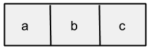

# What is a list?

Many apps use lists of data. For example, a game may keep a list of high scores and your Facebook app keeps a list of your friends.

Lists are a type of data structure used in every programming language, not just App Inventor. We use lists to create and manipulate different sets of values/elements.

# What is an index?

The position of an element in a list is called its index. In App Inventor, the first element in a list is index 1. In the figure below, a has index 1, b has index 2, and c has index 3.

What this means is that we can reference a specific element inside our list if we know which index it has and what the list name is.

# App Inventor Lists

In App Inventor, it may be useful to have a list to store data such as numbers in your phone, replies for the Magic Eight Ball app, or the names of people you meet at a conference.

We make lists by using the make a list block. This block is a [mutator](mutators.html) and can be expanded or shrunk by clicking the blue plus sign. Watch the following gif for more details on how to use this block.

App Inventor also provides blocks to do many other actions to lists. For more information on the List blocks, check out the [List blocks](../blocks/lists.html) information page.
