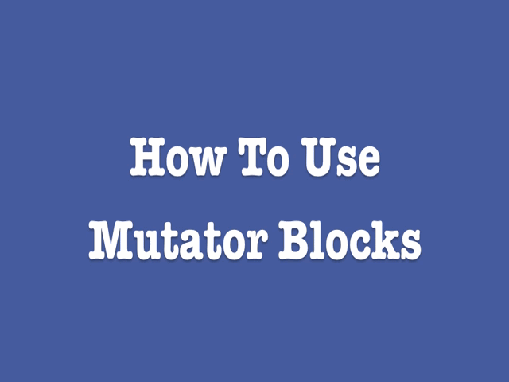

App Inventor 2 introduced a new feature that allows certain blocks to expand, shrink, or even change their functionality.

Any block that has a blue box with a white gear on top that matches the image to the right is considered a mutator block.

## What does a mutator do?

Mutators change shape. By clicking the blue icon, the user can drag additional smaller blocks into the larger mutator block, thus changing the shape and functionality of the original block. Clicking the icon again will minimize the extra blocks window and show the modified block.

The example below shows the min mutator block:

 
**Explanation of the min mutator block.**

The user wants to find the minimum number of a list of 3 values. Currently there is only space for 2 to connect to the min block.

To fix this, the user clicks the blue gear icon on the min block and drags another item over.

Now there are three sockets for blocks to plug into.

What are the different mutators?

* [if](../blocks/controls.html#if)
* [and](../blocks/logic.html#and)
* [or](../blocks/logic.html#or)
* [+](../blocks/math.html#add)
* [*](../blocks/math.html#multiply)
* [min](../blocks/math.html#min)
* [max](../blocks/math.html#max)
* [join](../blocks/text.html#join)
* [make a list](../blocks/lists.html#makealist)
* [add items to list](../blocks/lists.html#additems)
* [make a dictionary](../blocks/dictionaries.html#make-a-dictionary)
* [initialize local name in (do)](../blocks/variables.html#do)
* [initialize local name in (return)](../blocks/variables.html#return)
* [procedure do](../blocks/procedures.html#do)
* [procedure return](../blocks/procedures.html#return)
