Functional programming is a programming paradigm where programs are constructed by composing pure functions, avoiding shared state, mutable data, and side effects.
Many operators in functional programming are commonly used to make code more concise, and less complex.

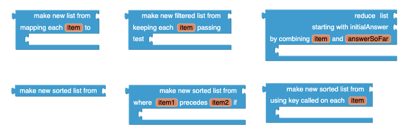

This tutorial demonstrates the usage functional operator blocks: filter, map, reduce and sort.

## Part 1: Berry's Lemonade Stand  {#lemonade-stand}

Berry is fundraising by setting up a lemonade stand, where she charges $2 per lemonade.
As shown below, she keeps a simple record of the number of lemonades she sold on each date.
She planned on doing this for seven consecutive days but was not able to set up her stand on some days, so for those days she wrote down N/A for the number of lemonades sold.
Berry is interested in finding her total profit for this week's lemonade stand.

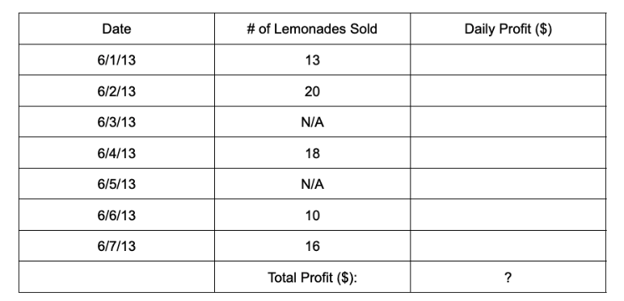

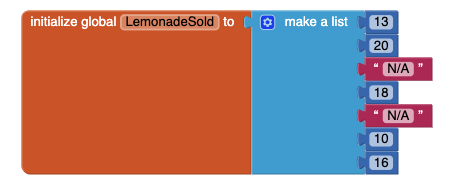

Thus, Berry needs to

1. keep only the entries that are numbers in her column of "# of Lemonades Sold" (filter),
2. multiply each entry by $2 to get a list of daily profits (map), and then
3. sum up all the daily profit entries to get total profit (reduce).

### Step 1: Filter

Berry needs to return a new list that results from filtering her original list so that "N/A" entries are eliminated and only numbers exist in list.

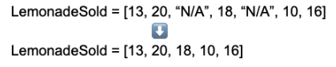

The filter block takes in two inputs: 1) an input list and 2) a body block that is a boolean expression involving item--it returns true or false.
Note that item is a variable name that refers to the current list item.
The filter block iterates through the list and keeps each item the list that makes the body block return true.
In this case, the input list is Berry’s original list, and the body block checks to see if item is a number.

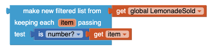

### Step 2: Map

Now that Berry has a filtered list of # of lemonades sold, she needs to multiply each item in the list by $2 to return a new list of daily profits.

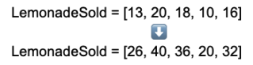

The map block takes in two inputs: 1) an input list and 2) a body block that is an expression manipulating item. The map block iterates through the list and maps each item in the list to a new item using the body block.
In this case, the input list is Berry’s filtered list, and the body block multiplies each item by 2.

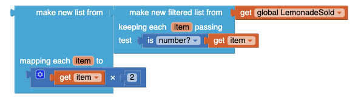

### Step 3: Reduce

Finally, Berry wants to sum up all the items in her list of daily profits to find her total profit.

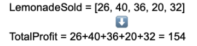

The reduce block takes in three inputs: 1) an input list, 2) initialAnswer and 3) a body block that combines item (referring to the current list item) and answerSoFar (referring to the accumulating answer).
If the input list is empty, then initialAnswer is returned. Otherwise, answerSoFar is initialized to initialAnswer.
The body block is first evaluated using answerSoFar (which is equivalent to initialAnswer at this point) and the first list item, and then on the accumulating answer and the next list item, and so on until the end of the list.

In this case, the input list is Berry’s list of daily profits, the initialAnswer is 0, since the sum of all the items in an empty list is 0, and the body block adds the current list item to the accumulating answer to sum all her daily profits.

Berry decides to define her procedure as getTotalProfit. When getTotalProfit is called, Berry’s total profit from her lemonade stand is returned.

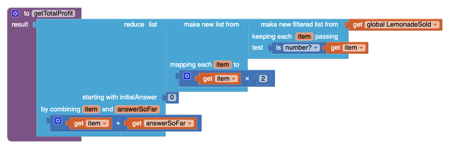

## Part 2: Bob's classmates' height  {#classmates-height}

Bob is collecting data about his classmates’ height. Here is a small part of his data:

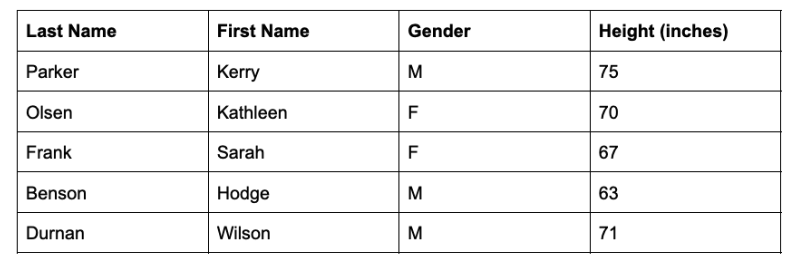

BobDataList is a list of lists, as shown below:

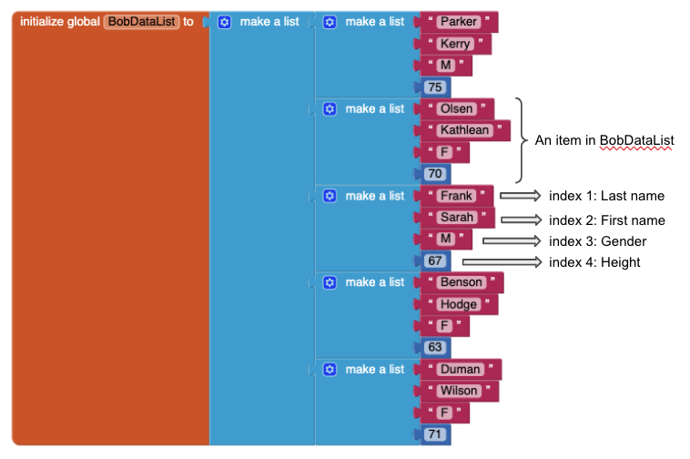

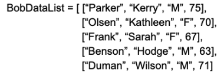

Thus, Bob would like to have the list being sorted in following three different ways: 

1. Sort the data alphabetically by last name (basic sort)
2. Sort the data alphabetically by gender, then numerically by height (sort with comparator)
3. Sort the data alphabetically by height (sort with key)

### Situation 1: Basic Sort

Bob wants to sort the list by last name.

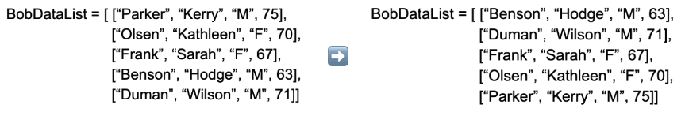

Since last name is in index 1 of each item in BobDataList, he can simply input his list into the basic sort block.

### Situation 2: Sort with Comparator

Bob wants to first sort his data alphabetically by gender, then numerically by height.
In other words, the females are listed first, followed by males.
Within females and within males, the data is organized by height.
Gender is index 3 of each item in BobDataList, and height is in index 4 of each item in BobDataList.

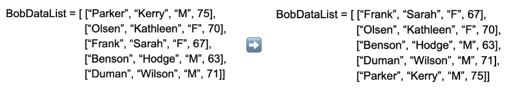

In this case, Bob can use the sort with comparator block.
This block takes in two inputs: 1) an input list and 2) a body block that specifies the order by which the the input list should be sorted.
The body block is a boolean expression involving item1 and item2 and returns true or false.
The given variable names, item1 and item2, refer to the two current list items that are being compared.

To achieve Bob’s goal, the body block will have two boolean expressions.
The first boolean expression checks to see if the gender of item1 is less than the gender of item2.
If is, then the body returns true immediately. If not (i.e. the gender is the same), then the second boolean expression will check to see if the height of item1 is less than the height of item2.

To implement this in terms of blocks, the body block will combine the two boolean expressions using an “or” block.
An “or” block tests the conditions from left to right, and stops testing as soon as one of the conditions is true.

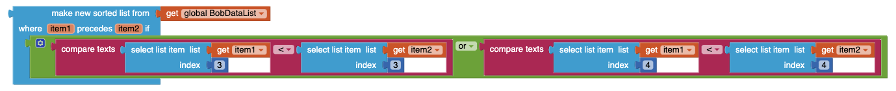

### Situation 3: Sort with Key

Bob wants to sort his data only by height.

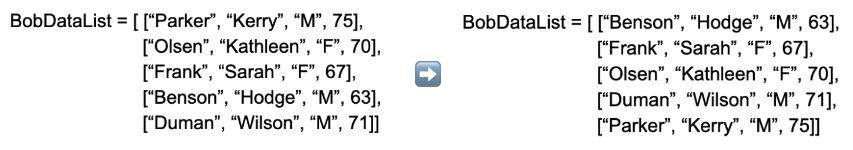

In this case, he can use the sort with key block.
This sort block takes in two inputs: 1) an input list and 2) a body block (key) that is a function that is applied to each item in the list prior to sorting.
The list of proxy values returned by the key is used for sorting.

Since Bob would like to sort by height, the body of the block gets index 4 of each item in BobDataList, and sorts by this value.

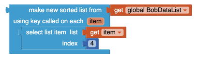

