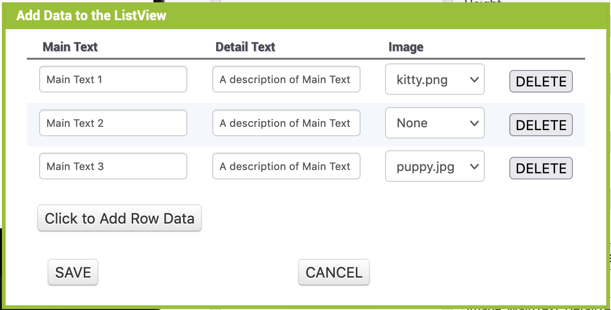
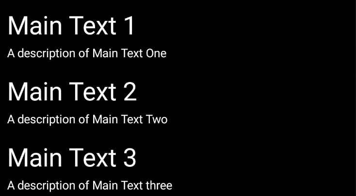
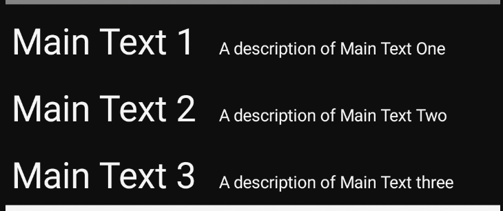
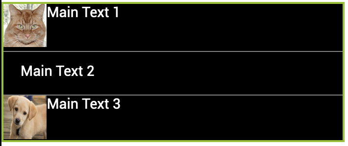
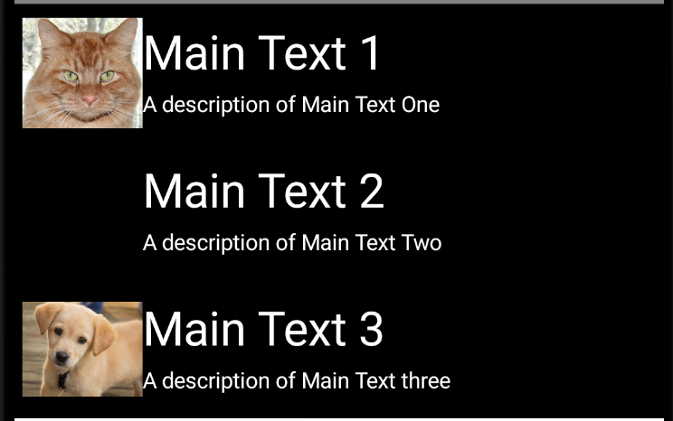

The ListView component supports two methods for defining elements: ElementsFromString and ListViewLayout.

ElementsFromtString is the legacy method. It supports elements consisting of a single string.

ListViewLayout, combined with ListData, allows for more complex element layouts that can consist of multiple strings and an optional image.

## ElementsFromString

This is the legacy method of describing elements in a ListView using a comma-delimited string. This method supports only elements that consist of a single string.

Example: Main Text 1, Main Text 2, Main Text 3

Would display in the device as:

## ListViewLayout and ListData

Starting with version nb187 of MIT App Inventor, ListViews support advanced layout options.

The layout is selected from a list of options in the ListViewLayout property. Elements can then be defined in the designer using the ListData property.

The ListData property editor is a pop-up window that allows the user to define Main Text, Detail Text, and Image, depending on which layout has been selected. The Image is selected from a list of images uploaded to media.

Current layout options with examples:

### MainText

### Main,DetailText(vertical)

### MainText,DetailText(horizontal)

### Image, MainText

### Image,MainText,DetailText

