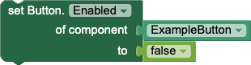
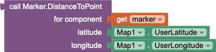
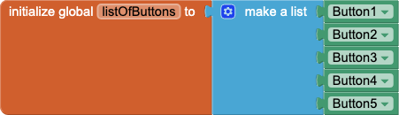
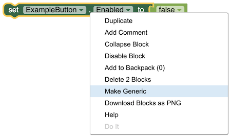
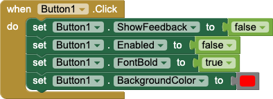
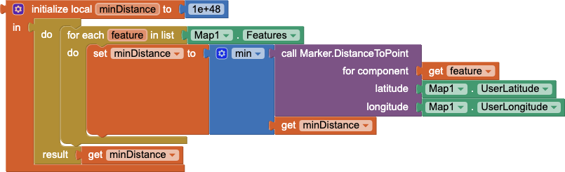

A common concept when writing apps is "Don't Repeat Yourself" (or DRY). Rather than making lots of repetitive code, by copy and paste for example, you can instead use special blocks called "Any Component" blocks.

What exactly is an "any component" block? Every component block, such as set Button1.Text to, has three parts: (1) the component that is being changed (Button1), the part of the component being manipulated (set ....Text to) and (3) the inputs (if any). The blocks you would typically pull out of block drawer name a single component when you code your app. But what if you want to perform an action on many different components of the <strong><em>same type</em></strong>? One option would be to copy and paste each block as many times as needed, but as your app expands this becomes difficult to edit. Instead it might make sense to be able to substitute different components in place of a single component. That is what "any component" blocks allow you to do. Rather than fix the block to a specific component, they allow you to make your code more general by providing any component of the same type as an input. This allows you, for example, to create a list of buttons and update all of their properties at once using a for-each loop, for example:

{:.figure}

{:.caption}
**Figure 1.** An example of a for loop that hides all of the buttons in a list.

Each of the three major component block types, i.e., events, methods, and properties, have corresponding "any component" blocks.

## Properties

The "any component" blocks for properties are the simplest versions of any component blocks. Property getters, like the one shown below, take a single component and return the value of the named property for that component. Property setters take an additional argument, which is the new value of the property.

{:.figure}

 

{:.caption}
**Figure 2.** Example blocks for the any property getters and setters.

## Methods

Any component method blocks function similar to the property getters and setters. For any given method on a component, the corresponding any component block will take a component and all of the parameters needed by the method. The block will have the same output as the specific method block (if any). For example, below is a method block to compute the distance from a Marker to the user's current location on a Map.

{:.figure}

{:.caption}
**Figure 3.** Example use of a method block that takes any marker and computes the distance to it from the user's current location.

## Events

Any component events are the most complex form of an any component block. For any given event, the corresponding any component event adds two more parameters, component and notAlreadyHandled, to the existing list of event parameters, if any. The component parameter will be the component that triggered the event, such as Button. The notAlreadyHandled parameter is true if no other event block specifically handles the event for component.

Consider the following pseudocode for event handling to see how this works:

1. An event occurs, such as the user clicks a button called Button1.
2. component is initialized to Button1.
3. notAlreadyHandled is initialized to true.
4. App Inventor checks to see if when Button1.Click exists.
5. If the event block is found:
    1. The event block code is run.
    2. notAlreadyHandled is set to false.
6. App Inventor checks to see if when any Button.Click exists.
7. If the any event block is found, the event block code is run with component and notAlreadyHandled passed to it.

## Tips & Tricks

There are a number of things you can do with any component blocks. Here are some tips and tricks to get the most out of any component blocks.

### Lists of Components

You can make a list of components using global variables. This makes it easy to reference large sets of components through a single list and apply changes using the for-each block.

{:.figure}

{:.caption}
**Figure 4.** The global variable listOfButtons is set to a list of button components.

### Swap Blocks

You can swap between a block for a specific component and the equivalent any component block through the "Make Generic" and "Make Specific" menu items in a block's right click (context) menu. "Make Generic" will convert a block for a specific component, e.g., set Button1.Enabled to, into a any component block, e.g., set Button.Enabled of component with the corresponding component block, e.g., Button1. In order to use the "Make Specific" menu item, the "of component" slot must be filled with a specific component, e.g., Button1, and not another type of block. This feature is available for property setters, property getters, and methods.

{:.figure}
 

{:.caption}
**Figure 5.** A demonstration of how blocks can be transformed from a specific to generic versions using the right click (context) menu.

### Any Component Events

Unlike the operation to turn properties and methods into their any component versions, turning a component event handler into an any component event using "Make Generic" is a one-way operation (it can be undone using the Undo option, however). When using this feature, all references to the component will be replaced with any component versions.

{:.figure}
 

{:.caption}
**Figure 6.** Top: A when Button1.Click event that changes a number of Button1's properties. Bottom: After using the "Make Generic" menu option (bottom), the when Button1.Click event is replaced with a when any Button.Click event, and all blocks that reference Button1 are replaced with component.

## Examples

### Snow Globe

In a snow globe app, you might use many Ball sprites on a Canvas to represent snowflakes in the snow globe. You may want them to disappear when they reach the edge of the screen. Previously, you would have to create a when Ball_XX_.EdgeReached for each snowflake to make this happen. With the when any Ball.EdgeReached event, you only need to write the code once:

{:.figure width="750px"} 
{:.figure} 

{:.caption}
**Figure 7.** Top: Repetitive event handlers before the use of the generic event handler. Bottom: All of the code reduces to a single event handler, saving space and time coding.

### Random Button Colors

This event block demonstrates any component events and property setters.

{:.figure}

{:.caption}
**Figure 8.** An event handler to change any button's background color when it is clicked.

### Distance to Nearest Feature

Given a Map with a number of Markers, find the distance to the Marker nearest the user with the call Marker.DistanceToPoint block:

{:.figure}

{:.caption}
**Figure 9.** An example of how to find the closest Marker on a Map to the user's current location.
