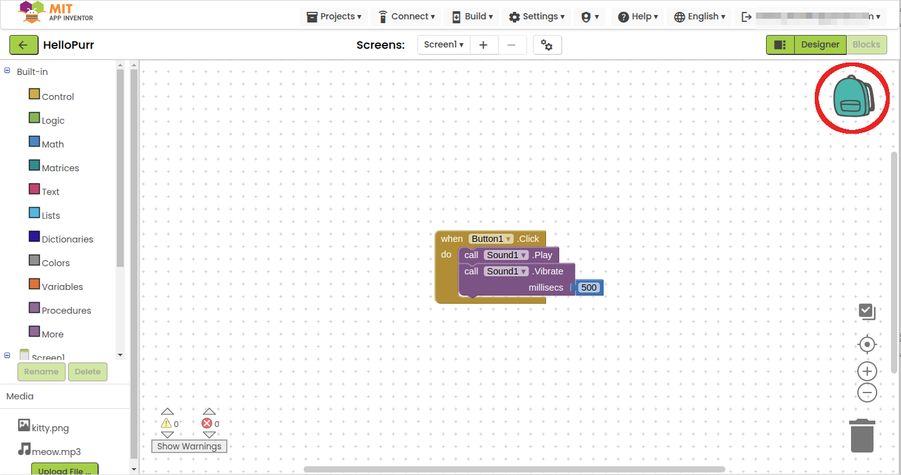
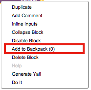
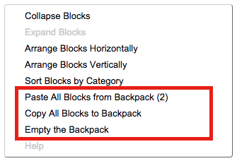
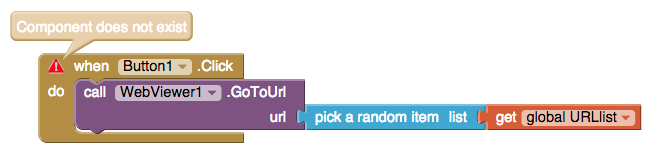
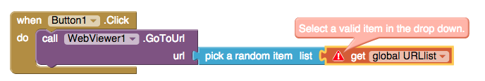

## {:style="float: left; margin-right: 10px;"}Backpack: Copy and Paste Blocks to Different Screens and Projects

The Backpack allows you to carry around blocks throughout your project
repositories, allowing blocks to be transferred between projects and
between screens. The contents of the Backpack are persistent across
logins. When you login to MIT App Inventor, you will find the blocks you
left from your last session.

Click [*here*](https://youtu.be/diQ8wJCYb6o){:target="_blank"} for a video demo.

## How does Backpack work?

The Backpack is a copy-and-paste feature that works between projects and
screens. The Backpack icon is located at the upper-right corner of the
workspace.

**Copying Blocks.** Blocks from the workspace can be dragged and dropped
into Backpack. This is the copy operation -- the blocks are copied
(duplicated) in the backpack. When blocks are dropped into the Backpack,
an animation and sound will occur to confirm for the user that the
operation was successful. The blocks are not removed from the workspace.

**Viewing the Backpack Contents.** The contents of the Backpack can be
viewed by clicking on its icon (upper right corner of the workspace). A
scrollable flyout will pull out from the right edge of the workspace,
displaying the Backpack’s contents. The flyout of the Backpack works the
same way as the flyouts in the Block drawers.

To close the flyout without pasting any blocks, you can click the
workspace or click any empty space in the Backpack with no block
highlighted. Note that if you click on a highlighted block in the
flyout, that block will be pasted to the workspace.

**Pasting Blocks.** Blocks can be pasted from the backpack into the
current workspace by clicking on the Backpack icon (upper right corner
of the workspace) and dragging the block from the flyout to the desired
location in the workspace.

## Background Menus

In addition to the drag-and-drop functionality, you can select Backpack
functions by right-clicking on a block or on the workspace, as shown in
the following image.

## Right Click on Block

-   **Add to Backpack:** You can add this block and all of its contained
    blocks to the Backpack by doing a right-click on the block and
    selecting this option. The number in the parentheses indicates the
    total number of blocks in the Backpack (not the number that will be
    added).

## Right Click on Workspace Background

-   **Paste All Blocks from Backpack:** This pastes all the blocks from
    the Backpack into the current project. The number in the parentheses
    indicates the total number of blocks in the Backpack.

-   **Copy All Blocks to Backpack:** This adds all blocks in the current
    workspace to the Backpack.

-   **Empty the Backpack:** This removes and discards all blocks in
    the Backpack. There is no way to undo this operation.

## What can be added to Backpack?

-   Function and procedure definitions. These will be renamed if a
    duplicate definition exists in the destination workspace.
-   Lists, strings, and other data
-   Variable definitions and references. Variable definitions will be
    renamed if a duplicate definition exists in the destination
    workspace.
-   Blocks Containing Components: Ideally, your destination project
    should have matching components with the same name or you will need
    to add components into the destination project after pasting from
    the Backpack. Reference to a non-existing component will cause
    ***red error triangles*** to be shown.

Initializations that duplicate existing blocks in the destination
workspace will be automatically renamed. For example, if you try to
paste a variable initialization block for global variable X and the
workspace already contains an initialization block for X, the variable
will be renamed X2 in the pasted block.

Similarly, if you try to paste a procedure definition for procedure foo
and the workspace already contains a definition of foo, the pasted
procedure will be renamed foo2.

## Can you paste blocks into any project or screen?

Yes. However, there are instances when pasting blocks from the Backpack
to a new project or screen will cause red error triangles to appear. For
example, this will occur when a block refers to a non-existent variable
or procedure in the destination project. The errors can be removed
(fixed) by defining the missing variable or procedure. It will also
occur when a block refers to a non-existent component in the destination
project. The errors can be removed (fixed) by adding the missing
component and giving it the same name as the one referred to in the
pasted block.

## Can blocks be removed from the Backpack?

To remove all blocks from the Backpack, right-click on the backpack, and
select "Empty the Backpack". To remove a block stack from the Backpack,
right-click on the block stack and select "Remove from Backpack". These
operations cannot be undone.
