First, you will need an active Apple Developer License. While this is typically $99/year, non-profit and educational organizations can often get a waiver for the fee. Every iOS app is signed using a private key and a certificate. The certificate is signed by Apple, and iOS devices will only install apps signed by a certificate signed by Apple. This document will take you through the process of setting up your App Inventor and Apple developer accounts so you can compile apps for your iOS devices.

## Retrieve a Certificate Signing Request

Apple uses digital certificates to sign your apps to allow them to run on iOS devices or to upload them to App Store Connect. Certificates expire after 1 year, so you must continue to renew them over time while participating in the Apple Developer program. In order for Apple to issue you a certificate, you must first obtain a Certificate Signing Request (CSR). App Inventor can generate this request for you by selecting the "Download Certificate Request" menu item under Projects. The request will be tied to the same keystore used for signing your Android apps.

Log into [MIT App Inventor](/).

From the Project menu, select "Download Certificate Request".

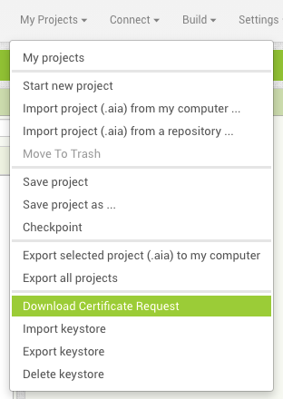

Your browser will save your CSR to your computer.

## Submit CSR to Apple

Log into the [Apple Developer portal](https://developer.apple.com).

In the Apple Developer Portal, go to the Certificates, Profiles & Devices section.

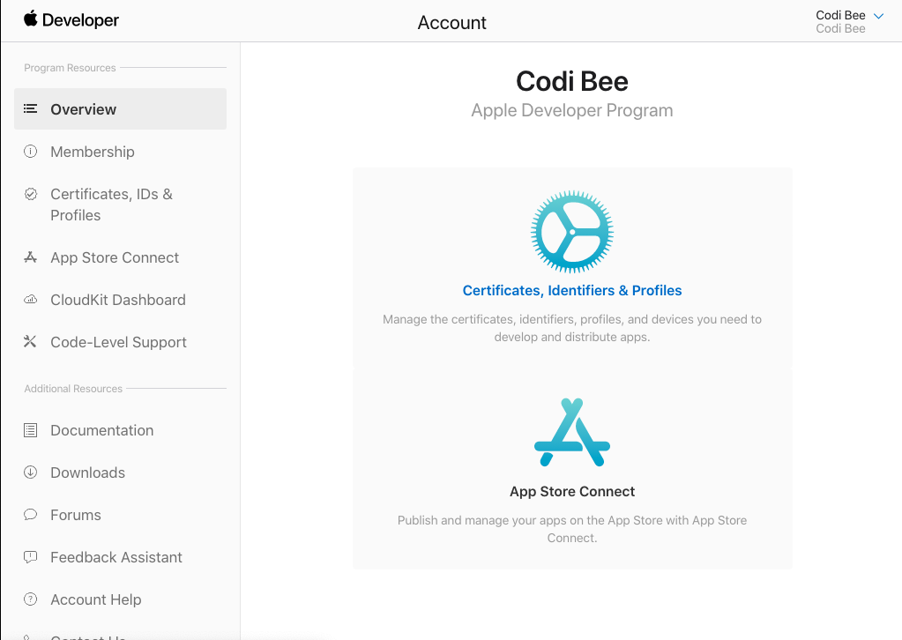{: style="zoom:0.5"}

Select Certificates, then click the + button to create a new certificate.

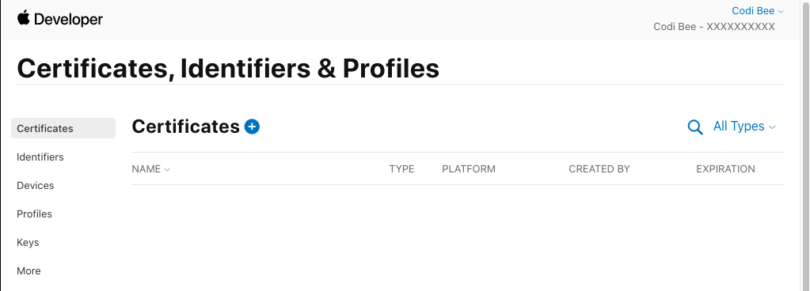{: style="zoom:0.5"}

When prompted for what type of certificate you would like, select Apple Distribution, and click Continue.

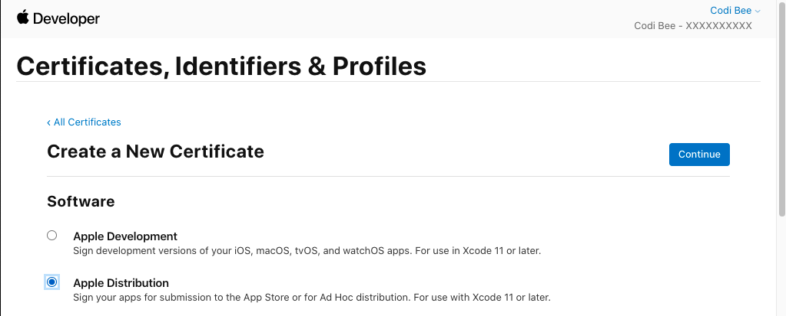{: style="zoom:0.5"}

On the next page, click "Choose File" and select the CSR file downloaded from App Inventor.

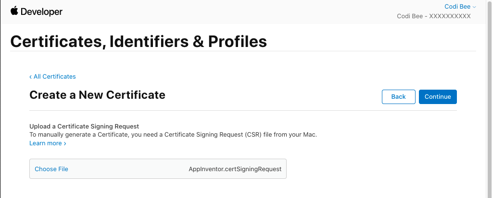{: style="zoom:0.5"}

Once you've submitted the form and your certificate has been approved, click "All Certificates" to go back to the developer portal. **You do not need to download your certificate.**

## Create App Identifier

Click on Identifiers to open the Identifers section.

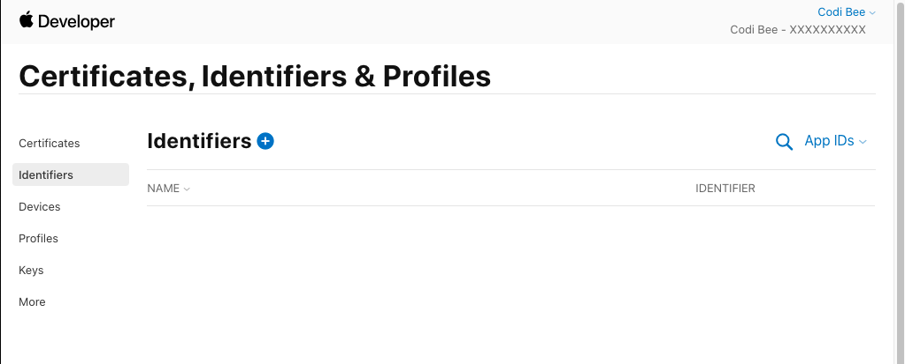{: style="zoom:0.5"}

Click on the + button to create a new identifier for your app. Select App IDs and click Continue. For the identifier type, select App. Once you've done this, you will be presented with a registration screen.

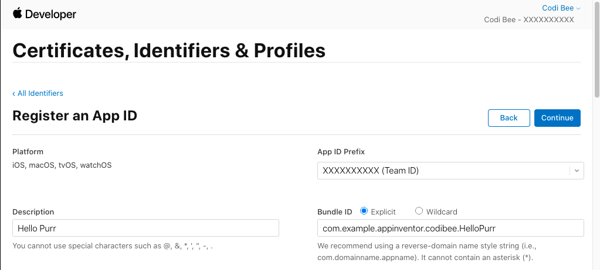{: style="zoom:0.5"}

### Description

The Description is a human-readable name that you can use to identify your profile. In most cases, it is best to use your app or project name as the description.

### App ID Prefix

The App ID Prefix is an identifier that uniquely identifies your developer account to Apple. For this option, you will want to choose the identifier marked "(Team ID)".

### Bundle ID

App Inventor generally expects identifiers of the format `appinventor.ai-USERNAME.PROJECTNAME` where `USERNAME` is replaced with the first part of your email address preceding the `@` and `PROJECTNAME` is replaced with your project's name. However, any reverse-DNS style identifier will do if you publish other applications that you wish to interact with.

You can also use wildcard IDs, such as `appinventor.ai-USERNAME.*` to create a single provisioning profile you can reuse across all your projects.

After completing the form, click Continue and then Register to complete the registration. Click "All Identifiers" to go back to the main interface.

## Add Device(s)

**App Store only:** This section can be skipped for App Store builds.

Click on Devices to open the Devices section.

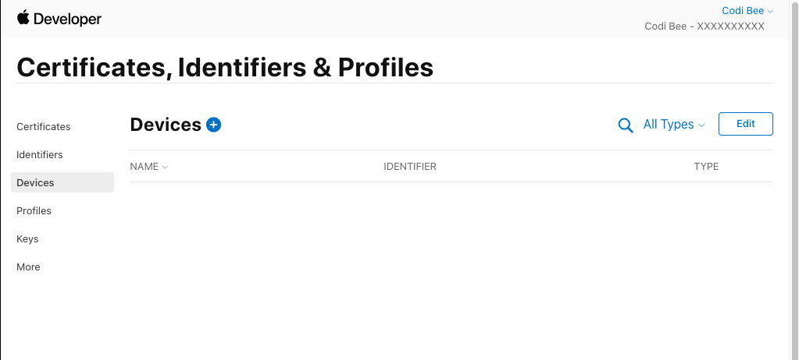{: style="zoom:0.5"}

Click on the + button to register a new device. On the registration form, you can either submit a single device or upload a file. See the section [Notes on Device IDs](#udids) on how to retrieve the identifier for your devices.

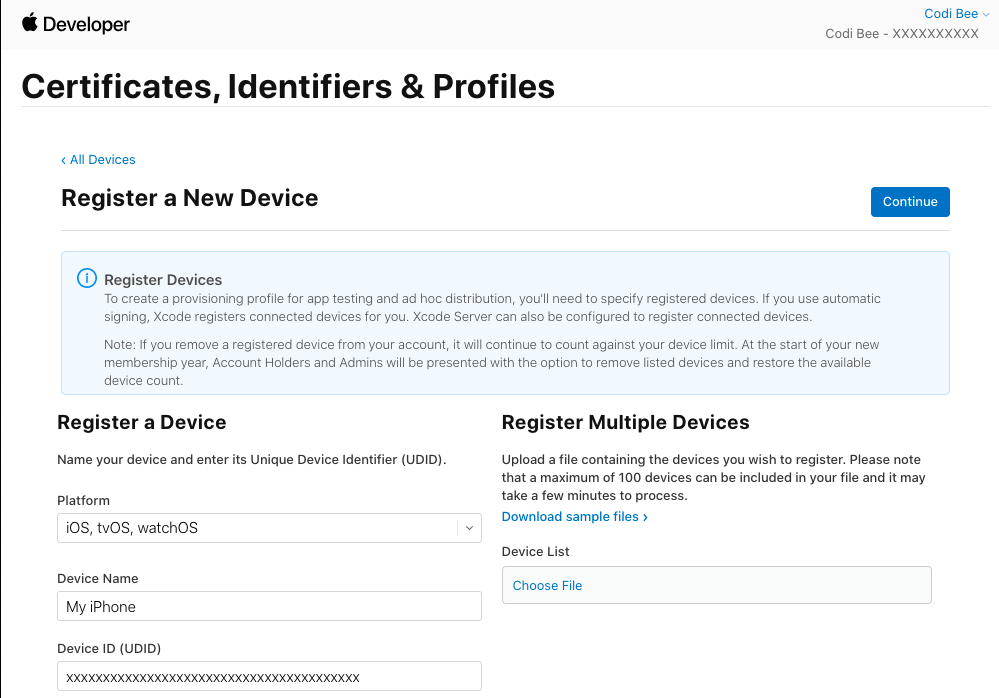{: style="zoom:0.5"}

Click Continue and then click Register to confirm addition of the new device. Click "All Devices" to return to the developer portal. You may also complete this step multiple times to add more devices.

## Create Profile

Our next step is to create a provisioning profile. This profiles ties together all of the previous items into a single package that is used for distributing your app. Click on Profiles to open the Profiles section and then click on the + button to create a new profile. App Inventor can build apps for either "Ad Hoc" or "App Store" distribution. To distribute to a limited number of devices without requiring App Store review, select "Ad Hoc." If you plan to distribute to the App Store, select "App Store."

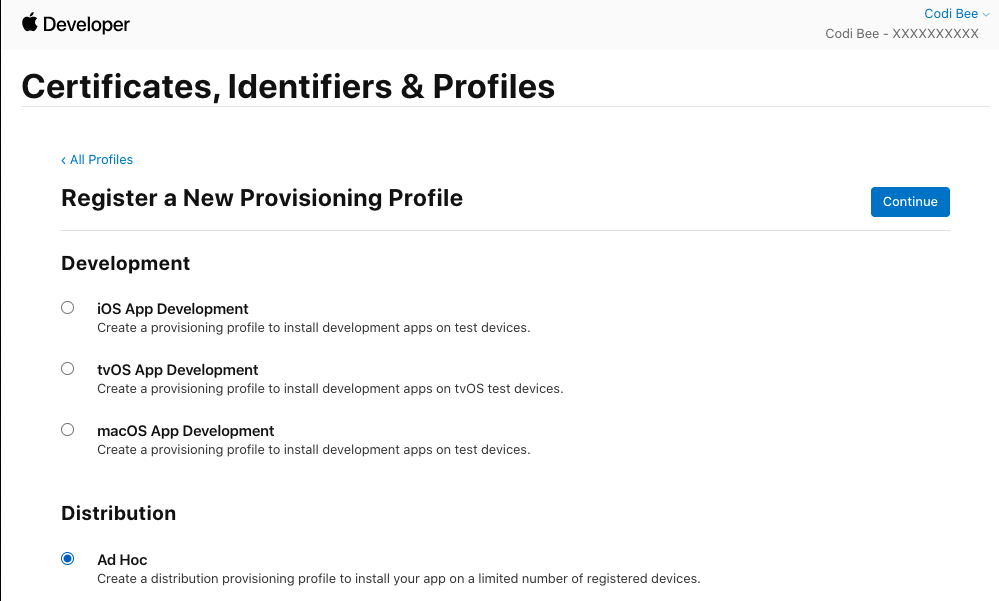{: style="zoom:0.5"}

On the next screen you will be asked to choose the App ID for this profile. Select the App ID created in the earlier step and click Continue.

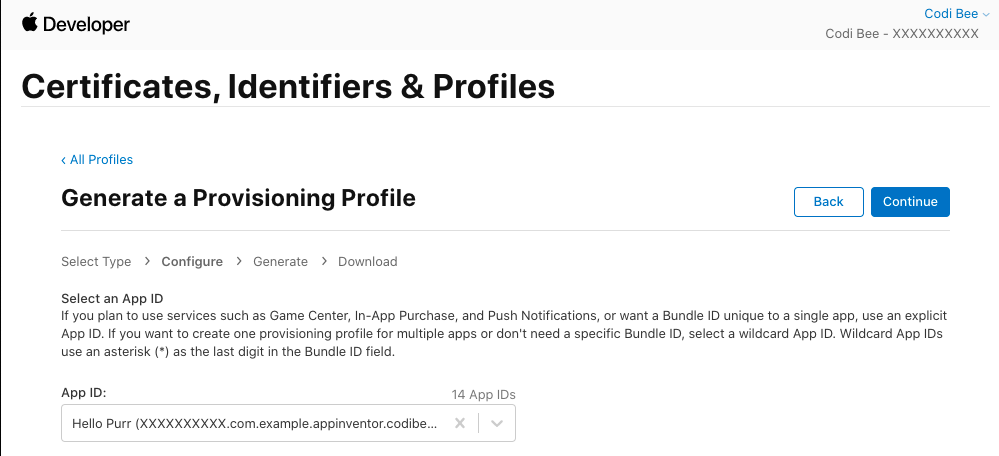{: style="zoom:0.5"}

On the next screen you will be asked to choose the certificate used for signing apps when this profile is used. Select your Certifcate created in the earlier step and click Continue.

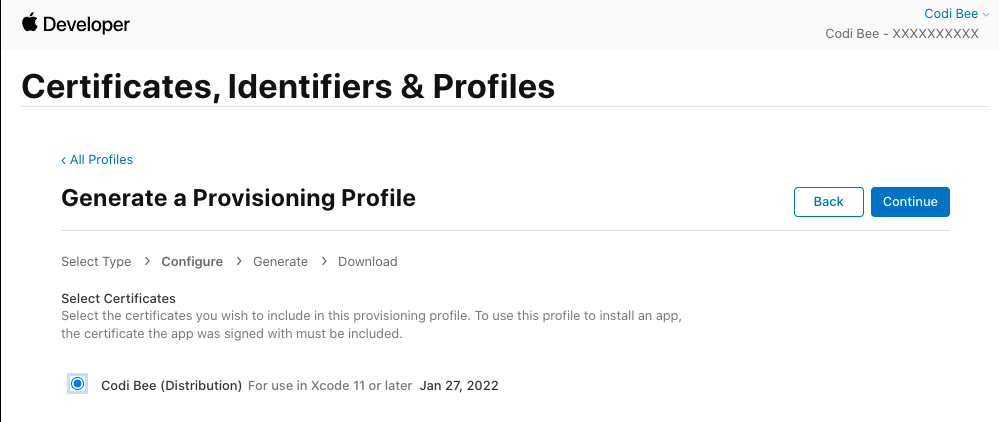{: style="zoom:0.5"}

**For Ad Hoc profiles only:** On the next screen you will be asked to choose the devices that will be allowed to run the app associated with this profile. Enable as many devices as you want in this step (minimum 1) and click Continue.

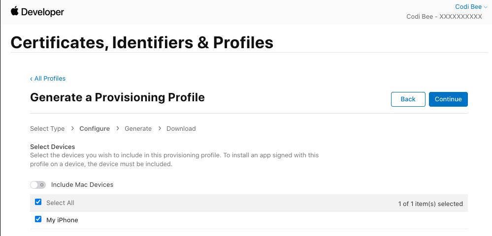{: style="zoom:0.5"}

On the next screen you will be asked to name your profile, review your selections, and confirm the creation of the profile. The name is only for readability purposes and you may call the profile whatever makes sense to you.

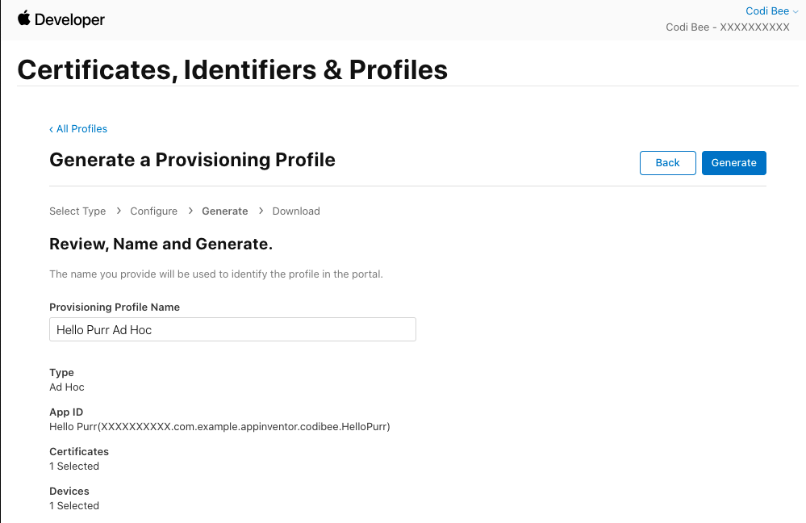{: style="zoom:0.5"}

After confirming your Profile, click the Download button to download the profile to your computer. After downloading your provisioning profile, you can close the tab with the Apple Developer Portal.

## Build App

Return to your project in App Inventor. Upload your provisioning profile created in the previous step to the Media section of your app.

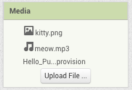

From the Build menu, select either `iOS Ad Hoc (.ipa)` to initiate an Ad Hoc build or `Upload to iOS App Store` to build and upload your app to the App Store. If this is your first App Store build, you will also need to provide an [app-specific password](#asp) .

**Note:** It is possible to include two different mobile provisioning profiles in your assets to use both types of builds.

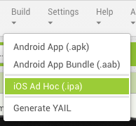

**Ad Hoc only:** When the build is complete, you will receive a QR code for scanning. On your iOS device, open the Camera app and point it at the QR code. It should show you a notification to open a link. Opening this link will initiate an installation of your app.

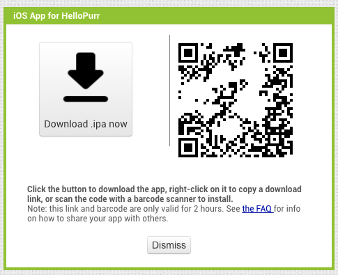

**App Store only:** After success, your app will need to be processed by Apple. You will receive a dialog confirming successful delivery with a link to open App Store Connect.

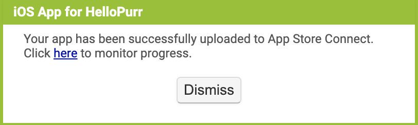{: style="zoom: 0.5" }

## Note on App Specific Passwords  {#asp}

For publishing to the App Store with MIT App Inventor, you will need to create an app-specific password for your Apple account.

To create an app-specific password, go to [Apple ID](https://appleid.apple.com) and sign in.

At the dashboard, locate the App-Specific Password card and click on it.

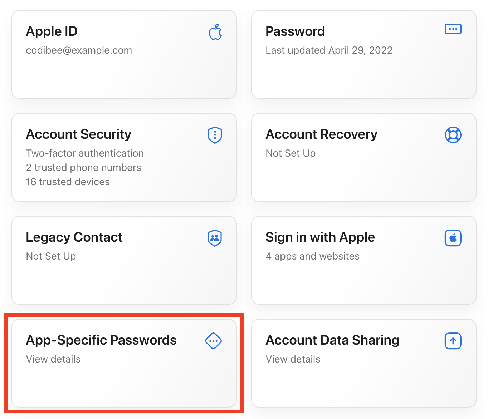{: style="zoom: 0.5" }

Next, click the + button to add a new password.

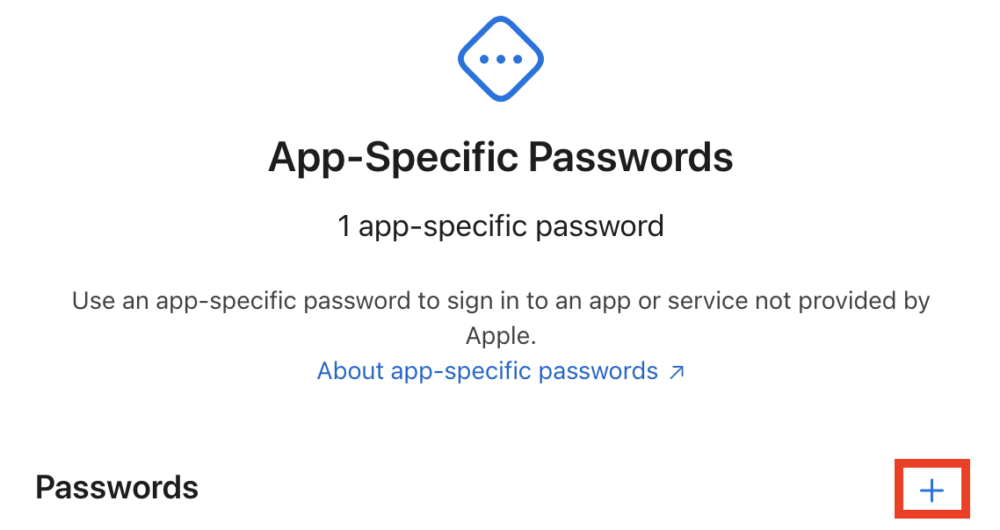{: style="zoom: 0.5" }

You will be prompted for an app name. Enter "MIT App Inventor" and then click Create.

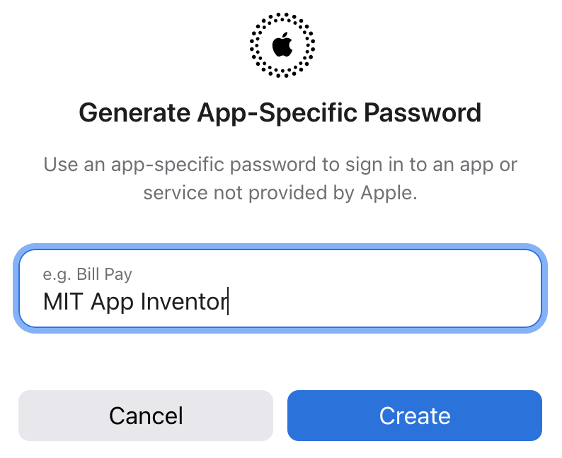{: style="zoom: 0.5" }

At this point you may be prompted to re-enter your Apple ID password for security confirmation. Once you have done that, you should receive your app-specific password. Save this somewhere as this will be the only time it will be shown.

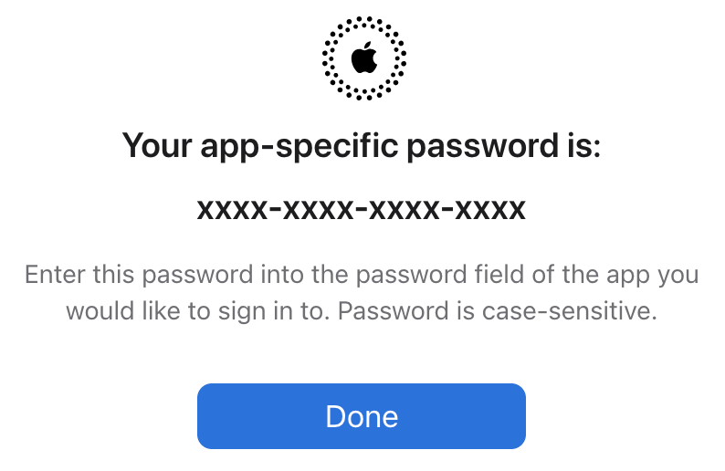{: style="zoom: 0.5" }

Lastly, in App Inventor, you can provide your app specific password by going to the Settings menu and opening the App Store Settings dialog. You will need to provide both your Apple ID (usually your email address) and the App Specific Password created in the previous step. For most users, you can leave ASC Short Name blank.

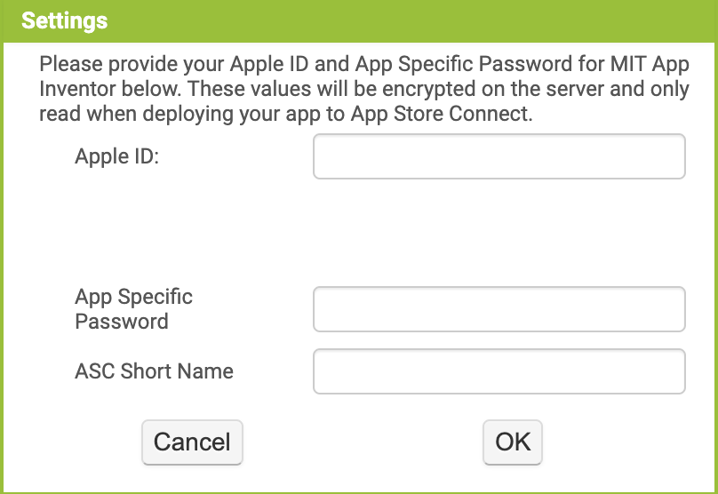{: style="zoom: 0.5" }

**Note:** These credentials are encrypted on the App Inventor server and cannot be decrypted by the server and cannot be retrieved after being set. If you need to change your credentials, you can set a new app-specific password by repeating the steps above.

## Note on Developer Mode  {#devmode}

Starting with iOS 16, Apple requires that users turn on Developer Mode before they can install apps packaged using the Ad Hoc approach.

To enable Developer Mode, go to the Settings app and go to the Privacy & Security section:

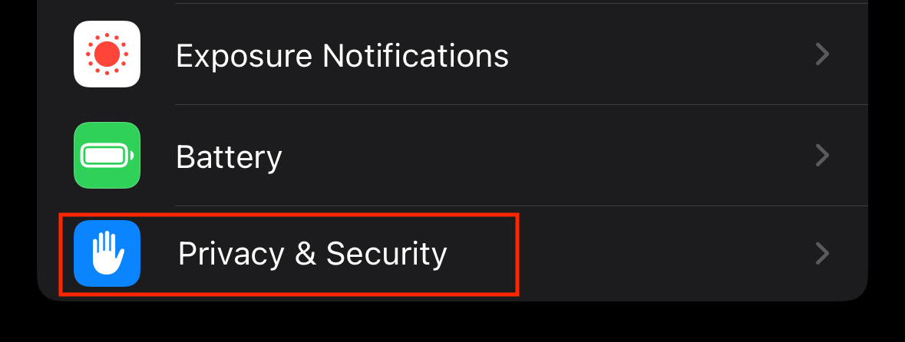{: style="zoom:0.5"}

Scroll down to the Security section and select Developer Mode:

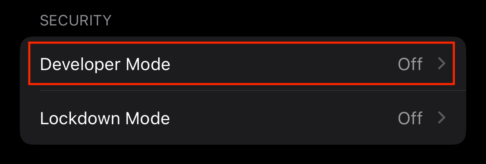{: style="zoom:0.5"}

Turn on the switch to enable Developer Mode:

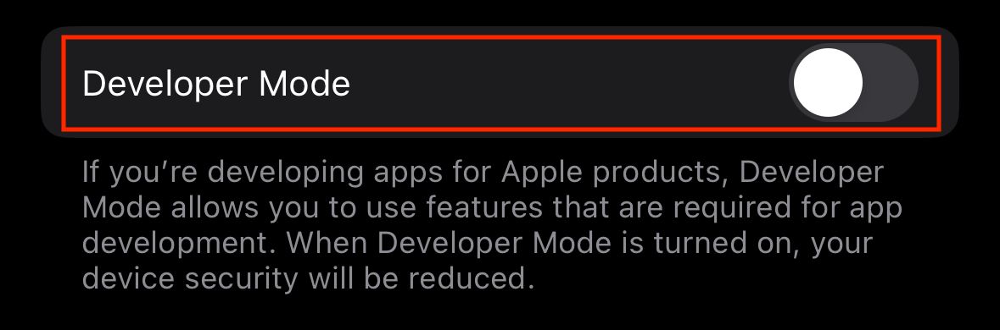{: style="zoom:0.5"}

The device may request that you first restart before the option can be enabled:

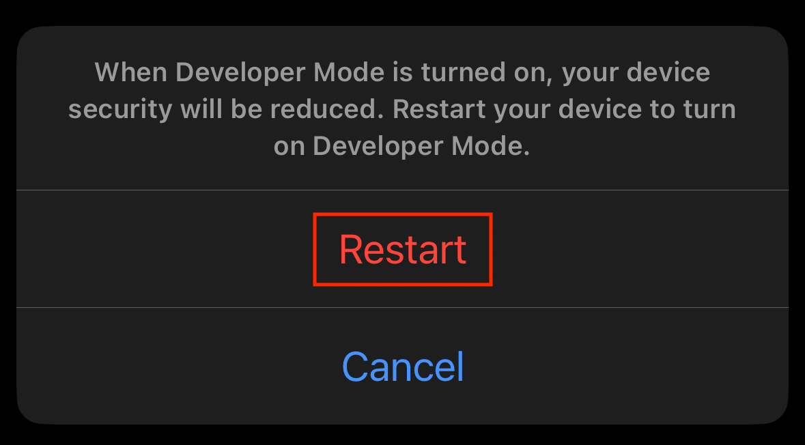{: style="zoom:0.5"}

After restarting your device, you will be prompted to turn on Developer Mode:

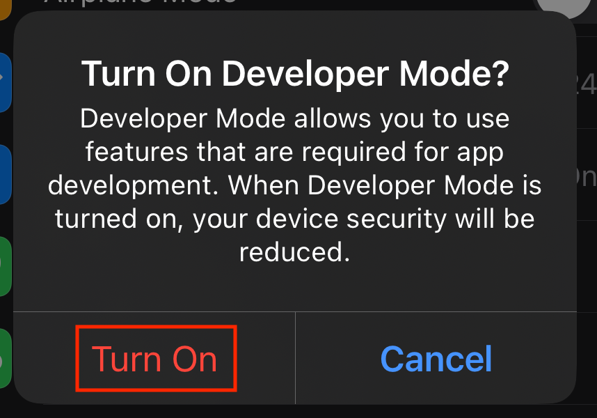{: style="zoom:0.5"}

Once you have enabled Developer Mode, you can scan the QR code returned by App Inventor or install the downloaded IPA to your device.

## Note on Device IDs  {#udids}

Every iOS device has a unique identifier called the UDID. You can obtain the UDID for your device using iTunes or Finder (on macOS 10.14+).

### macOS

On newer versions of macOS without iTunes, your iOS device will appear in the Finder when connected via USB to your computer. Select the device in Finder and look for the device type under its name.

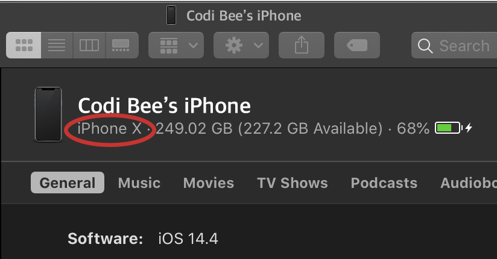{: style="zoom:0.5"}

Click on the device type (iPhone X in the example) to reveal the UDID. You can control-click or right-click to copy the UDID.

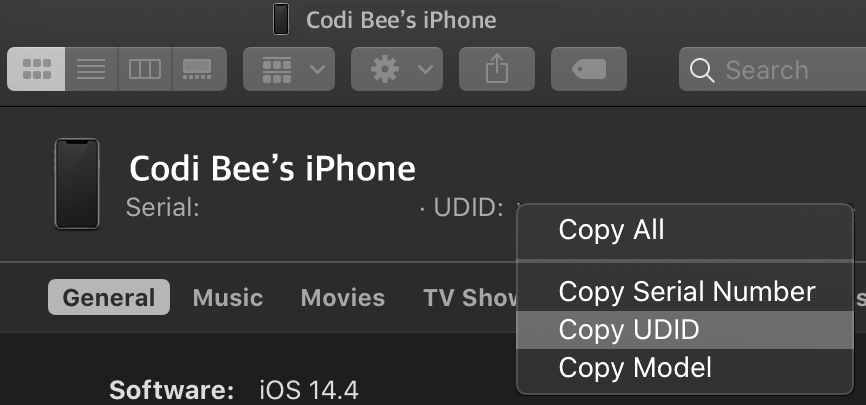{: style="zoom:0.5"}

Paste the UDID into the form in the Apple Developer console when needed.

### iTunes (Windows or Mac OS X)

Windows or older versions of Mac OS X prior to 10.14, you will be able to retrieve via iTunes. First, connect your device to your computer via USB cable and then open iTunes. Click on the device icon that appears in the toolbar:

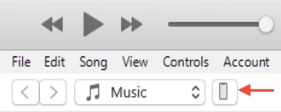{: style="zoom:0.5"}

In the information window, click on the area where the Serial Number appears. This will change the entry to UDID.

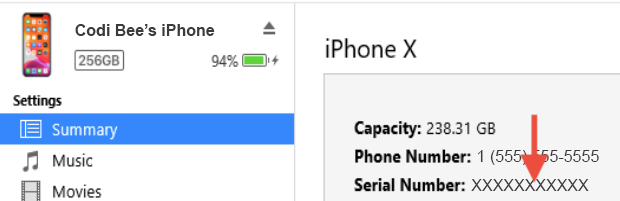{: style="zoom:0.5"}

Right click (or control click on Mac) to open the context menu to copy the UDID.

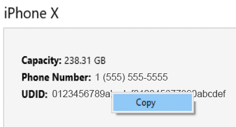{: style="zoom:0.5"}

Paste the UDID into the form in the Apple Developer console when needed.
