- [Create a Service Account](#create-a-service-account)
  * [1. Create a Google Developer Account](#1-create-a-google-developer-account)
  * [2. Create a Google Developer Project](#2-create-a-google-developer-project)
  * [3. Enable the Google Sheeets API](#3-enable-the-google-sheeets-api)
  * [4. Creating a Service Acccount](#4-creating-a-service-acccount)
- [Linking the Google Sheets Document](#linking-the-google-sheets-document)
  * [1. Create the Google Sheets Document](#1-create-the-google-sheets-document)
  * [2. Share the Google Sheets Document](#2-share-the-google-sheets-document)
  * [3. Record Relevant Information](#3-record-relevant-information)
    + [The Spreadsheet ID](#the-spreadsheet-id)
    + [The Sheet Name](#the-sheet-name)
    + [The Grid ID](#the-grid-id)

Note: If you are only going to read from the Google Sheets document, and not
edit or write data to the document, you can skip the process of making a Service
Account. The only requirement is that the Google Sheets document is shared such
that anyone with the link can read the document. 

# Create a Service Account

In this tutorial, we will be creating a Service Account, a user account that’s
created to interact with a specific piece of software or service. In our case,
this specific piece of software is the Google Sheets API. You can then reuse
this Service account for other apps made with App Inventor.

## 1. Create a Google Developer Account

The first step to use the Google Sheets API is to create a Google Developer
Account. A Google Developer Account is a Google Account that is activated to use
developer tools, so if you have not already done so, begin by navigating to
https://www.google.com and create a google account. Once you have done so,
navigate to https://developers.google.com and sign in to your desired Google
Account. This does not need to be the google account which will own the Google
Sheets that you intend to use.

## 2. Create a Google Developer Project

Our next step is to create a coding project. Once you have logged into your
Google Developer Account, navigate to https://console.developers.google.com/. If
this is your first time using your Google Developer Account, you will be
prompted to agree to the Terms of Service. Check the box and continue.

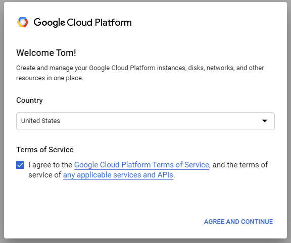

Next, you will be on the Developer Dashboard. If you have not created a project
before, you can create your first project by selecting [CREATE PROJECT].

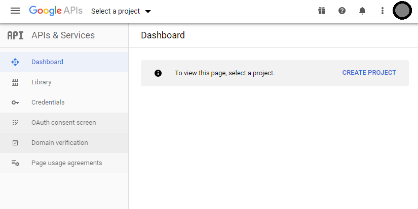

If you are using an existing Developer Account and already have a Project, you
will be on a Project’s Dashboard. To create a new Project, click on the drop
down menu at the top of the webpage.

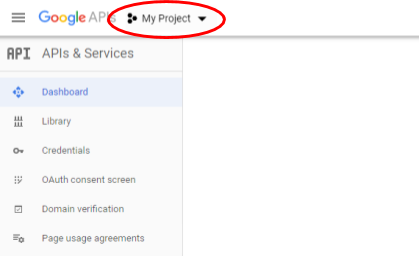

At the top of the pop-up menu, select NEW PROJECT.

On the Creation page, give the project a name. For this tutorial, we will name
it “App Inventor.” We don’t need to provide an organization, so we will leave it
as No organization.

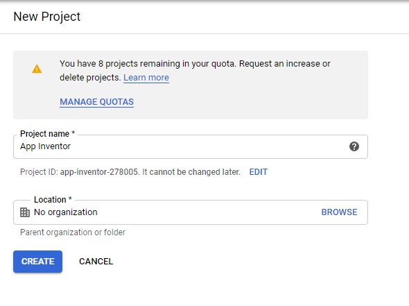

Click ‘Create’ to finish creating the project.

## 3. Enable the Google Sheeets API

The next step is to enable the Google Sheets API for your project. Click on the
“+ Enable APIs and Services” button next to APIs & Services.

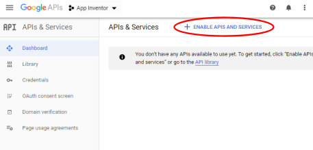

Enter in the search bar “Google Sheets API” and select the resulting API that
appears. Then click the Enable button for the API Library.

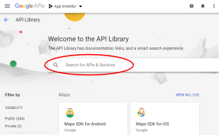
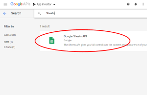
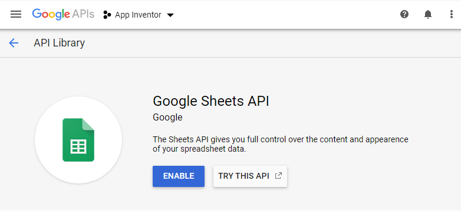

## 4. Creating a Service Acccount

Now that we have enabled the Google Sheets API for this project, we want to
create a service account. Simply put, this service account will look a lot like
a google email account. After selecting the ‘Enable’ button for the Google
Sheets API, you will be sent to the Overview tab for the Google Sheets API in
your project. To the right of the screen, click ‘Create Credentials’ to get
started with creating the Service Account.

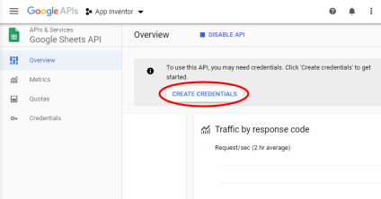

On the next page, we are presented with a guide that will ask various questions
about what kind of project we are making. In the first drop down menu under
‘Which API are you using?’, select the Google Sheets API.

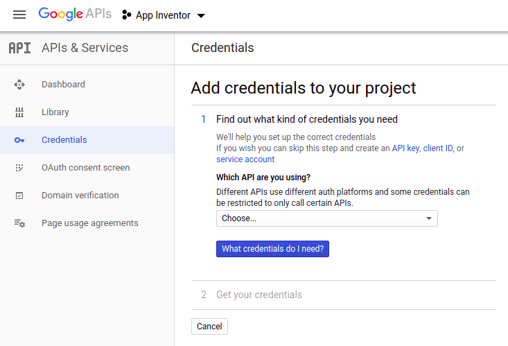

After you select that, a follow-up question will appear below. Under the
question “Where will you be calling the API from?”, select Other UI. Finally,
under what data will you be accessing, select Application Data.

After entering the above information, click on the blue button labeled “What
credentials do I need?” This will take you to the second part of creating the
credentials. This part will allow you to customize the service account and
should look like the figure below.

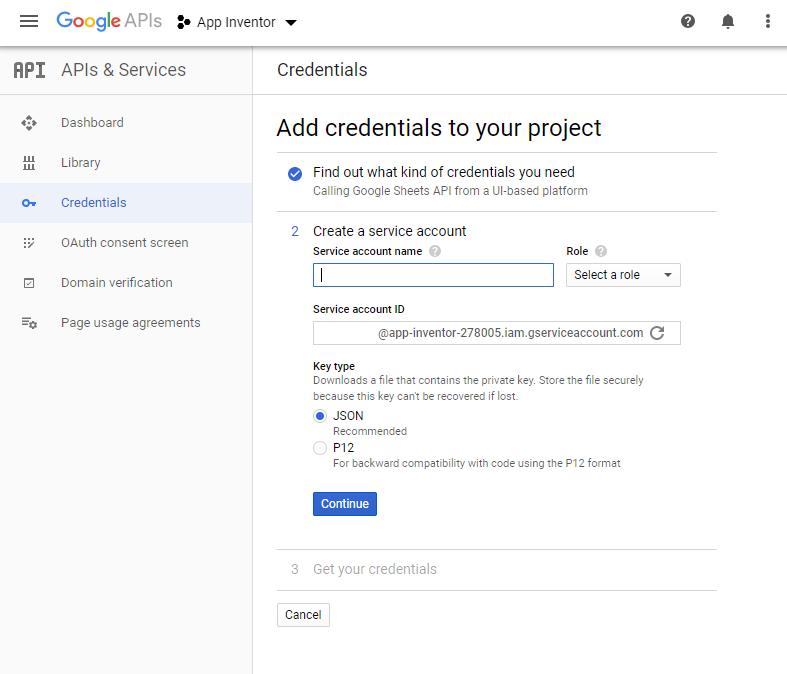

The name of the service account is not important. For this tutorial, I will name
it “example-service.” You then set the role to Selecting Project > Editor, which
should provide this service account with enough permissions. Make sure to save
the entire text in the box labeled Service Account ID. You should notice that
this will look a lot like an email address. You will want to copy this Service
Account ID someplace so that we can use it later.

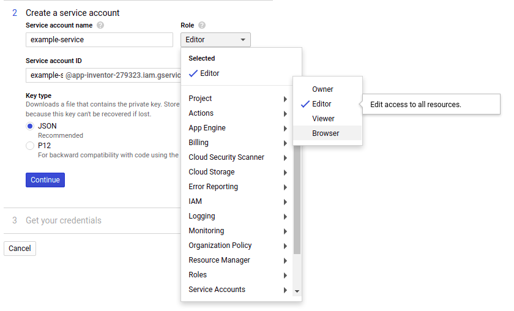

Make sure that “JSON” is selected under Key Type like it is above before
pressing ‘Continue’. This will download a JSON file with the name
“AppInventor-####.json.”

When using the Google Sheets API component, we will upload this json file in
order to work properly. Make sure to keep this JSON safe!

# Linking the Google Sheets Document

Now that we have created a Service Account, we want to provide the service account access to the Google Sheets files we will or read from.

## 1. Create the Google Sheets Document

The first step, if you haven’t already, is to create a Google Sheets document.
The name of the Google Sheets document can be anything you’d like. If you
already have a Google Sheets file you would like to use, then simply go to your
Google Drive and navigate anywhere you would like to create the document. Then
click New and select New Sheet.

## 2. Share the Google Sheets Document

After you have created the Google Sheets file that you would like to use, you
simply need to share the Google Sheets file with the service account email we
saved from earlier. This will provide the service account with the permissions
you need. You can specify whether the service account can only read the data or
whether the service account can read and write the data by changing the
permissions between Viewer and Editor respectively.

## 3. Record Relevant Information

Finally, there are a handful of pieces of information about the google sheets
document which you would need to record in order to properly access the file.
You can also use this portion of the instructions as a reference for where to
find the information later.

You can read more about these terms <a href="https://developers.google.com/sheets/api/guides/concepts#common_terms">here</a>.

### The Spreadsheet ID

The spreadsheet ID can be found in the url of the Google Sheets Document. The url of the Google Sheets Document is typically in the form:

<tt>https://docs.google.com/spreadsheets/d/<b>&lt;Spreadsheet ID&gt;</b>/edit#gid=<b>&lt;Grid ID&gt;</b></tt>

The spreadsheet ID corresponds to the ID of the Google Sheets File.

### The Sheet Name

Within a spreadsheet are individual sheets, each of which have unique titles and ID numbers. In this component, the title of the page is called the <tt>sheetName</tt>.

A single spreadsheet document can have multiple pages. By default, when you
create a new Google Sheets document, the spreadsheet has a single page with the
name “Sheet1”. You can find this in the tabs at the bottom left corner of the
screen like so:

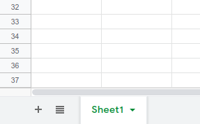

You can add a new page to the document by pressing the “+” symbol. Doing so
will create a new tab next to Sheet1 that will read Sheet2.

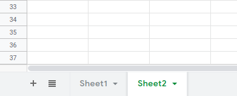

Each block in the Google Sheets Component will ask you to specify the title of the page (or the "Sheet Name") you want to read from or edit. For example, if I want to edit values on Sheet2, then I would provide the text “Sheet2” in the sheetName slot.

Additionally, you can rename the sheet to whatever you’d like by right clicking
on the tab and clicking rename. Note, doing so would require that you change
the sheet name in the project as well to match.

### The Grid ID

Similarly to the sheet name, this is used to refer to which page you would like
to edit. However, unlike the sheet name, the grid ID cannot be customized by
the user. Certain blocks require that the grid ID is provided instead of a
sheet name. To find the grid ID, navigate to the page you want to reference by
clicking on the tab. In the URL, you should see that the end should have “gid=”
followed by a number.

<tt>https://docs.google.com/spreadsheets/d/<b>&lt;Spreadsheet ID&gt;</b>/edit#gid=<b>&lt;Grid ID&gt;</b></tt>

# Debugging Tips

<code>Unable to resolve host "oauth2.googleapis.com"</code>

If you get this error message, double check your device’s connection to the
internet. This is a sign that the Android networking subsystem can't resolve
the hostname, so it's not able to talk to DNS.

<code>Attempt to invoke virtual method … on a null object reference. </code>

If you get this error message, double check that you have linked your
credentials in the designer properties. If your Designer property reads
“None…” like it says in the image below, click on the box and select the .json
file you got from the Service Account setup steps.

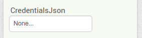

<code>Unable to parse range: ______ </code>

If you get this error message, there may be an error with the range that you
provided. This could mean that the sheetName you’ve provided does not actually
exist, or that the reference you provided is not valid A1-notation. To learn
more about A1 notation, see this reference:
https://developers.google.com/sheets/api/guides/concepts#a1_notation
