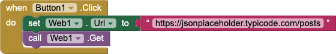
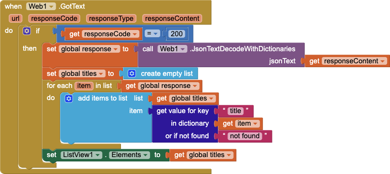
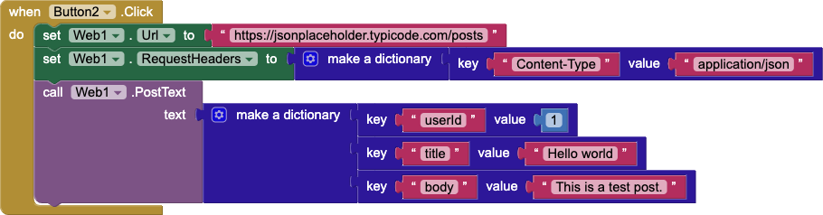
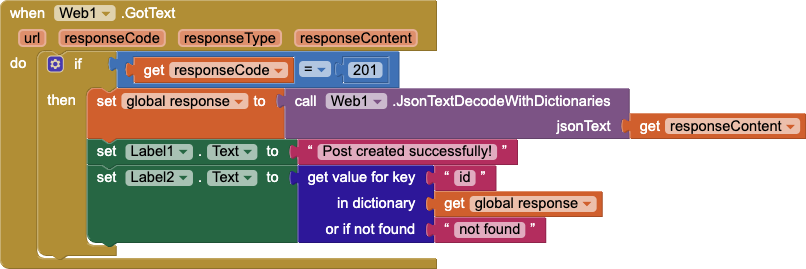

The JavaScript Object Notation (JSON) is widely used for interacting with application programming interfaces (APIs) on the web. JSON provides different types that are used to compose messages. App Inventor supports these values as well.

* JSON values `true` and `false` become App Inventor `true`{:.logic.block} and `false`{:.logic.block}
* JSON numbers (both integers and decimal numbers) become App Inventor `number`{:.math.block}
* JSON strings become App Inventor `text`{:.text.block}
* JSON arrays become App Inventor `list`{:.list.block}
* JSON objects become App Inventor `dictionary`{:.dictionary.block}

An example message in JSON might look like:

```json
{
  "name": "Tim Beaver",
  "likes": ["dams", "engineering"],
  "hasTowel": true,
  "widgets": 42
}
```

This JSON declares an object (indicated by the `{` and `}`). The keys are the quoted strings (e.g., `"name"`) before the colons (`:`). We see that there are different values, including arrays (comma-separated values between square brackets `[...]`), numbers (e.g., `42`), and Booleans (e.g., `true`).

For the remainder of this document, we will be using a service called [JSONPlaceholder](https://jsonplaceholder.typicode.com), which is intended for use in examples. It produces sample JSON responses in the style of Lorem Ipsum and does not actually store any data.

## Components Used in this Document

The following examples make use of these components:

* [Button](../components/userinterface.html#Button)
* [Label](../components/userinterface.html#Label)
* [ListView](../components/userinterface.html#ListView)
* [Web](../components/connectivity.html#Web)

## Retrieving Data

The Web component provides a `Get`{:.method.block}. When the request completes, the Web's `GotText`{:.event.block} event block will run. The event has two important parameters:

* `responseCode`{:.variable.block}: The HTTP status code provided by the server. Usually this will be `200`{:.math.block} (OK) or `201`{:.math.block} (Created), but you may also get values such as `400`{:.math.block} (Bad Request), `403`{:.math.block} (Forbidden), and `404`{:.math.block} (Not Found). Depending on the API you use in your app, you should check the status code to know whether your request was successful.
* `responseContent`{:.variable.block}: The content of the response returned by the server as a `text`{:.text.block}. Let's look at how it can be processed as JSON:

The Web component provides the method [`JsonTextDecodeWithDictionaries`{:.method.block}](../components/connectivity.html#Web.JsonTextDecodeWithDictionaries) that takes `text`{:.text.block}, such as the contents of the `responseContent`{:.variable.block} parameter, and converts it into the appropriate App Inventor type. Depending on the returned content, the output of the `JsonTextDecodeWithDictionaries`{:.method.block} may return different types, such as `list`{:.list.block} or `dictionary`{:.dictionary.block}. App Inventor provides blocks such as `is a list?`{:.list.block} and `is a dictionary?`{:.dictionary.block} that you can use to test the value if the API allows for more than one type of thing to be returned.

### Example - Successful Get

Request the first post by setting the `Url`{:.setter.block} property accordingly and calling `Get`{:.method.block}


On success, the `GotText`{:.event.block} event will have a `responseCode`{:.variable.block} of `200`{:.math.block}. We can parse the contents of the `responseText}`{:.variable.block} using the `JsonTextDecodeWithDictionaries`{:.method.block} method. Once we have our dictionary with the result, we can access its `title`{:.text.block} and `body`{:.text.block} properties.

**Sample JSON**

```json
{
  "userId": 1,
  "id": 1,
  "title": "sunt aut facere repellat provident occaecati excepturi optio reprehenderit",
  "body": "quia et suscipit\nsuscipit recusandae consequuntur expedita et cum\nreprehenderit molestiae ut ut quas totam\nnostrum rerum est autem sunt rem eveniet architecto"
}
```

**Blocks**


After running the blocks above, Label1 will contain the title from the JSON (i.e., `"sunt aut facere..."`) and Label2 will contain the body from the JSON (i.e., `"quia et sucipit..."`).

### Example - Failed Get

If you request a resource that does not exist (post 101 in the example shown), then you will get an error instead.


HTTP uses the error code `404`{:.math.block} to indicate that a resource cannot be found by the server. We test for this and report an error to the user.


### Example - Walking a Response

If you call `Get`{:.method.block} with `Url`{:.setter.block} set to `https://jsonplaceholder.typicode.com/posts`{:.text.block}, then you will get a list of 100 entries back.



If you wanted to display some information about these items in a ListView, one way to do it would be to use a `for each item`{:.control.block} block to loop over the list. 



However, the [`list by walking key path`{:.dictionary.block}](../blocks/dictionaries.html#list-by-walking-key-path) makes this easier. This block works by starting at the object it is given and following a sequence of steps provided to it in the form of a `list`{:.list.block}. In the following example, we give it the key path of `walk all at level`{:.dictionary.block} and `title`{:.text.block} to get the title of every post in the list (in order of appearance). This code is functionally equivalent to the code above using the `for each`{:.control.block} block but it is more concise.


## Sending Data

Sending data to a web API for processing typically involves two things. First, you must construct the message you need to send to the API. API developers will usually provide thorough documentation on how to use their API. Second, depending on the whether the action is sensitive, such as changing or deleting data, you will need to provide some authentication token.

To work with Web APIs that consume JSON, you will want to make use of App Inventor's list and dictionary types. For example,

### Example

We can use the Web component's [`PostText`{:.method.block}](../components/connectivity.html#Web.PostText) method to send content to a JSON-baed Web API. For JSONPlaceholder, posts should contain 3 keys: `"userId"`, `"title"`, and `"body"`.



On success, the `responseCode`{:.variable.block} in `GotText`{:.event.block} will be `201`{:.math.block}, which means "Created".



## Further Reading

To learn more about HTTP response codes, please see [HTTP response status codes](https://developer.mozilla.org/en-US/docs/Web/HTTP/Status).
