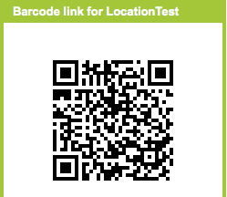
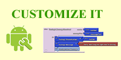
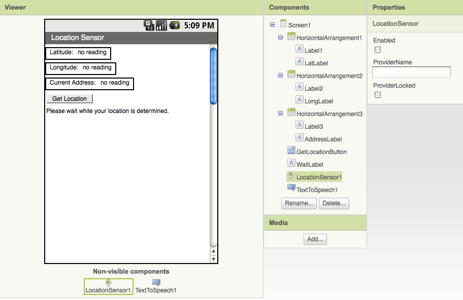

*This tutorial was developed by [Professor David Wolber](http://appinventorblog.com/) at The University of San Francisco.*

The LocationSensor component can determine the phone's latitude and longitude as well as a street address. You can use it to share your location with others, record "breadcrumbs" on a journey or treasure hunt, or as a way to take roll in class (as long as the students have Android devices!)

The sample apps below are simple but illustrate the basic way that location can be determined. Both apps report the current latitude, longitude, and addres on the phone's display and, just for fun, speak the address aloud. The first app reports the location as soon as the sensor gets the data and every time the phone's location is changed. The second app only invokes the location sensor in response to an event-- when the user clicks a button.

For each sample app, the following is provided:

* A barcode which can be scanned to **install** the app on your phone.
* The source (blocks) for you to use/**customize**. Download the file to your computer then upload it into App Inventor.
* A snapshot of the app in the Component **Designer**.
* **Annotated blocks** to help you undertstand the app. The annotations are block comments that will appear in the app when you upload it as well.

## Sample App 1: Location Reader

Report location data as soon as sensor reads it and when the location changes

**TRY IT!** Scan the QR code with your Android phone to install this app (if you haven't already, download a scanner from the Google Play Store)	.

**CUSTOMIZE IT!** Download the source blocks to your phone by clicking the button on below, then upload into App Inventor by choosing More Actions | Upload Source on the Projects page.

**UNDERSTAND IT!** Here is the user interface and components for the app:

Here are the blocks for the app, with annotation:

## Sample App 2: Get the location when a button is clicked

This app illustrates how to access location information only when some event occurs. The LocationSensor is disabled to begin, then enabled when the button is clicked and disabled once again when the location is determined.

**TRY IT!** Scan the QR code with your Android phone to install this app (if you haven't already, download a scanner from the Google Play Store)

**CUSTOMIZE IT!** Download the source blocks to your phone by clicking the button below, then upload into App Inventor by choosing More Actions | Upload Source on the Projects page.

**UNDERSTAND IT!** Here is the user interface and components for the app:

Here are the blocks for the app, with annotation:

## Variations

* The second app illustrates using location data in response to an event. Write an app that responds to any received text by sending back a text that says, "I'm driving right now, I'll get back to you later. My location is ..." with the current location filled in.
* Write a "breadcrumb" app that tracks your (phone's) whereabouts by recording each location change. One interesting refinement would be to only record a new "breadcrumb" if the location has changed by a certain amount.
